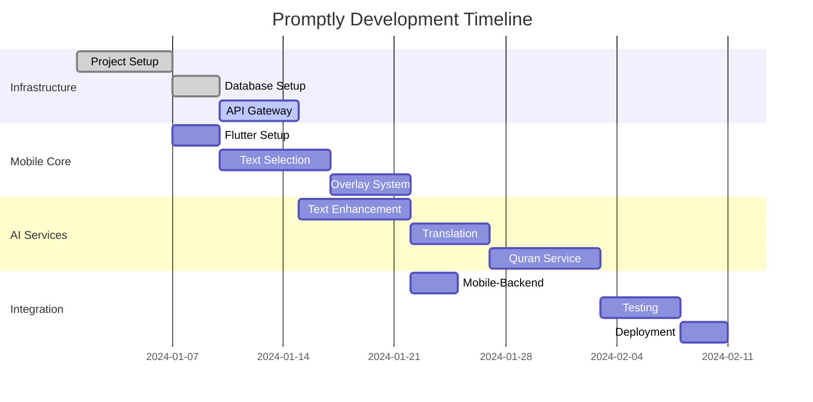

# Development Tasks Document
## Promptly - AI-Powered Mobile Text Enhancement App

**Document Version:** 2.0  
**Date:** December 2024  
**Last Updated:** December 2024 - Enhanced with Smart Communication, Universal Audio, and Advanced Platform Integration  
**Project Manager:** [To be filled]  
**Mobile Team Lead:** [To be filled]  
**Backend Team Lead:** [To be filled]

---

## **Table of Contents**

1. [Overview](#1-overview)
2. [Mobile App Development Tasks](#2-mobile-app-development-tasks)
3. [Backend Development Tasks](#3-backend-development-tasks)
4. [Shared Infrastructure Tasks](#4-shared-infrastructure-tasks)
5. [Task Dependencies & Critical Path](#5-task-dependencies--critical-path)
6. [Sprint Planning Recommendations](#6-sprint-planning-recommendations)
7. [Definition of Done](#7-definition-of-done)

---

## **1. Overview**

This document breaks down the user stories from the User Stories document into specific, actionable development tasks for both mobile app and backend teams. Tasks are organized by epic, prioritized, and include estimated effort, dependencies, and acceptance criteria.

### **1.1 Task Classification**
- **🍎 Mobile App Tasks**: Flutter mobile development
- **🚀 Backend Tasks**: Node.js microservices development
- **🔧 Infrastructure Tasks**: DevOps, deployment, and shared systems
- **🎨 Design Tasks**: UI/UX design and assets

### **1.2 Effort Estimation**
- **XS (1-2 hours)**: Simple configuration or minor fixes
- **S (4-6 hours)**: Small feature or component
- **M (1-2 days)**: Medium complexity feature
- **L (3-5 days)**: Large feature or complex integration
- **XL (1-2 weeks)**: Major feature or system component

### **1.3 Priority Levels**
- **P0**: Critical for MVP (must-have)
- **P1**: Important for Phase 2 (should-have)
- **P2**: Nice-to-have for Phase 3 (could-have)
- **P3**: Future consideration

---

## **2. Mobile App Development Tasks**

### **Epic 1: Text Selection & Overlay System**

#### **Story 1.1: Basic Text Selection Detection**

##### **🍎 Mobile Tasks:**

**M-1.1.1: Setup Flutter Project Structure** (Priority: P0, Effort: M)
- Create new Flutter project with proper folder structure
- Configure analysis_options.yaml for code quality
- Setup dependency injection with GetIt
- Create base architecture with BLoC pattern
- Configure build variants for dev/staging/prod
- **Dependencies:** None
- **Acceptance Criteria:**
  - [ ] Project builds successfully on Android and iOS
  - [ ] Folder structure follows best practices
  - [ ] GetIt dependency injection is configured
  - [ ] BLoC pattern is set up with sample implementation

**M-1.1.2: Android Text Selection Detection** (Priority: P0, Effort: L)
- Implement Accessibility Service for text selection detection
- Create platform-specific method channels
- Handle permission requests for accessibility service
- Implement text selection event stream
- Add error handling for permission denials
- **Dependencies:** M-1.1.1
- **Acceptance Criteria:**
  - [ ] Accessibility service detects text selection across apps
  - [ ] Selection events are captured within 200ms
  - [ ] Proper permission handling is implemented
  - [ ] Error handling for unsupported apps

**M-1.1.3: iOS Text Selection Detection** (Priority: P0, Effort: L)
- Implement Share Extension for iOS text sharing
- Create iOS-specific method channels
- Handle iOS privacy permissions
- Implement Universal Clipboard integration
- Add fallback mechanisms for restricted apps
- **Dependencies:** M-1.1.1
- **Acceptance Criteria:**
  - [ ] Share extension properly captures selected text
  - [ ] Works with iOS Share Sheet functionality
  - [ ] Privacy permissions are handled correctly
  - [ ] Fallback methods work for restricted content

**M-1.1.4: Cross-Platform Text Selection Service** (Priority: P0, Effort: M)
- Create abstract TextSelectionDetector interface
- Implement platform-specific detection services
- Create unified text selection event stream
- Add text validation and sanitization
- Implement selection metadata capture (app context, position)
- **Dependencies:** M-1.1.2, M-1.1.3
- **Acceptance Criteria:**
  - [ ] Unified interface works across platforms
  - [ ] Text selection events include proper metadata
  - [ ] Input validation prevents malformed data
  - [ ] Selection context is properly captured

**M-1.1.5: Edge Case Handling** (Priority: P0, Effort: M)
- Handle password fields and secure content
- Implement image text detection (OCR integration)
- Add support for split-screen and multi-window modes
- Handle orientation changes during selection
- Add support for different device form factors
- **Dependencies:** M-1.1.4
- **Acceptance Criteria:**
  - [ ] Password fields are properly excluded
  - [ ] OCR works for image text selection
  - [ ] Split-screen mode is supported
  - [ ] Orientation changes don't break functionality

#### **Story 1.2: Smart Overlay Positioning**

##### **🍎 Mobile Tasks:**

**M-1.2.1: Overlay UI Components** (Priority: P0, Effort: M)
- Create floating overlay widget with Material Design
- Implement overlay animation system
- Create action button components
- Add overlay theming and customization
- Implement accessibility support for overlays
- **Dependencies:** M-1.1.4
- **Acceptance Criteria:**
  - [ ] Overlay renders properly on all screen sizes
  - [ ] Animations are smooth and performant
  - [ ] Material Design guidelines are followed
  - [ ] Accessibility labels are properly set

**M-1.2.2: Dynamic Positioning Algorithm** (Priority: P0, Effort: L)
- Implement screen geometry calculations
- Create collision detection with UI elements
- Add positioning optimization for one-handed use
- Handle notched displays and safe areas
- Implement foldable device support
- **Dependencies:** M-1.2.1
- **Acceptance Criteria:**
  - [ ] Overlay positions optimally on all devices
  - [ ] Collision detection prevents UI blocking
  - [ ] One-handed reachability is maintained
  - [ ] Safe areas are properly respected

**M-1.2.3: Orientation and Layout Handling** (Priority: P0, Effort: M)
- Handle orientation changes smoothly
- Implement layout adjustments for landscape/portrait
- Add support for tablet-specific layouts
- Handle keyboard appearance/dismissal
- Implement adaptive sizing for different screen densities
- **Dependencies:** M-1.2.2
- **Acceptance Criteria:**
  - [ ] Orientation changes are handled smoothly
  - [ ] Layouts adapt properly to screen changes
  - [ ] Tablet layouts are optimized
  - [ ] Keyboard interactions don't break positioning

#### **Story 1.3: Overlay Interaction & Dismissal**

##### **🍎 Mobile Tasks:**

**M-1.3.1: Gesture Recognition System** (Priority: P0, Effort: M)
- Implement tap, long-press, and drag gestures
- Create gesture conflict resolution
- Add haptic feedback for interactions
- Implement swipe-to-dismiss functionality
- Add double-tap for expand/collapse
- **Dependencies:** M-1.2.3
- **Acceptance Criteria:**
  - [ ] All gestures are properly recognized
  - [ ] Gesture conflicts are resolved correctly
  - [ ] Haptic feedback enhances user experience
  - [ ] Swipe dismissal works reliably

**M-1.3.2: Overlay State Management** (Priority: P0, Effort: M)
- Create overlay state BLoC
- Implement overlay lifecycle management
- Add persistent overlay positioning
- Create overlay animation state machine
- Implement overlay focus management
- **Dependencies:** M-1.3.1
- **Acceptance Criteria:**
  - [ ] Overlay state is properly managed
  - [ ] Positioning persists across sessions
  - [ ] Animations follow proper state transitions
  - [ ] Focus management works with accessibility

**M-1.3.3: Advanced Options Menu** (Priority: P1, Effort: M)
- Create expandable options menu
- Implement settings quick access
- Add recently used actions
- Create customizable action shortcuts
- Implement context-sensitive options
- **Dependencies:** M-1.3.2
- **Acceptance Criteria:**
  - [ ] Advanced options are easily accessible
  - [ ] Settings integration works properly
  - [ ] Recent actions are tracked and displayed
  - [ ] Context-sensitive options appear correctly

### **Epic 2: Professional Text Enhancement**

#### **Story 2.1: Basic Tone Adjustment**

##### **🍎 Mobile Tasks:**

**M-2.1.1: Enhancement UI Components** (Priority: P0, Effort: M)
- Create enhancement option buttons
- Implement loading states and progress indicators
- Create result display components
- Add confidence score visualization
- Implement alternative versions carousel
- **Dependencies:** M-1.3.2
- **Acceptance Criteria:**
  - [ ] Enhancement options are clearly displayed
  - [ ] Loading states provide good user feedback
  - [ ] Results are presented in an engaging way
  - [ ] Confidence scores are visualized effectively

**M-2.1.2: Text Processing Integration** (Priority: P0, Effort: L)
- Create AI service client for text enhancement
- Implement request/response models
- Add caching layer for enhancement results
- Create retry logic for failed requests
- Implement offline queue for enhancements
- **Dependencies:** M-2.1.1
- **Acceptance Criteria:**
  - [ ] AI service integration works reliably
  - [ ] Caching improves performance significantly
  - [ ] Failed requests are handled gracefully
  - [ ] Offline queue processes when online

**M-2.1.3: Enhancement Result Management** (Priority: P0, Effort: M)
- Create result comparison interface
- Implement result rating system
- Add copy-to-clipboard functionality
- Create result sharing capabilities
- Implement undo/redo for text replacements
- **Dependencies:** M-2.1.2
- **Acceptance Criteria:**
  - [ ] Multiple results can be compared easily
  - [ ] Rating system captures user feedback
  - [ ] Clipboard operations work correctly
  - [ ] Sharing functionality is seamless

#### **Story 2.2: Custom Prompt Enhancement**

##### **🍎 Mobile Tasks:**

**M-2.2.1: Custom Prompt Input UI** (Priority: P0, Effort: M)
- Create prompt input dialog
- Implement auto-suggestions for prompts
- Add prompt history and favorites
- Create prompt template system
- Implement prompt validation
- **Dependencies:** M-2.1.3
- **Acceptance Criteria:**
  - [ ] Prompt input is intuitive and fast
  - [ ] Auto-suggestions improve user experience
  - [ ] History and favorites work correctly
  - [ ] Templates speed up common tasks

**M-2.2.2: Prompt Management System** (Priority: P0, Effort: M)
- Create prompt storage and retrieval
- Implement prompt categorization
- Add prompt sharing functionality
- Create prompt effectiveness tracking
- Implement prompt sync across devices
- **Dependencies:** M-2.2.1
- **Acceptance Criteria:**
  - [ ] Prompts are stored securely and efficiently
  - [ ] Categorization helps prompt discovery
  - [ ] Sharing works between users
  - [ ] Sync maintains consistency across devices

#### **Story 2.3: Grammar and Style Correction**

##### **🍎 Mobile Tasks:**

**M-2.3.1: Grammar Error Visualization** (Priority: P0, Effort: M)
- Create error highlighting system
- Implement error categorization UI
- Add explanation popups for corrections
- Create before/after comparison view
- Implement selective correction application
- **Dependencies:** M-2.2.2
- **Acceptance Criteria:**
  - [ ] Errors are clearly highlighted and categorized
  - [ ] Explanations help users learn
  - [ ] Comparisons show improvement clearly
  - [ ] Selective application gives user control

**M-2.3.2: Learning Progress Tracking** (Priority: P1, Effort: M)
- Create learning analytics dashboard
- Implement mistake pattern recognition
- Add personalized tips and suggestions
- Create progress visualization
- Implement achievement system
- **Dependencies:** M-2.3.1
- **Acceptance Criteria:**
  - [ ] Learning progress is tracked accurately
  - [ ] Pattern recognition provides insights
  - [ ] Tips are personalized and helpful
  - [ ] Achievements motivate continued use

### **Epic 3: Real-Time Translation**

#### **Story 3.1: Automatic Language Detection & Translation**

##### **🍎 Mobile Tasks:**

**M-3.1.1: Translation UI Components** (Priority: P0, Effort: M)
- Create translation display interface
- Implement language selector
- Add confidence indicators
- Create translation alternatives view
- Implement formatting preservation display
- **Dependencies:** M-2.3.2
- **Acceptance Criteria:**
  - [ ] Translation interface is clear and intuitive
  - [ ] Language selection is fast and accurate
  - [ ] Confidence levels are clearly communicated
  - [ ] Formatting is preserved visually

**M-3.1.2: Translation Service Integration** (Priority: P0, Effort: L)
- Create translation service client
- Implement language detection logic
- Add translation caching system
- Create offline translation support
- Implement translation quality scoring
- **Dependencies:** M-3.1.1
- **Acceptance Criteria:**
  - [ ] Translation service works reliably
  - [ ] Language detection is accurate
  - [ ] Caching improves performance
  - [ ] Quality scoring helps user confidence

#### **Story 3.2: Interactive Pronunciation Guide**

##### **🍎 Mobile Tasks:**

**M-3.2.1: Audio Playback System** (Priority: P0, Effort: M)
- Implement audio player with controls
- Create syllable-by-syllable highlighting
- Add playback speed controls
- Implement voice gender selection
- Create audio caching system
- **Dependencies:** M-3.1.2
- **Acceptance Criteria:**
  - [ ] Audio playback is smooth and responsive
  - [ ] Highlighting synchronizes with audio
  - [ ] Speed controls work accurately
  - [ ] Audio caching reduces load times

**M-3.2.2: Pronunciation Learning Features** (Priority: P0, Effort: M)
- Create phonetic transcription display
- Implement regional accent options
- Add pronunciation practice mode
- Create audio quality indicators
- Implement accessibility features for hearing-impaired
- **Dependencies:** M-3.2.1
- **Acceptance Criteria:**
  - [ ] Phonetic transcriptions aid learning
  - [ ] Regional accents provide variety
  - [ ] Practice mode helps skill development
  - [ ] Accessibility features work properly

### **Epic 4: Quran Mode & Arabic Support**

#### **Story 4.1: Automatic Quran Verse Detection**

##### **🍎 Mobile Tasks:**

**M-4.1.1: Arabic Text Processing** (Priority: P0, Effort: L)
- Implement Arabic text normalization
- Create verse detection algorithm
- Add fuzzy matching for variations
- Implement confidence scoring
- Create verse metadata display
- **Dependencies:** M-3.2.2
- **Acceptance Criteria:**
  - [ ] Arabic text is properly normalized
  - [ ] Verse detection accuracy >95%
  - [ ] Fuzzy matching handles variations
  - [ ] Metadata display is informative

**M-4.1.2: Quran Database Integration** (Priority: P0, Effort: M)
- Create local Quran database
- Implement verse lookup and search
- Add translation integration
- Create transliteration support
- Implement offline verse access
- **Dependencies:** M-4.1.1
- **Acceptance Criteria:**
  - [ ] Database queries are fast and accurate
  - [ ] All verses are accessible offline
  - [ ] Translations are properly integrated
  - [ ] Transliterations aid pronunciation

#### **Story 4.2: Tajweed-Aware Pronunciation**

##### **🍎 Mobile Tasks:**

**M-4.2.1: Tajweed Visualization System** (Priority: P0, Effort: L)
- Create tajweed rule highlighting
- Implement color-coded pronunciation guides
- Add rule explanation popups
- Create visual pronunciation markers
- Implement customizable highlighting themes
- **Dependencies:** M-4.1.2
- **Acceptance Criteria:**
  - [ ] Tajweed rules are clearly highlighted
  - [ ] Color coding follows established conventions
  - [ ] Explanations are educationally valuable
  - [ ] Customization meets user preferences

**M-4.2.2: Quranic Audio Integration** (Priority: P0, Effort: M)
- Integrate with Quranic audio services
- Implement reciter selection
- Add slow recitation options
- Create synchronized highlighting
- Implement audio quality optimization
- **Dependencies:** M-4.2.1
- **Acceptance Criteria:**
  - [ ] Audio integration is seamless
  - [ ] Multiple reciters are available
  - [ ] Slow recitation aids learning
  - [ ] Highlighting synchronizes perfectly

### **Epic 5: User Onboarding & Setup**

#### **Story 5.1: First-Time User Onboarding**

##### **🍎 Mobile Tasks:**

**M-5.1.1: Onboarding Flow Implementation** (Priority: P0, Effort: M)
- Create welcome screen with value proposition
- Implement feature demonstration
- Add interactive tutorial elements
- Create practice environment
- Implement skip and replay options
- **Dependencies:** M-4.2.2
- **Acceptance Criteria:**
  - [ ] Onboarding completes in <2 minutes
  - [ ] Value proposition is clearly communicated
  - [ ] Interactive elements engage users
  - [ ] Practice environment is safe and educational

**M-5.1.2: Permission Request Flow** (Priority: P0, Effort: M)
- Create permission explanation screens
- Implement progressive permission requests
- Add visual diagrams for permission benefits
- Create fallback options for denied permissions
- Implement permission status monitoring
- **Dependencies:** M-5.1.1
- **Acceptance Criteria:**
  - [ ] Permission requests are well-explained
  - [ ] Progressive requests don't overwhelm users
  - [ ] Visual aids improve understanding
  - [ ] Fallback options maintain functionality

### **Epic 6: Performance & Reliability**

#### **Story 6.1: Fast Response Times**

##### **🍎 Mobile Tasks:**

**M-6.1.1: Performance Optimization** (Priority: P0, Effort: L)
- Implement efficient widget rebuilding
- Optimize image and asset loading
- Create memory management system
- Implement CPU usage monitoring
- Add performance profiling tools
- **Dependencies:** M-5.1.2
- **Acceptance Criteria:**
  - [ ] Widget rebuilds are minimized
  - [ ] Asset loading is optimized
  - [ ] Memory usage stays under limits
  - [ ] CPU usage is efficiently managed

**M-6.1.2: Caching and Local Storage** (Priority: P0, Effort: M)
- Implement multi-tier caching system
- Create intelligent cache management
- Add offline data storage
- Implement cache invalidation strategies
- Create storage usage monitoring
- **Dependencies:** M-6.1.1
- **Acceptance Criteria:**
  - [ ] Caching significantly improves performance
  - [ ] Cache management is intelligent
  - [ ] Offline storage works reliably
  - [ ] Storage usage is monitored and controlled

### **Epic 7: Smart Communication & Tone Analysis**

#### **Story 7.1: Conversation Context Analysis**

##### **🍎 Mobile Tasks:**

**M-7.1.1: Conversation Context UI** (Priority: P0, Effort: L)
- Create conversation analysis interface
- Implement context display components
- Add conversation history visualization
- Create context confidence indicators
- Implement privacy controls for context analysis
- **Dependencies:** M-6.1.2
- **Acceptance Criteria:**
  - [ ] Conversation context is clearly displayed
  - [ ] Privacy controls are accessible
  - [ ] Context analysis works across messaging apps
  - [ ] Confidence indicators are accurate

**M-7.1.2: Context Integration Service** (Priority: P0, Effort: L)
- Create conversation reading service
- Implement message history analysis
- Add conversation topic detection
- Create participant relationship detection
- Implement privacy-preserving context processing
- **Dependencies:** M-7.1.1
- **Acceptance Criteria:**
  - [ ] Message history is analyzed securely
  - [ ] Topic detection is accurate
  - [ ] Relationship detection improves suggestions
  - [ ] Privacy is maintained throughout processing

#### **Story 7.2: Smart Reply Generation**

##### **🍎 Mobile Tasks:**

**M-7.2.1: Smart Reply UI Components** (Priority: P0, Effort: M)
- Create reply suggestion interface
- Implement quick-reply button system
- Add reply customization options
- Create reply preview functionality
- Implement reply insertion mechanism
- **Dependencies:** M-7.1.2
- **Acceptance Criteria:**
  - [ ] Reply suggestions are displayed clearly
  - [ ] Quick insertion works smoothly
  - [ ] Customization options are intuitive
  - [ ] Preview functionality is accurate

**M-7.2.2: Reply Generation Integration** (Priority: P0, Effort: M)
- Create AI reply service client
- Implement context-aware reply requests
- Add reply quality assessment
- Create reply personalization system
- Implement reply learning from user feedback
- **Dependencies:** M-7.2.1
- **Acceptance Criteria:**
  - [ ] Replies are contextually relevant
  - [ ] Quality assessment prevents poor suggestions
  - [ ] Personalization improves over time
  - [ ] User feedback is incorporated

#### **Story 7.3: Emotional Tone Detection**

##### **🍎 Mobile Tasks:**

**M-7.3.1: Tone Analysis UI** (Priority: P1, Effort: M)
- Create tone detection display
- Implement tone visualization components
- Add tone explanation interface
- Create confidence scoring display
- Implement tone comparison features
- **Dependencies:** M-7.2.2
- **Acceptance Criteria:**
  - [ ] Tone detection is clearly visualized
  - [ ] Explanations help user understanding
  - [ ] Confidence scores are meaningful
  - [ ] Comparisons aid decision making

**M-7.3.2: Tone Detection Service** (Priority: P1, Effort: M)
- Create tone analysis client
- Implement real-time tone detection
- Add tone categorization system
- Create tone learning algorithms
- Implement cultural tone adaptations
- **Dependencies:** M-7.3.1
- **Acceptance Criteria:**
  - [ ] Tone detection is accurate and fast
  - [ ] Categorization is meaningful
  - [ ] Cultural adaptations are appropriate
  - [ ] Learning improves accuracy over time

#### **Story 7.4: Tone Adjustment & Modification**

##### **🍎 Mobile Tasks:**

**M-7.4.1: Tone Adjustment Interface** (Priority: P1, Effort: M)
- Create tone selection UI
- Implement tone slider controls
- Add before/after comparison view
- Create tone adjustment preview
- Implement tone explanation system
- **Dependencies:** M-7.3.2
- **Acceptance Criteria:**
  - [ ] Tone selection is intuitive
  - [ ] Adjustments are previewed accurately
  - [ ] Comparisons show clear differences
  - [ ] Explanations clarify changes

**M-7.4.2: Tone Modification Service** (Priority: P1, Effort: M)
- Create tone adjustment client
- Implement multi-level tone modification
- Add meaning preservation validation
- Create tone consistency checking
- Implement adjustment quality scoring
- **Dependencies:** M-7.4.1
- **Acceptance Criteria:**
  - [ ] Tone adjustments preserve meaning
  - [ ] Multiple adjustment levels work correctly
  - [ ] Consistency is maintained
  - [ ] Quality scoring guides improvements

### **Epic 8: Universal Audio & Read Aloud**

#### **Story 8.1: General Text-to-Speech**

##### **🍎 Mobile Tasks:**

**M-8.1.1: Audio Playback UI** (Priority: P0, Effort: M)
- Create audio player interface
- Implement playback controls (play/pause/speed)
- Add text highlighting during playback
- Create audio progress indicators
- Implement background playback controls
- **Dependencies:** M-7.4.2
- **Acceptance Criteria:**
  - [ ] Audio controls are intuitive and responsive
  - [ ] Text highlighting synchronizes with audio
  - [ ] Background playback works seamlessly
  - [ ] Progress indicators are accurate

**M-8.1.2: TTS Integration Service** (Priority: P0, Effort: L)
- Create text-to-speech service client
- Implement multi-language TTS support
- Add voice selection and customization
- Create audio caching system
- Implement offline TTS capabilities
- **Dependencies:** M-8.1.1
- **Acceptance Criteria:**
  - [ ] TTS works for 50+ languages
  - [ ] Voice options enhance user experience
  - [ ] Caching improves performance
  - [ ] Offline functionality is reliable

#### **Story 8.2: Multi-Language Audio Support**

##### **🍎 Mobile Tasks:**

**M-8.2.1: Language-Aware Audio System** (Priority: P1, Effort: M)
- Create automatic language detection for audio
- Implement language-specific voice selection
- Add pronunciation accuracy optimization
- Create regional accent support
- Implement mixed-language text handling
- **Dependencies:** M-8.1.2
- **Acceptance Criteria:**
  - [ ] Language detection is accurate for audio
  - [ ] Voice selection matches language appropriately
  - [ ] Pronunciation accuracy is high
  - [ ] Mixed-language text is handled properly

**M-8.2.2: Advanced Audio Features** (Priority: P1, Effort: M)
- Create voice gender selection
- Implement emotional inflection support
- Add audio quality enhancement
- Create voice personalization options
- Implement audio accessibility features
- **Dependencies:** M-8.2.1
- **Acceptance Criteria:**
  - [ ] Voice options provide variety
  - [ ] Emotional inflection enhances naturalness
  - [ ] Quality enhancement is noticeable
  - [ ] Accessibility features work properly

#### **Story 8.3: Background Audio Playback**

##### **🍎 Mobile Tasks:**

**M-8.3.1: Background Audio System** (Priority: P1, Effort: M)
- Create background audio service
- Implement notification controls
- Add lock screen playback controls
- Create audio session management
- Implement audio interruption handling
- **Dependencies:** M-8.2.2
- **Acceptance Criteria:**
  - [ ] Background playback continues seamlessly
  - [ ] Notification controls are functional
  - [ ] Lock screen controls work properly
  - [ ] Audio interruptions are handled gracefully

**M-8.3.2: Audio State Management** (Priority: P1, Effort: S)
- Create audio playback state persistence
- Implement resume functionality
- Add audio bookmark system
- Create playback history tracking
- Implement cross-device sync for audio state
- **Dependencies:** M-8.3.1
- **Acceptance Criteria:**
  - [ ] Audio state persists across sessions
  - [ ] Resume functionality works reliably
  - [ ] Bookmarks enable quick navigation
  - [ ] Sync maintains consistency across devices

#### **Story 8.4: Audio Bookmarks & Navigation**

##### **🍎 Mobile Tasks:**

**M-8.4.1: Audio Navigation Interface** (Priority: P2, Effort: M)
- Create audio bookmark creation UI
- Implement bookmark management system
- Add bookmark notes and categorization
- Create quick navigation controls
- Implement bookmark search functionality
- **Dependencies:** M-8.3.2
- **Acceptance Criteria:**
  - [ ] Bookmark creation is intuitive
  - [ ] Management system is comprehensive
  - [ ] Navigation controls are responsive
  - [ ] Search functionality is effective

**M-8.4.2: Advanced Audio Controls** (Priority: P2, Effort: S)
- Create chapter/section navigation
- Implement audio loop functionality
- Add playback speed memory
- Create audio playlist features
- Implement social sharing of audio bookmarks
- **Dependencies:** M-8.4.1
- **Acceptance Criteria:**
  - [ ] Chapter navigation is smooth
  - [ ] Loop functionality works correctly
  - [ ] Speed preferences are remembered
  - [ ] Sharing features work properly

### **Epic 9: Enhanced Platform Integration**

#### **Story 9.1: Advanced Android Accessibility Integration**

##### **🍎 Mobile Tasks:**

**M-9.1.1: Advanced Accessibility Service** (Priority: P0, Effort: XL)
- Implement comprehensive accessibility service
- Create system-wide text selection detection
- Add conversation reading capabilities
- Create floating bubble interface
- Implement custom keyboard integration
- **Dependencies:** M-8.4.2
- **Acceptance Criteria:**
  - [ ] System-wide text detection works flawlessly
  - [ ] Conversation reading respects privacy
  - [ ] Floating bubble is persistent and functional
  - [ ] Keyboard integration is seamless

**M-9.1.2: Android Intent Integration** (Priority: P0, Effort: M)
- Create deep linking with popular apps
- Implement notification access service
- Add smart reply for incoming messages
- Create app-specific privacy settings
- Implement system-level sharing integration
- **Dependencies:** M-9.1.1
- **Acceptance Criteria:**
  - [ ] Deep linking works with major apps
  - [ ] Notification access is secure
  - [ ] Smart replies are contextually appropriate
  - [ ] Privacy settings are granular and effective

#### **Story 9.2: Advanced iOS Extension System**

##### **🍎 Mobile Tasks:**

**M-9.2.1: Enhanced Share Extension** (Priority: P0, Effort: XL)
- Create comprehensive share extension
- Implement rich text processing with preview
- Add Siri Shortcuts integration
- Create custom keyboard extension
- Implement Universal Clipboard support
- **Dependencies:** M-9.1.2
- **Acceptance Criteria:**
  - [ ] Share extension handles complex text processing
  - [ ] Siri Shortcuts provide voice access
  - [ ] Keyboard extension offers inline suggestions
  - [ ] Universal Clipboard works cross-device

**M-9.2.2: iOS Widget Integration** (Priority: P0, Effort: M)
- Create iOS widget for quick access
- Implement widget configuration options
- Add recent enhancements display
- Create widget-to-app navigation
- Implement widget privacy controls
- **Dependencies:** M-9.2.1
- **Acceptance Criteria:**
  - [ ] Widget provides quick access to features
  - [ ] Configuration options are comprehensive
  - [ ] Navigation to app is seamless
  - [ ] Privacy controls are effective

#### **Story 9.3: Conversation Context Intelligence**

##### **🍎 Mobile Tasks:**

**M-9.3.1: Context Intelligence Engine** (Priority: P1, Effort: L)
- Create conversation thread analysis
- Implement participant relationship detection
- Add communication pattern recognition
- Create context-sensitive suggestions
- Implement secure context processing
- **Dependencies:** M-9.2.2
- **Acceptance Criteria:**
  - [ ] Thread analysis is accurate
  - [ ] Relationship detection improves suggestions
  - [ ] Pattern recognition enhances relevance
  - [ ] Security is maintained throughout

**M-9.3.2: Cross-Platform Context Sync** (Priority: P1, Effort: M)
- Create context synchronization service
- Implement platform-specific adaptations
- Add context privacy controls
- Create context learning algorithms
- Implement context expiration management
- **Dependencies:** M-9.3.1
- **Acceptance Criteria:**
  - [ ] Context syncs across platforms securely
  - [ ] Platform adaptations work properly
  - [ ] Privacy controls are granular
  - [ ] Context learning improves over time

#### **Story 9.4: Smart Keyboard Integration**

##### **🍎 Mobile Tasks:**

**M-9.4.1: AI-Powered Keyboard** (Priority: P1, Effort: L)
- Create custom keyboard with AI integration
- Implement inline suggestion system
- Add real-time enhancement suggestions
- Create typing pattern learning
- Implement suggestion mode toggles
- **Dependencies:** M-9.3.2
- **Acceptance Criteria:**
  - [ ] Keyboard provides intelligent suggestions
  - [ ] Inline suggestions don't interrupt typing
  - [ ] Learning improves accuracy over time
  - [ ] Mode toggles work efficiently

**M-9.4.2: Keyboard Performance Optimization** (Priority: P1, Effort: M)
- Optimize keyboard responsiveness
- Implement efficient suggestion algorithms
- Add memory usage optimization
- Create battery usage minimization
- Implement adaptive suggestion frequency
- **Dependencies:** M-9.4.1
- **Acceptance Criteria:**
  - [ ] Keyboard responds instantly to input
  - [ ] Suggestions don't slow down typing
  - [ ] Memory usage is optimized
  - [ ] Battery impact is minimal

### **Epic 10: Security & Privacy (Enhanced)**

#### **Story 10.1: Data Privacy & Minimal Collection**

##### **🍎 Mobile Tasks:**

**M-10.1.1: Enhanced Privacy Implementation** (Priority: P0, Effort: M)
- Implement advanced client-side encryption
- Create secure data transmission protocols
- Add automatic data cleanup with overwriting
- Implement granular privacy controls
- Create comprehensive data deletion functionality
- **Dependencies:** M-9.4.2
- **Acceptance Criteria:**
  - [ ] All sensitive data is encrypted with AES-256
  - [ ] Transmission uses TLS 1.3
  - [ ] Data cleanup is thorough and automatic
  - [ ] Privacy controls are user-friendly and comprehensive

**M-10.1.2: Privacy Transparency Features** (Priority: P0, Effort: M)
- Create comprehensive privacy dashboard
- Implement real-time data usage visualization
- Add interactive privacy policy integration
- Create consent management with granular options
- Implement GDPR-compliant data export functionality
- **Dependencies:** M-10.1.1
- **Acceptance Criteria:**
  - [ ] Privacy dashboard shows all data handling
  - [ ] Data usage visualization is real-time
  - [ ] Consent management is legally compliant
  - [ ] Data export is comprehensive and secure

### **Epic 8: Analytics & Personalization**

#### **Story 8.1: Usage Analytics & Insights**

##### **🍎 Mobile Tasks:**

**M-8.1.1: Analytics Implementation** (Priority: P1, Effort: M)
- Implement privacy-respecting analytics
- Create usage pattern tracking
- Add performance metrics collection
- Implement feature adoption tracking
- Create analytics dashboard
- **Dependencies:** M-7.1.2
- **Acceptance Criteria:**
  - [ ] Analytics respect user privacy
  - [ ] Usage patterns provide insights
  - [ ] Performance metrics are accurate
  - [ ] Dashboard is user-friendly

### **Epic 9: Accessibility & Inclusivity**

#### **Story 9.1: Screen Reader Compatibility**

##### **🍎 Mobile Tasks:**

**M-9.1.1: Accessibility Implementation** (Priority: P0, Effort: M)
- Implement comprehensive screen reader support
- Create semantic UI structure
- Add accessibility labels and hints
- Implement focus management
- Create voice navigation support
- **Dependencies:** M-8.1.1
- **Acceptance Criteria:**
  - [ ] Screen readers work with all features
  - [ ] UI structure is semantically correct
  - [ ] Labels and hints are helpful
  - [ ] Focus management is logical

### **Epic 10: Platform Integration**

#### **Story 10.1: Deep Android Integration**

##### **🍎 Mobile Tasks:**

**M-10.1.1: Android Platform Features** (Priority: P0, Effort: L)
- Implement floating bubble interface
- Create accessibility service integration
- Add share sheet functionality
- Implement keyboard integration
- Create notification management
- **Dependencies:** M-9.1.1
- **Acceptance Criteria:**
  - [ ] Floating bubble works system-wide
  - [ ] Accessibility integration is seamless
  - [ ] Share functionality is native
  - [ ] Keyboard integration is smooth

#### **Story 10.2: iOS Platform Integration**

##### **🍎 Mobile Tasks:**

**M-10.2.1: iOS Platform Features** (Priority: P0, Effort: L)
- Implement share extension
- Create Siri Shortcuts integration
- Add universal clipboard support
- Implement iOS widget
- Create Apple Pencil support
- **Dependencies:** M-10.1.1
- **Acceptance Criteria:**
  - [ ] Share extension works with all apps
  - [ ] Siri Shortcuts provide voice access
  - [ ] Universal clipboard is supported
  - [ ] Widget provides quick access

---

## **3. Backend Development Tasks**

### **Epic 1: Core Infrastructure Setup**

#### **Infrastructure Foundation**

##### **🚀 Backend Tasks:**

**B-1.1.1: Project Architecture Setup** (Priority: P0, Effort: L)
- Setup Node.js microservices architecture
- Configure TypeScript and build system
- Implement dependency injection container
- Setup logging and monitoring infrastructure
- Create API versioning strategy
- **Dependencies:** None
- **Acceptance Criteria:**
  - [ ] Microservices architecture is properly structured
  - [ ] TypeScript compilation works correctly
  - [ ] Logging captures all necessary events
  - [ ] API versioning supports v1 and v2

**B-1.1.2: Database Infrastructure** (Priority: P0, Effort: L)
- Setup PostgreSQL database with connection pooling
- Implement database migration system
- Create Redis cache cluster
- Setup database backup and recovery
- Implement database monitoring
- **Dependencies:** B-1.1.1
- **Acceptance Criteria:**
  - [ ] Database connections are stable and pooled
  - [ ] Migrations work reliably
  - [ ] Redis cache improves performance
  - [ ] Backup/recovery procedures are tested

**B-1.1.3: API Gateway Setup** (Priority: P0, Effort: M)
- Configure Kong API Gateway
- Implement authentication middleware
- Setup rate limiting and throttling
- Create request/response logging
- Implement API documentation generation
- **Dependencies:** B-1.1.2
- **Acceptance Criteria:**
  - [ ] API Gateway routes requests correctly
  - [ ] Authentication works for all endpoints
  - [ ] Rate limiting prevents abuse
  - [ ] Documentation is auto-generated

### **Epic 2: Text Enhancement Service**

#### **Story 2.1: Basic Tone Adjustment**

##### **🚀 Backend Tasks:**

**B-2.1.1: Text Analysis Service** (Priority: P0, Effort: L)
- Create text analysis microservice
- Implement tone detection algorithms
- Add content safety filtering
- Create text preprocessing pipeline
- Implement language detection
- **Dependencies:** B-1.1.3
- **Acceptance Criteria:**
  - [ ] Text analysis provides accurate tone assessment
  - [ ] Content safety prevents harmful content
  - [ ] Preprocessing improves AI results
  - [ ] Language detection is >95% accurate

**B-2.1.2: OpenAI Integration Service** (Priority: P0, Effort: M)
- Create OpenAI API client with retry logic
- Implement prompt engineering system
- Add response validation and filtering
- Create cost optimization and monitoring
- Implement multiple model support (GPT-4, GPT-3.5)
- **Dependencies:** B-2.1.1
- **Acceptance Criteria:**
  - [ ] OpenAI integration is reliable and fast
  - [ ] Prompt engineering produces quality results
  - [ ] Response validation ensures safety
  - [ ] Cost monitoring prevents overruns

**B-2.1.3: Enhancement Processing Pipeline** (Priority: P0, Effort: M)
- Create enhancement request queue system
- Implement result caching with Redis
- Add enhancement quality scoring
- Create batch processing for efficiency
- Implement result personalization
- **Dependencies:** B-2.1.2
- **Acceptance Criteria:**
  - [ ] Queue system handles high load
  - [ ] Caching reduces API costs significantly
  - [ ] Quality scoring improves over time
  - [ ] Batch processing optimizes throughput

#### **Story 2.2: Custom Prompt Enhancement**

##### **🚀 Backend Tasks:**

**B-2.2.1: Prompt Management Service** (Priority: P0, Effort: M)
- Create prompt storage and retrieval system
- Implement prompt validation and safety checks
- Add prompt effectiveness tracking
- Create prompt suggestion algorithms
- Implement prompt sharing and templates
- **Dependencies:** B-2.1.3
- **Acceptance Criteria:**
  - [ ] Prompt storage is secure and efficient
  - [ ] Safety checks prevent harmful prompts
  - [ ] Effectiveness tracking improves suggestions
  - [ ] Sharing system works securely

**B-2.2.2: Custom Enhancement Engine** (Priority: P0, Effort: M)
- Implement custom prompt processing
- Create prompt optimization algorithms
- Add context-aware prompt modification
- Implement A/B testing for prompts
- Create prompt performance analytics
- **Dependencies:** B-2.2.1
- **Acceptance Criteria:**
  - [ ] Custom prompts produce high-quality results
  - [ ] Optimization improves prompt effectiveness
  - [ ] Context awareness enhances relevance
  - [ ] A/B testing drives improvements

### **Epic 3: Translation Service**

#### **Story 3.1: Automatic Language Detection & Translation**

##### **🚀 Backend Tasks:**

**B-3.1.1: Translation Service Core** (Priority: P0, Effort: L)
- Create translation microservice architecture
- Integrate Google Translate API
- Implement language detection service
- Add translation quality assessment
- Create translation caching system
- **Dependencies:** B-2.2.2
- **Acceptance Criteria:**
  - [ ] Translation service handles 50+ languages
  - [ ] Language detection accuracy >95%
  - [ ] Quality assessment helps user confidence
  - [ ] Caching improves performance and reduces costs

**B-3.1.2: Translation Optimization** (Priority: P0, Effort: M)
- Implement context-aware translation
- Add domain-specific translation models
- Create translation alternative generation
- Implement translation quality scoring
- Add formatting preservation logic
- **Dependencies:** B-3.1.1
- **Acceptance Criteria:**
  - [ ] Context improves translation accuracy
  - [ ] Domain-specific models handle specialized text
  - [ ] Multiple alternatives give users choices
  - [ ] Formatting is preserved correctly

#### **Story 3.2: Interactive Pronunciation Guide**

##### **🚀 Backend Tasks:**

**B-3.2.1: Text-to-Speech Service** (Priority: P0, Effort: M)
- Integrate with Google Text-to-Speech API
- Implement voice selection and customization
- Create pronunciation optimization
- Add audio caching and CDN integration
- Implement audio quality enhancement
- **Dependencies:** B-3.1.2
- **Acceptance Criteria:**
  - [ ] TTS produces natural-sounding audio
  - [ ] Voice selection provides variety
  - [ ] Audio caching reduces latency
  - [ ] Quality enhancement improves clarity

**B-3.2.2: Pronunciation Analysis** (Priority: P0, Effort: M)
- Create syllable detection algorithms
- Implement phonetic transcription generation
- Add pronunciation difficulty scoring
- Create regional accent support
- Implement pronunciation learning analytics
- **Dependencies:** B-3.2.1
- **Acceptance Criteria:**
  - [ ] Syllable detection is accurate
  - [ ] Phonetic transcriptions aid learning
  - [ ] Difficulty scoring helps progression
  - [ ] Regional accents are supported

### **Epic 4: Quran Service**

#### **Story 4.1: Automatic Quran Verse Detection**

##### **🚀 Backend Tasks:**

**B-4.1.1: Quran Database Service** (Priority: P0, Effort: L)
- Create comprehensive Quran database
- Implement fuzzy verse matching algorithms
- Add multiple translation storage
- Create verse metadata management
- Implement search and indexing
- **Dependencies:** B-3.2.2
- **Acceptance Criteria:**
  - [ ] Database contains complete Quran with metadata
  - [ ] Fuzzy matching handles text variations
  - [ ] Multiple translations are properly stored
  - [ ] Search performance is optimized

**B-4.1.2: Arabic Text Processing** (Priority: P0, Effort: M)
- Implement Arabic text normalization
- Create diacritic handling algorithms
- Add verse boundary detection
- Implement confidence scoring for matches
- Create Arabic language utilities
- **Dependencies:** B-4.1.1
- **Acceptance Criteria:**
  - [ ] Text normalization handles variations
  - [ ] Diacritic processing is accurate
  - [ ] Verse boundaries are detected correctly
  - [ ] Confidence scores are reliable

#### **Story 4.2: Tajweed-Aware Pronunciation**

##### **🚀 Backend Tasks:**

**B-4.2.1: Tajweed Processing Service** (Priority: P0, Effort: L)
- Create tajweed rule detection algorithms
- Implement rule-based pronunciation generation
- Add tajweed marker data management
- Create reciter voice integration
- Implement tajweed learning progression
- **Dependencies:** B-4.1.2
- **Acceptance Criteria:**
  - [ ] Tajweed rules are accurately detected
  - [ ] Pronunciation follows proper rules
  - [ ] Marker data is comprehensive
  - [ ] Multiple reciters are supported

**B-4.2.2: Quranic Audio Management** (Priority: P0, Effort: M)
- Integrate with Quranic audio repositories
- Implement audio synchronization with text
- Create audio quality optimization
- Add reciter management system
- Implement audio streaming optimization
- **Dependencies:** B-4.2.1
- **Acceptance Criteria:**
  - [ ] Audio integration is seamless
  - [ ] Synchronization is precise
  - [ ] Audio quality is optimized for mobile
  - [ ] Streaming is efficient and fast

### **Epic 5: User Management & Authentication**

#### **User Service Infrastructure**

##### **🚀 Backend Tasks:**

**B-5.1.1: Authentication Service** (Priority: P1, Effort: M)
- Implement JWT-based authentication
- Create user registration and login
- Add OAuth integration (Google, Apple)
- Implement password security (hashing, validation)
- Create session management
- **Dependencies:** B-4.2.2
- **Acceptance Criteria:**
  - [ ] JWT authentication is secure and scalable
  - [ ] Registration/login flow is smooth
  - [ ] OAuth integration works reliably
  - [ ] Password security follows best practices

**B-5.1.2: User Preferences Service** (Priority: P1, Effort: M)
- Create user preference storage
- Implement preference synchronization
- Add preference validation and defaults
- Create preference migration system
- Implement preference analytics
- **Dependencies:** B-5.1.1
- **Acceptance Criteria:**
  - [ ] Preferences are stored securely
  - [ ] Synchronization works across devices
  - [ ] Default preferences improve onboarding
  - [ ] Migration handles schema changes

### **Epic 6: Analytics & Monitoring**

#### **Analytics Infrastructure**

##### **🚀 Backend Tasks:**

**B-6.1.1: Analytics Data Pipeline** (Priority: P1, Effort: L)
- Create event tracking system
- Implement data anonymization
- Add real-time analytics processing
- Create analytics data warehouse
- Implement compliance monitoring
- **Dependencies:** B-5.1.2
- **Acceptance Criteria:**
  - [ ] Event tracking captures relevant data
  - [ ] Data anonymization protects privacy
  - [ ] Real-time processing provides insights
  - [ ] Compliance monitoring ensures regulations

**B-6.1.2: Performance Monitoring** (Priority: P0, Effort: M)
- Implement application performance monitoring
- Create error tracking and alerting
- Add resource usage monitoring
- Implement distributed tracing
- Create performance optimization analytics
- **Dependencies:** B-6.1.1
- **Acceptance Criteria:**
  - [ ] Performance monitoring detects issues early
  - [ ] Error tracking helps debugging
  - [ ] Resource monitoring prevents outages
  - [ ] Distributed tracing aids optimization

### **Epic 7: Security & Privacy**

#### **Security Infrastructure**

##### **🚀 Backend Tasks:**

**B-7.1.1: Security Framework** (Priority: P0, Effort: M)
- Implement encryption at rest and in transit
- Create input validation and sanitization
- Add SQL injection prevention
- Implement rate limiting and DDoS protection
- Create security audit logging
- **Dependencies:** B-6.1.2
- **Acceptance Criteria:**
  - [ ] All data is properly encrypted
  - [ ] Input validation prevents attacks
  - [ ] SQL injection protection is comprehensive
  - [ ] Rate limiting prevents abuse

**B-7.1.2: Privacy Compliance** (Priority: P0, Effort: M)
- Implement GDPR compliance features
- Create data retention policies
- Add data deletion capabilities
- Implement consent management
- Create privacy audit trails
- **Dependencies:** B-7.1.1
- **Acceptance Criteria:**
  - [ ] GDPR compliance is verified
  - [ ] Data retention follows policies
  - [ ] Data deletion is complete and secure
  - [ ] Consent is properly managed

### **Epic 7: Smart Communication & Tone Analysis Services**

#### **Smart Communication Backend Infrastructure**

##### **🚀 Backend Tasks:**

**B-7.1.1: Conversation Context Service** (Priority: P0, Effort: L)
- Create conversation analysis microservice
- Implement message history processing
- Add topic detection algorithms
- Create participant relationship analysis
- Implement privacy-preserving context processing
- **Dependencies:** B-2.2.2
- **Acceptance Criteria:**
  - [ ] Conversation analysis is accurate and fast
  - [ ] Topic detection works across languages
  - [ ] Relationship analysis improves suggestions
  - [ ] Privacy is maintained throughout processing

**B-7.1.2: Smart Reply Generation Service** (Priority: P0, Effort: M)
- Create AI-powered reply generation engine
- Implement context-aware reply algorithms
- Add reply quality scoring and filtering
- Create reply personalization system
- Implement multi-AI provider support (GPT-4, Gemini)
- **Dependencies:** B-7.1.1
- **Acceptance Criteria:**
  - [ ] Replies are contextually relevant and appropriate
  - [ ] Quality scoring prevents poor suggestions
  - [ ] Personalization improves over time
  - [ ] Multi-provider support enhances reliability

**B-7.1.3: Tone Analysis Service** (Priority: P1, Effort: M)
- Create emotional tone detection algorithms
- Implement tone categorization system
- Add cultural tone adaptation
- Create confidence scoring for tone detection
- Implement tone learning from user feedback
- **Dependencies:** B-7.1.2
- **Acceptance Criteria:**
  - [ ] Tone detection is accurate across languages
  - [ ] Categorization is meaningful and consistent
  - [ ] Cultural adaptations are appropriate
  - [ ] Learning improves accuracy over time

**B-7.1.4: Tone Modification Service** (Priority: P1, Effort: M)
- Create tone adjustment algorithms
- Implement meaning preservation validation
- Add multi-level tone modification
- Create tone consistency checking
- Implement adjustment quality assessment
- **Dependencies:** B-7.1.3
- **Acceptance Criteria:**
  - [ ] Tone adjustments preserve original meaning
  - [ ] Multiple adjustment levels work correctly
  - [ ] Consistency is maintained across text
  - [ ] Quality assessment guides improvements

### **Epic 8: Universal Audio & Multi-AI Integration Services**

#### **Advanced Audio Processing Backend**

##### **🚀 Backend Tasks:**

**B-8.1.1: Enhanced Text-to-Speech Service** (Priority: P0, Effort: L)
- Create advanced TTS processing pipeline
- Implement multi-provider TTS integration
- Add voice selection and customization
- Create audio quality optimization
- Implement language-specific pronunciation
- **Dependencies:** B-7.1.4
- **Acceptance Criteria:**
  - [ ] TTS supports 50+ languages with high quality
  - [ ] Multi-provider support ensures reliability
  - [ ] Voice customization enhances user experience
  - [ ] Audio quality is optimized for mobile

**B-8.1.2: Multi-Language Audio Processing** (Priority: P1, Effort: M)
- Create automatic language detection for audio
- Implement language-specific voice optimization
- Add regional accent support
- Create mixed-language text handling
- Implement emotional inflection processing
- **Dependencies:** B-8.1.1
- **Acceptance Criteria:**
  - [ ] Language detection is accurate for audio
  - [ ] Voice optimization improves naturalness
  - [ ] Regional accents are supported
  - [ ] Mixed-language processing works seamlessly

**B-8.1.3: Audio Streaming & Management** (Priority: P1, Effort: M)
- Create audio streaming optimization
- Implement audio caching and CDN integration
- Add background audio processing
- Create audio session management
- Implement audio bookmark processing
- **Dependencies:** B-8.1.2
- **Acceptance Criteria:**
  - [ ] Audio streaming is efficient and fast
  - [ ] Caching reduces latency significantly
  - [ ] Background processing works reliably
  - [ ] Session management handles interruptions

**B-8.1.4: Advanced Audio Features** (Priority: P2, Effort: M)
- Create audio navigation processing
- Implement audio bookmark synchronization
- Add audio playlist management
- Create audio sharing functionality
- Implement audio analytics and insights
- **Dependencies:** B-8.1.3
- **Acceptance Criteria:**
  - [ ] Navigation processing is smooth
  - [ ] Bookmark sync works across devices
  - [ ] Playlist management is comprehensive
  - [ ] Analytics provide valuable insights

### **Epic 9: Multi-AI Provider Integration**

#### **Enhanced AI Services Backend**

##### **🚀 Backend Tasks:**

**B-9.1.1: Multi-AI Provider Framework** (Priority: P0, Effort: L)
- Create unified AI provider interface
- Implement OpenAI GPT-4 integration
- Add Google Gemini integration
- Create provider fallback mechanisms
- Implement load balancing across providers
- **Dependencies:** B-8.1.4
- **Acceptance Criteria:**
  - [ ] Unified interface works with all providers
  - [ ] Provider fallbacks ensure reliability
  - [ ] Load balancing optimizes performance
  - [ ] Integration is seamless and fast

**B-9.1.2: Enhanced Translation Services** (Priority: P0, Effort: M)
- Create multi-provider translation framework
- Implement Google Translate integration
- Add DeepL integration for enhanced quality
- Create translation quality comparison
- Implement context-aware translation routing
- **Dependencies:** B-9.1.1
- **Acceptance Criteria:**
  - [ ] Multi-provider framework improves reliability
  - [ ] Quality comparison guides provider selection
  - [ ] Context-aware routing enhances accuracy
  - [ ] Integration maintains performance targets

**B-9.1.3: AI Provider Optimization** (Priority: P1, Effort: M)
- Create intelligent provider selection
- Implement cost optimization algorithms
- Add performance monitoring per provider
- Create quality assessment and feedback
- Implement predictive provider switching
- **Dependencies:** B-9.1.2
- **Acceptance Criteria:**
  - [ ] Provider selection optimizes cost and quality
  - [ ] Performance monitoring enables optimization
  - [ ] Quality assessment improves over time
  - [ ] Predictive switching prevents failures

**B-9.1.4: Advanced AI Features** (Priority: P1, Effort: M)
- Create custom model fine-tuning pipeline
- Implement specialized domain models
- Add AI response caching and optimization
- Create AI prompt optimization
- Implement AI usage analytics and insights
- **Dependencies:** B-9.1.3
- **Acceptance Criteria:**
  - [ ] Fine-tuning improves domain-specific results
  - [ ] Specialized models enhance accuracy
  - [ ] Caching reduces costs and improves speed
  - [ ] Analytics drive continuous improvement

### **Epic 10: External API Integration (Enhanced)**

#### **Third-Party Service Integration**

##### **🚀 Backend Tasks:**

**B-10.1.1: Enhanced API Integration Framework** (Priority: P0, Effort: M)
- Create advanced circuit breaker pattern implementation
- Implement sophisticated retry logic with exponential backoff
- Add comprehensive API health monitoring
- Create intelligent fallback service mechanisms
- Implement detailed API cost monitoring and optimization
- **Dependencies:** B-9.1.4
- **Acceptance Criteria:**
  - [ ] Circuit breakers prevent cascade failures effectively
  - [ ] Retry logic handles all types of transient failures
  - [ ] Health monitoring provides actionable insights
  - [ ] Fallbacks maintain service availability seamlessly

**B-10.1.2: Advanced API Optimization** (Priority: P1, Effort: M)
- Implement intelligent request batching and optimization
- Create sophisticated caching strategies with ML
- Add advanced request deduplication
- Implement predictive pre-loading with user behavior analysis
- Create comprehensive API usage analytics and insights
- **Dependencies:** B-10.1.1
- **Acceptance Criteria:**
  - [ ] Batching significantly reduces API costs
  - [ ] ML-powered caching strategies are highly effective
  - [ ] Deduplication eliminates all unnecessary requests
  - [ ] Analytics drive continuous optimization improvements

---

## **4. Shared Infrastructure Tasks**

### **DevOps & Deployment**

#### **🔧 Infrastructure Tasks:**

**I-1.1: Container Infrastructure** (Priority: P0, Effort: L)
- Create Docker containers for all services
- Setup Kubernetes cluster configuration
- Implement container health checks
- Create resource limits and quotas
- Setup container registry and CI/CD
- **Dependencies:** None
- **Acceptance Criteria:**
  - [ ] All services run in containers
  - [ ] Kubernetes deployment is stable
  - [ ] Health checks work reliably
  - [ ] CI/CD deploys automatically

**I-1.2: Monitoring & Alerting** (Priority: P0, Effort: M)
- Setup Prometheus and Grafana
- Create alerting rules and notifications
- Implement log aggregation with ELK stack
- Setup uptime monitoring
- Create performance dashboards
- **Dependencies:** I-1.1
- **Acceptance Criteria:**
  - [ ] Monitoring captures all key metrics
  - [ ] Alerts notify of issues promptly
  - [ ] Logs are searchable and useful
  - [ ] Dashboards provide actionable insights

**I-1.3: Security Infrastructure** (Priority: P0, Effort: M)
- Setup secrets management system
- Implement network security policies
- Create backup and disaster recovery
- Setup SSL/TLS certificates
- Implement security scanning
- **Dependencies:** I-1.2
- **Acceptance Criteria:**
  - [ ] Secrets are securely managed
  - [ ] Network policies prevent unauthorized access
  - [ ] Backup/recovery procedures are tested
  - [ ] SSL certificates are properly configured

### **🎨 Design & UI/UX Tasks**

**D-1.1: Design System Creation** (Priority: P0, Effort: L)
- Create comprehensive design system
- Design all UI components and screens
- Create accessibility-compliant designs
- Design onboarding flow
- Create error and empty states
- **Dependencies:** None
- **Acceptance Criteria:**
  - [ ] Design system is comprehensive and consistent
  - [ ] All screens follow design guidelines
  - [ ] Accessibility requirements are met
  - [ ] Onboarding flow is engaging

**D-1.2: Asset Creation** (Priority: P0, Effort: M)
- Create app icons and logos
- Design overlay and floating UI elements
- Create loading and animation assets
- Design cultural and language-specific elements
- Create marketing and store assets
- **Dependencies:** D-1.1
- **Acceptance Criteria:**
  - [ ] All visual assets are created and optimized
  - [ ] UI elements work across all screen sizes
  - [ ] Animations enhance user experience
  - [ ] Cultural elements are authentic and respectful

---

## **5. Task Dependencies & Critical Path**

### **5.1 Critical Path Analysis**

### **5.2 Task Dependencies**

#### **Critical Dependencies:**
1. **Infrastructure Foundation** → All backend services
2. **Flutter Project Setup** → All mobile development
3. **Text Selection System** → All overlay-based features
4. **API Gateway** → All service integrations
5. **Authentication Service** → User-specific features

#### **Parallel Development Tracks:**
- **Track 1:** Mobile UI development (can start after Flutter setup)
- **Track 2:** Backend services (can start after infrastructure)
- **Track 3:** Design system (can start immediately)
- **Track 4:** DevOps setup (can start immediately)

### **5.3 Risk Analysis**

#### **High-Risk Tasks:**
- **M-1.1.2/M-1.1.3:** Platform-specific text selection (complex integration)
- **B-2.1.2:** OpenAI API integration (external dependency)
- **M-4.2.1:** Tajweed visualization (domain expertise required)
- **I-1.3:** Security infrastructure (compliance critical)

#### **Mitigation Strategies:**
- Start high-risk tasks early in sprints
- Assign senior developers to critical path items
- Create fallback plans for external dependencies
- Regular integration testing throughout development

---

## **6. Sprint Planning Recommendations**

### **6.1 Enhanced MVP Sprint Breakdown (20 Sprints)**

#### **Phase 1: Foundation & Core Features (Sprints 1-6)**

#### **Sprint 1 (Week 1-2): Foundation Setup**
**Goal:** Setup development environment and basic infrastructure

**Mobile Tasks:**
- M-1.1.1: Flutter Project Structure (2 days)
- M-1.1.2: Android Text Selection (3 days)
- D-1.1: Design System Creation (2 days)

**Backend Tasks:**
- B-1.1.1: Project Architecture (3 days)
- B-1.1.2: Database Infrastructure (2 days)
- I-1.1: Container Infrastructure (2 days)

**Sprint Goal Metrics:**
- [ ] Flutter app builds and runs on Android
- [ ] Backend services deploy successfully
- [ ] Basic text selection works in 5+ apps

#### **Sprint 2 (Week 3-4): Text Selection System**
**Goal:** Complete cross-platform text selection and overlay system

**Mobile Tasks:**
- M-1.1.3: iOS Text Selection (3 days)
- M-1.1.4: Cross-Platform Service (2 days)
- M-1.2.1: Overlay UI Components (3 days)

**Backend Tasks:**
- B-1.1.3: API Gateway Setup (3 days)
- B-2.1.1: Text Analysis Service (2 days)
- I-1.2: Monitoring & Alerting (2 days)

**Sprint Goal Metrics:**
- [ ] Text selection works on both platforms
- [ ] Overlay appears within 500ms
- [ ] API Gateway routes requests correctly

#### **Sprint 3 (Week 5-6): Basic Enhancement**
**Goal:** Implement core text enhancement functionality

**Mobile Tasks:**
- M-1.2.2: Dynamic Positioning (3 days)
- M-2.1.1: Enhancement UI (2 days)
- M-2.1.2: AI Service Integration (3 days)

**Backend Tasks:**
- B-2.1.2: OpenAI Integration (3 days)
- B-2.1.3: Enhancement Pipeline (3 days)
- B-10.1.1: Enhanced API Integration Framework (2 days)

**Sprint Goal Metrics:**
- [ ] Text enhancement completes in <2 seconds
- [ ] Enhancement results show alternatives
- [ ] API integration framework is established

#### **Sprint 4 (Week 7-8): Custom Prompts & Multi-AI**
**Goal:** Add custom prompts and multi-AI provider support

**Mobile Tasks:**
- M-2.2.1: Custom Prompt UI (3 days)
- M-2.3.1: Grammar Visualization (2 days)
- M-1.3.1: Gesture System (2 days)

**Backend Tasks:**
- B-2.2.1: Prompt Management (3 days)
- B-2.2.2: Custom Enhancement Engine (3 days)
- B-9.1.1: Multi-AI Provider Framework (2 days)

**Sprint Goal Metrics:**
- [ ] Custom prompts work reliably
- [ ] Grammar errors are highlighted
- [ ] Multi-AI provider support is functional

#### **Sprint 5 (Week 9-10): Smart Communication Foundation**
**Goal:** Implement conversation context and smart replies

**Mobile Tasks:**
- M-7.1.1: Conversation Context UI (3 days)
- M-7.1.2: Context Integration Service (2 days)
- M-7.2.1: Smart Reply UI Components (3 days)

**Backend Tasks:**
- B-7.1.1: Conversation Context Service (3 days)
- B-7.1.2: Smart Reply Generation Service (3 days)
- B-9.1.2: Enhanced Translation Services (2 days)

**Sprint Goal Metrics:**
- [ ] Conversation context analysis works accurately
- [ ] Smart reply suggestions are relevant
- [ ] Enhanced translation framework is operational

#### **Sprint 6 (Week 11-12): Translation & Audio Foundation**
**Goal:** Complete translation system and begin audio features

**Mobile Tasks:**
- M-3.1.1: Translation UI (2 days)
- M-3.1.2: Translation Service Integration (3 days)
- M-8.1.1: Audio Playback UI (3 days)

**Backend Tasks:**
- B-3.1.1: Translation Service Core (3 days)
- B-3.1.2: Translation Optimization (2 days)
- B-8.1.1: Enhanced Text-to-Speech Service (3 days)

**Sprint Goal Metrics:**
- [ ] Translation works for 50+ languages with DeepL
- [ ] Audio playback UI is functional
- [ ] Enhanced TTS service supports multiple providers

#### **Phase 2: Advanced AI Features (Sprints 7-12)**

#### **Sprint 7 (Week 13-14): Tone Analysis & Universal Audio**
**Goal:** Implement tone analysis and universal audio features

**Mobile Tasks:**
- M-7.3.1: Tone Analysis UI (3 days)
- M-7.3.2: Tone Detection Service (2 days)
- M-8.1.2: TTS Integration Service (3 days)

**Backend Tasks:**
- B-7.1.3: Tone Analysis Service (3 days)
- B-8.1.2: Multi-Language Audio Processing (3 days)
- B-9.1.3: AI Provider Optimization (2 days)

**Sprint Goal Metrics:**
- [ ] Tone analysis provides accurate detection
- [ ] Universal audio works across 50+ languages
- [ ] AI provider optimization reduces costs

#### **Sprint 8 (Week 15-16): Tone Modification & Audio Features**
**Goal:** Complete tone modification and advanced audio capabilities

**Mobile Tasks:**
- M-7.4.1: Tone Adjustment Interface (3 days)
- M-7.4.2: Tone Modification Service (2 days)
- M-8.2.1: Language-Aware Audio System (3 days)

**Backend Tasks:**
- B-7.1.4: Tone Modification Service (3 days)
- B-8.1.3: Audio Streaming & Management (3 days)
- B-9.1.4: Advanced AI Features (2 days)

**Sprint Goal Metrics:**
- [ ] Tone modification preserves meaning
- [ ] Language-aware audio enhances experience
- [ ] Advanced AI features improve accuracy

#### **Sprint 9 (Week 17-18): Platform Integration & Background Audio**
**Goal:** Implement advanced platform integration

**Mobile Tasks:**
- M-9.1.1: Advanced Accessibility Service (4 days)
- M-8.3.1: Background Audio System (2 days)
- M-8.2.2: Advanced Audio Features (2 days)

**Backend Tasks:**
- B-8.1.4: Advanced Audio Features (3 days)
- B-10.1.2: Advanced API Optimization (3 days)
- I-1.3: Security Infrastructure (2 days)

**Sprint Goal Metrics:**
- [ ] Advanced accessibility works system-wide
- [ ] Background audio plays seamlessly
- [ ] Advanced API optimization improves performance

#### **Sprint 10 (Week 19-20): iOS Integration & Context Intelligence**
**Goal:** Complete iOS platform integration and context features

**Mobile Tasks:**
- M-9.2.1: Enhanced Share Extension (4 days)
- M-9.3.1: Context Intelligence Engine (2 days)
- M-8.3.2: Audio State Management (2 days)

**Backend Tasks:**
- B-5.1.1: Authentication Service (3 days)
- B-5.1.2: User Preferences Service (2 days)
- B-6.1.1: Analytics Pipeline (3 days)

**Sprint Goal Metrics:**
- [ ] iOS integration matches Android capabilities
- [ ] Context intelligence improves suggestions
- [ ] Audio state management works cross-platform

#### **Sprint 11 (Week 21-22): Quran Mode & Pronunciation**
**Goal:** Implement specialized Quran features

**Mobile Tasks:**
- M-4.1.1: Arabic Text Processing (3 days)
- M-4.1.2: Quran Database Integration (3 days)
- M-4.2.1: Tajweed Visualization (2 days)

**Backend Tasks:**
- B-4.1.1: Quran Database Service (3 days)
- B-4.1.2: Arabic Text Processing (2 days)
- B-4.2.1: Tajweed Processing (3 days)

**Sprint Goal Metrics:**
- [ ] Quran verses are detected with >95% accuracy
- [ ] Tajweed rules are properly highlighted
- [ ] Arabic text processing handles all variations

#### **Sprint 12 (Week 23-24): Quran Audio & Smart Keyboard**
**Goal:** Complete Quran features and smart keyboard

**Mobile Tasks:**
- M-4.2.2: Quranic Audio Integration (3 days)
- M-9.4.1: AI-Powered Keyboard (3 days)
- M-9.2.2: iOS Widget Integration (2 days)

**Backend Tasks:**
- B-4.2.2: Quranic Audio Management (3 days)
- B-6.1.2: Performance Monitoring (2 days)
- B-7.1.2: Privacy Compliance (3 days)

**Sprint Goal Metrics:**
- [ ] Quranic audio synchronizes perfectly
- [ ] Smart keyboard provides intelligent suggestions
- [ ] Performance monitoring catches issues early

#### **Phase 3: Enhanced Features & Polish (Sprints 13-16)**

#### **Sprint 13 (Week 25-26): Advanced Features & Audio Navigation**
**Goal:** Polish advanced features and audio navigation

**Mobile Tasks:**
- M-8.4.1: Audio Navigation Interface (3 days)
- M-9.3.2: Cross-Platform Context Sync (2 days)
- M-9.4.2: Keyboard Performance Optimization (3 days)

**Backend Tasks:**
- B-8.1.4: Advanced Audio Features (3 days)
- B-6.1.1: Analytics Data Pipeline (2 days)
- B-7.1.1: Security Framework (3 days)

**Sprint Goal Metrics:**
- [ ] Audio navigation is intuitive and fast
- [ ] Context sync works seamlessly
- [ ] Keyboard performance is optimized

#### **Sprint 14 (Week 27-28): Privacy & Security Enhancement**
**Goal:** Implement comprehensive privacy and security

**Mobile Tasks:**
- M-10.1.1: Enhanced Privacy Implementation (3 days)
- M-10.1.2: Privacy Transparency Features (3 days)
- M-8.4.2: Advanced Audio Controls (2 days)

**Backend Tasks:**
- B-7.1.1: Security Framework (3 days)
- B-7.1.2: Privacy Compliance (3 days)
- B-10.1.2: Advanced API Optimization (2 days)

**Sprint Goal Metrics:**
- [ ] Privacy implementation meets all regulations
- [ ] Security framework prevents vulnerabilities
- [ ] Advanced audio controls enhance UX

#### **Sprint 15 (Week 29-30): Onboarding & Performance**
**Goal:** Perfect user onboarding and performance optimization

**Mobile Tasks:**
- M-5.1.1: Onboarding Flow (3 days)
- M-5.1.2: Permission Flow (2 days)
- M-6.1.1: Performance Optimization (3 days)

**Backend Tasks:**
- B-6.1.2: Performance Monitoring (3 days)
- B-8.1.1: API Integration Framework (2 days)
- I-1.3: Security Infrastructure (3 days)

**Sprint Goal Metrics:**
- [ ] Onboarding completion rate >80%
- [ ] Performance meets all targets
- [ ] Security infrastructure is comprehensive

#### **Sprint 16 (Week 31-32): Accessibility & Final Integration**
**Goal:** Complete accessibility features and final testing

**Mobile Tasks:**
- M-9.1.1: Accessibility Implementation (3 days)
- M-6.1.2: Caching and Local Storage (2 days)
- Final integration testing (3 days)

**Backend Tasks:**
- B-8.1.1: API Integration Framework (3 days)
- Final backend integration testing (3 days)
- Performance validation (2 days)

**Sprint Goal Metrics:**
- [ ] Accessibility compliance achieved
- [ ] All features work end-to-end
- [ ] Performance benchmarks are met

#### **Phase 4: Launch Preparation (Sprints 17-20)**

#### **Sprint 17 (Week 33-34): Beta Testing & Polish**
**Goal:** Beta testing and feature refinement

#### **Sprint 18 (Week 35-36): Security Audit & Compliance**
**Goal:** Security audit and regulatory compliance

#### **Sprint 19 (Week 37-38): App Store Preparation**
**Goal:** App store submission and approval process

#### **Sprint 20 (Week 39-40): Launch & Post-Launch**
**Goal:** Production launch and immediate post-launch support

### **6.2 Enhanced Team Structure Recommendations**

#### **Mobile Team (4-5 developers):**
- **Lead Mobile Developer:** Architecture, complex integrations, platform coordination
- **UI/UX Developer:** Interface implementation, animations, accessibility
- **Android Specialist:** Accessibility service, floating bubbles, custom keyboard
- **iOS Specialist:** Share extensions, Siri Shortcuts, widgets
- **QA Engineer:** Testing, device compatibility, performance testing

#### **Backend Team (5-6 developers):**
- **Lead Backend Developer:** Architecture, API design, microservices coordination
- **AI Integration Specialist:** Multi-AI providers (OpenAI, Gemini), model optimization
- **Audio & Translation Specialist:** TTS, translation services, DeepL integration
- **Smart Communication Developer:** Conversation analysis, tone detection, context intelligence
- **Database Developer:** Data modeling, optimization, caching strategies
- **DevOps Engineer:** Infrastructure, deployment, monitoring

#### **Shared Resources:**
- **Product Manager:** Requirements, prioritization, stakeholder coordination
- **Senior UX/UI Designer:** Design system, user research, accessibility design
- **Security Specialist:** Security review, compliance, privacy implementation
- **QA Lead:** Test planning, quality assurance, automation
- **Performance Engineer:** Performance optimization, load testing

---

## **7. Definition of Done**

### **7.1 Task Completion Criteria**

For each development task to be considered "Done," it must meet ALL of the following criteria:

#### **Functional Requirements**
- [ ] All acceptance criteria are implemented and verified
- [ ] Feature works according to specifications
- [ ] Error handling is implemented and tested
- [ ] Edge cases are handled appropriately
- [ ] Integration with other components works correctly

#### **Quality Requirements**
- [ ] Code review completed and approved by peer
- [ ] Unit tests written with >80% coverage
- [ ] Integration tests pass for affected components
- [ ] Performance requirements are met
- [ ] Security review completed (if applicable)

#### **Technical Requirements**
- [ ] Code follows team coding standards
- [ ] Documentation is updated (API docs, README)
- [ ] No linter errors or warnings
- [ ] Dependencies are properly managed
- [ ] Backward compatibility is maintained

#### **Mobile-Specific Requirements**
- [ ] Works on both Android and iOS platforms
- [ ] Tested on multiple device sizes and orientations
- [ ] Accessibility guidelines are followed
- [ ] Memory and battery usage are optimized
- [ ] App store guidelines compliance verified

#### **Backend-Specific Requirements**
- [ ] API endpoints are properly documented
- [ ] Database migrations are tested
- [ ] Service monitoring is configured
- [ ] Load testing is completed (if applicable)
- [ ] Security scanning shows no critical issues

### **7.2 Sprint Completion Criteria**

For each sprint to be considered complete:
- [ ] All committed tasks meet Definition of Done
- [ ] Sprint goal is achieved and demonstrated
- [ ] Regression testing passes
- [ ] Performance benchmarks are met
- [ ] Documentation is updated
- [ ] Demo is prepared for stakeholders

### **7.3 Release Readiness Criteria**

For a release to be ready for production:
- [ ] All MVP features are complete and tested
- [ ] End-to-end testing passes
- [ ] Performance testing meets targets
- [ ] Security audit is completed
- [ ] App store review process is initiated
- [ ] Rollback procedures are tested
- [ ] Support documentation is prepared

---

**Document Approval:**

| Role | Name | Signature | Date |
|------|------|-----------|------|
| Project Manager | [Name] | [Signature] | [Date] |
| Mobile Team Lead | [Name] | [Signature] | [Date] |
| Backend Team Lead | [Name] | [Signature] | [Date] |
| DevOps Lead | [Name] | [Signature] | [Date] |
| Security Specialist | [Name] | [Signature] | [Date] |

---

**Document Version Control:**

| Version | Date | Changes | Author |
|---------|------|---------|--------|
| 1.0 | Dec 2024 | Initial development tasks breakdown | [Author] |
| 2.0 | Dec 2024 | Enhanced with Smart Communication, Universal Audio, Advanced Platform Integration, Multi-AI providers, and 20-week development timeline | [Author] |

---

**Next Steps:**
1. Review enhanced tasks with development teams
2. Estimate effort for new Smart Communication and Universal Audio features
3. Assign tasks to specific developers based on expertise areas
4. Setup project tracking for 20-sprint timeline
5. Establish multi-AI provider integrations and testing protocols
6. Begin Sprint 1 development with enhanced foundation
