# System Architecture Document
## Promptly - AI-Powered Mobile Text Enhancement App

**Document Version:** 1.0  
**Date:** December 2024  
**Architect:** [To be filled]  
**Last Updated:** [Date]

---

## **Table of Contents**

1. [Executive Summary](#1-executive-summary)
2. [High-Level Architecture](#2-high-level-architecture)
3. [Mobile Application Architecture](#3-mobile-application-architecture)
4. [Backend Services Architecture](#4-backend-services-architecture)
5. [Data Architecture](#5-data-architecture)
6. [Security Architecture](#6-security-architecture)
7. [Integration Architecture](#7-integration-architecture)
8. [Deployment Architecture](#8-deployment-architecture)
9. [Performance Architecture](#9-performance-architecture)
10. [Data Flow Diagrams](#10-data-flow-diagrams)
11. [Technology Stack](#11-technology-stack)
12. [Architectural Decisions](#12-architectural-decisions)
13. [Scalability Considerations](#13-scalability-considerations)
14. [Monitoring and Observability](#14-monitoring-and-observability)

---

## **1. Executive Summary**

### **1.1 Architecture Overview**
The Promptly system is designed as a comprehensive, cloud-native architecture that provides universal AI-powered text enhancement capabilities through system-level integration. The architecture supports advanced features including custom prompting, tone analysis, smart replies, universal translation, specialized Quranic pronunciation, and general text-to-speech across all mobile applications.

### **1.2 Key Architectural Principles**
- **Universal Integration**: System-level text processing across any mobile application
- **Multi-AI Architecture**: Integration with multiple AI providers (OpenAI GPT, Google Gemini) for enhanced capabilities
- **Contextual Intelligence**: Smart feature suggestions based on text content and user context
- **Privacy by Design**: Minimal data retention with secure processing and user consent
- **Microservices Architecture**: Domain-specific services for scalability and maintainability
- **Platform-Optimized**: Native integration using Android accessibility and iOS extensions
- **Real-time Performance**: Sub-2-second response times with intelligent caching
- **Offline Capability**: Essential features available without network connectivity

### **1.3 Architecture Goals**
- Support 50,000+ concurrent users with 99.9% uptime
- Process all AI operations (enhancement, translation, tone analysis) in < 2 seconds
- Handle complex conversation context analysis for smart replies
- Maintain data privacy and GDPR/CCPA compliance
- Enable rapid deployment of new AI features and models
- Provide seamless experience across Android and iOS with platform-specific optimizations
- Support specialized audio processing for 50+ languages with Tajweed compliance

---

## **2. High-Level Architecture**

### **2.1 System Overview Diagram**

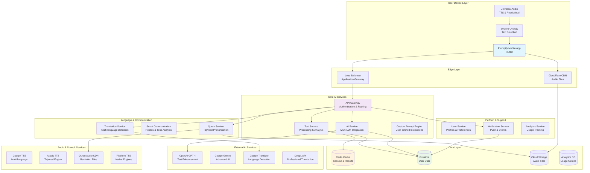

### **2.2 Architecture Layers**

#### **Presentation Layer**
- **Mobile Application (Flutter)**: Cross-platform mobile app with BLoC state management
- **System Overlay Services**: Platform-specific text selection and floating UI integration
- **Custom Keyboard Extensions**: Inline AI suggestions and text processing
- **User Interface Components**: Context-aware floating overlays, mini-interface, and action menus

#### **Application Layer**
- **API Gateway (Kong)**: Advanced routing, authentication, rate limiting, and API versioning
- **Core AI Services**: Multi-LLM integration, custom prompt processing, text analysis
- **Communication Services**: Smart replies, tone analysis, conversation context processing
- **Audio Services**: Universal TTS, specialized Arabic pronunciation, background audio management
- **Background Services**: Async processing, caching, and intelligent prefetching

#### **Data Layer**
- **Multi-Tier Cache (Redis)**: L1 (memory), L2 (Redis), L3 (database) caching strategy
- **Database (PostgreSQL)**: Primary data storage with read replicas and partitioning
- **Object Storage (S3)**: Audio files, voice datasets, and static assets with CDN
- **Analytics Storage**: Usage metrics, performance data, and AI quality scoring

#### **Integration Layer**
- **Multi-AI Provider Integration**: OpenAI, Google Gemini, specialized TTS engines
- **Platform APIs**: Android accessibility services, iOS share extensions, keyboard APIs
- **Message Queues**: Async communication, background jobs, and event processing
- **Circuit Breakers**: Fault tolerance and fallback mechanisms for external services

---

## **3. Mobile Application Architecture**

### **3.1 Flutter App Architecture**

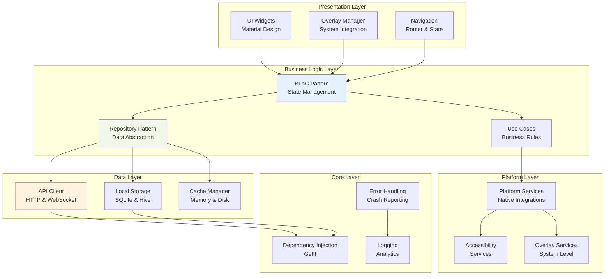

### **3.2 Enhanced Mobile Architecture Components**

#### **Universal Text Selection Engine**
```dart
// Enhanced platform-specific text selection with context awareness
abstract class TextSelectionDetector {
  Stream<TextSelectionEvent> get selectionStream;
  Future<void> startDetection();
  Future<void> stopDetection();
  Future<TextContext> analyzeContext(String text);
}

class AndroidTextDetector extends TextSelectionDetector {
  late AccessibilityService accessibilityService;
  late ConversationAnalyzer conversationAnalyzer;
  
  @override
  Future<TextContext> analyzeContext(String text) async {
    final appContext = await accessibilityService.getCurrentAppContext();
    final conversationHistory = await conversationAnalyzer.getRecentMessages();
    
    return TextContext(
      selectedText: text,
      sourceApp: appContext.packageName,
      inputFieldType: appContext.inputType,
      conversationHistory: conversationHistory,
      detectedLanguage: await detectLanguage(text),
      suggestedFeatures: await getSuggestedFeatures(text, appContext),
    );
  }
}

class IOSTextDetector extends TextSelectionDetector {
  late ShareExtensionManager shareExtension;
  late KeyboardExtensionManager keyboardExtension;
  
  @override
  Future<TextContext> analyzeContext(String text) async {
    final context = await shareExtension.getShareContext();
    return TextContext(
      selectedText: text,
      sourceApp: context.sourceApplication,
      inputFieldType: InputFieldType.unknown, // iOS limitation
      detectedLanguage: await detectLanguage(text),
      suggestedFeatures: await getSuggestedFeatures(text, context),
    );
  }
}

class TextContext {
  final String selectedText;
  final String sourceApp;
  final InputFieldType inputFieldType;
  final List<Message>? conversationHistory;
  final String detectedLanguage;
  final List<AIFeature> suggestedFeatures;
  
  const TextContext({
    required this.selectedText,
    required this.sourceApp,
    required this.inputFieldType,
    this.conversationHistory,
    required this.detectedLanguage,
    required this.suggestedFeatures,
  });
}
```

#### **Overlay Management System**
```dart
class OverlayManager {
  Future<void> showActionOverlay(
    TextSelection selection,
    List<AIAction> actions,
  );
  
  Future<void> hideOverlay();
  
  void updateOverlayPosition(Offset position);
}
```

#### **Enhanced AI Service Client**
```dart
class AIServiceClient {
  final Dio _httpClient;
  final CacheManager _cacheManager;
  final CircuitBreaker _circuitBreaker;
  
  AIServiceClient({
    required Dio httpClient,
    required CacheManager cacheManager,
    required CircuitBreaker circuitBreaker,
  }) : _httpClient = httpClient,
       _cacheManager = cacheManager,
       _circuitBreaker = circuitBreaker;

  // Enhanced text processing with custom prompts
  Future<EnhancementResponse> enhanceText(
    String text,
    EnhancementRequest request,
  ) async {
    final cacheKey = _generateCacheKey(text, request);
    
    // Check cache first
    final cached = await _cacheManager.get<EnhancementResponse>(cacheKey);
    if (cached != null) {
      return cached;
    }
    
    // Make API call with circuit breaker
    final response = await _circuitBreaker.execute(() async {
      return await _httpClient.post('/api/v2/text/enhance', data: {
        'text': text,
        'enhancement_type': request.type.name,
        'custom_prompt': request.customPrompt,
        'target_tone': request.targetTone?.name,
        'context': request.context?.toJson(),
      });
    });
    
    final result = EnhancementResponse.fromJson(response.data);
    
    // Cache result
    await _cacheManager.set(cacheKey, result, duration: Duration(hours: 1));
    
    return result;
  }
  
  // Smart conversation analysis and reply generation
  Future<SmartReplyResponse> generateSmartReplies(
    List<Message> conversationHistory,
    ReplyStyle style,
  ) async {
    return await _circuitBreaker.execute(() async {
      final response = await _httpClient.post('/api/v2/communication/smart-replies', data: {
        'conversation_history': conversationHistory.map((m) => m.toJson()).toList(),
        'reply_style': style.name,
        'max_suggestions': 3,
      });
      
      return SmartReplyResponse.fromJson(response.data);
    });
  }
  
  // Tone analysis and adjustment
  Future<ToneAnalysisResponse> analyzeTone(
    String text,
    ToneAdjustmentRequest? adjustment,
  ) async {
    return await _circuitBreaker.execute(() async {
      final response = await _httpClient.post('/api/v2/communication/tone-analysis', data: {
        'text': text,
        'adjustment': adjustment?.toJson(),
      });
      
      return ToneAnalysisResponse.fromJson(response.data);
    });
  }
  
  // Enhanced translation with alternatives
  Future<TranslationResponse> translateText(
    String text,
    String targetLanguage, {
    bool includeAlternatives = true,
    bool includePronunciation = false,
  }) async {
    final cacheKey = 'translation:${text.hashCode}:$targetLanguage';
    final cached = await _cacheManager.get<TranslationResponse>(cacheKey);
    
    if (cached != null) {
      return cached;
    }
    
    final response = await _circuitBreaker.execute(() async {
      return await _httpClient.post('/api/v2/language/translate', data: {
        'text': text,
        'target_language': targetLanguage,
        'include_alternatives': includeAlternatives,
        'include_pronunciation': includePronunciation,
      });
    });
    
    final result = TranslationResponse.fromJson(response.data);
    await _cacheManager.set(cacheKey, result, duration: Duration(hours: 24));
    
    return result;
  }
  
  // Universal audio processing
  Future<AudioResponse> getAudioPronunciation(
    String text,
    String language, {
    AudioOptions? options,
  }) async {
    return await _circuitBreaker.execute(() async {
      final response = await _httpClient.post('/api/v2/audio/pronunciation', data: {
        'text': text,
        'language': language,
        'voice': options?.voice,
        'speed': options?.speed ?? 1.0,
        'is_quran_mode': language == 'ar' && options?.isQuranMode == true,
      });
      
      return AudioResponse.fromJson(response.data);
    });
  }
  
  // Quran-specific processing
  Future<QuranResponse> processQuranVerse(
    String arabicText,
    QuranOptions options,
  ) async {
    return await _circuitBreaker.execute(() async {
      final response = await _httpClient.post('/api/v2/quran/analyze', data: {
        'arabic_text': arabicText,
        'reciter': options.reciter,
        'include_translation': options.includeTranslation,
        'include_transliteration': options.includeTransliteration,
        'tajweed_markers': options.includeTajweedMarkers,
      });
      
      return QuranResponse.fromJson(response.data);
    });
  }
}
```

### **3.3 State Management Architecture**

#### **BLoC Pattern Implementation**
```dart
// Text Enhancement BLoC
class TextEnhancementBloc extends Bloc<TextEnhancementEvent, TextEnhancementState> {
  final AIRepository aiRepository;
  final CacheRepository cacheRepository;
  
  TextEnhancementBloc({
    required this.aiRepository,
    required this.cacheRepository,
  }) : super(TextEnhancementInitial()) {
    on<RewriteTextEvent>(_onRewriteText);
    on<TranslateTextEvent>(_onTranslateText);
    on<GetPronunciationEvent>(_onGetPronunciation);
  }
  
  Future<void> _onRewriteText(
    RewriteTextEvent event,
    Emitter<TextEnhancementState> emit,
  ) async {
    emit(TextEnhancementLoading());
    
    try {
      // Check cache first
      final cachedResult = await cacheRepository.getCachedRewrite(
        event.text,
        event.type,
      );
      
      if (cachedResult != null) {
        emit(TextEnhancementSuccess(result: cachedResult));
        return;
      }
      
      // Make API call
      final result = await aiRepository.rewriteText(
        event.text,
        event.type,
      );
      
      // Cache result
      await cacheRepository.cacheRewrite(
        event.text,
        event.type,
        result,
      );
      
      emit(TextEnhancementSuccess(result: result));
    } catch (error) {
      emit(TextEnhancementError(message: error.toString()));
    }
  }
}
```

---

## **4. Backend Services Architecture**

### **4.1 Microservices Overview**

```mermaid
graph TB
    subgraph "API Gateway Layer"
        GW[Kong API Gateway<br/>Rate Limiting & Auth]
    end
    
    subgraph "Core AI Services"
        TS[Text Service<br/>:3001]
        AS[AI Service<br/>:3002]
        CP[Custom Prompt Engine<br/>:3003]
        TA[Tone Analysis Service<br/>:3004]
    end
    
    subgraph "Language & Communication"
        TRS[Translation Service<br/>:3005]
        SC[Smart Communication<br/>:3006]
        UA[Universal Audio<br/>:3007]
        QS[Quran Service<br/>:3008]
    end
    
    subgraph "Platform Services"
        US[User Service<br/>:3009]
        NS[Notification Service<br/>:3010]
        AS_SVC[Analytics Service<br/>:3011]
        CS[Cache Service<br/>:3012]
    end
    
    subgraph "Support Services"
        AC[Auth Service<br/>:3010]
        AN[Analytics Service<br/>:3011]
        CS[Cache Service<br/>:3012]
        FS[File Service<br/>:3013]
    end
    
    subgraph "Message Queue"
        MQ[Redis Queue<br/>Background Jobs]
    end
    
    subgraph "AI & Language APIs"
        OAI[OpenAI GPT-4]
        GEMINI[Google Gemini]
        GT[Google Translate]
        DEEPL[DeepL API]
    end
    
    subgraph "Audio & Speech APIs"
        GTTS[Google TTS]
        ATTS[Arabic TTS Engine]
        NATIVE[Platform TTS]
        QA[Quran Audio CDN]
    end
    
    GW --> TS
    GW --> AS
    GW --> CP
    GW --> TA
    GW --> TRS
    GW --> SC
    GW --> QS
    GW --> US
    
    AS --> OAI
    AS --> GEMINI
    CP --> OAI
    TA --> OAI
    TRS --> GT
    TRS --> DEEPL
    SC --> OAI
    UA --> GTTS
    UA --> NATIVE
    QS --> ATTS
    QS --> QA
    
    TS --> MQ
    AS --> MQ
    SC --> MQ
    NS --> MQ
    
    US --> AC
    AS_SVC --> CS
    QS --> FS
    
    style GW fill:#e8eaf6
    style TS fill:#e1f5fe
    style AS fill:#f3e5f5
    style MQ fill:#fff3e0
```

### **4.2 Service Specifications**

#### **Enhanced Text Service (Node.js + Express)**
```javascript
// Advanced text processing and analysis service with context awareness
const express = require('express');
const app = express();

// Enhanced text analysis with context
app.post('/api/v2/text/analyze', async (req, res) => {
  const { text, context, options } = req.body;
  
  try {
    // Multi-dimensional text analysis
    const analysis = await Promise.all([
      textAnalyzer.analyzeLanguage(text),
      textAnalyzer.analyzeSentiment(text),
      textAnalyzer.analyzeComplexity(text),
      textAnalyzer.analyzeContext(text, context),
      textAnalyzer.suggestFeatures(text, context)
    ]);
    
    const result = {
      language: analysis[0],
      sentiment: analysis[1],
      complexity: analysis[2],
      contextAnalysis: analysis[3],
      suggestedFeatures: analysis[4],
      confidence: calculateOverallConfidence(analysis)
    };
    
    await cacheService.set(
      `analysis:${hash(text + JSON.stringify(context))}`,
      result,
      600 // 10 minutes TTL
    );
    
    res.json({
      success: true,
      data: result,
      metadata: {
        processingTime: Date.now() - req.startTime,
        apiVersion: 'v2'
      }
    });
  } catch (error) {
    logger.error('Enhanced text analysis failed', { text, context, error });
    res.status(500).json({
      success: false,
      error: 'Analysis failed'
    });
  }
});

// Universal text enhancement endpoint
app.post('/api/v2/text/enhance', async (req, res) => {
  const { 
    text, 
    enhancement_type, 
    custom_prompt, 
    target_tone, 
    context,
    ai_provider = 'openai' // Support multiple AI providers
  } = req.body;
  
  // Enhanced validation
  const validation = validateEnhancementRequest({
    text, enhancement_type, custom_prompt, target_tone
  });
  
  if (!validation.isValid) {
    return res.status(400).json({
      success: false,
      error: validation.error
    });
  }
  
  // Intelligent cache key generation
  const cacheKey = generateEnhancementCacheKey({
    text, enhancement_type, custom_prompt, target_tone, ai_provider
  });
  
  // Check multi-tier cache
  const cached = await cacheService.getFromMultiTier(cacheKey);
  if (cached) {
    return res.json({
      success: true,
      data: cached,
      metadata: { 
        cached: true, 
        cacheLevel: cached.cacheLevel,
        apiVersion: 'v2'
      }
    });
  }
  
  // Queue for async processing with priority
  const jobPriority = calculateJobPriority(req.user, enhancement_type);
  const jobId = await queueService.add('text-enhancement-v2', {
    text,
    enhancement_type,
    custom_prompt,
    target_tone,
    context,
    ai_provider,
    userId: req.user.id,
    requestTime: Date.now()
  }, { priority: jobPriority });
  
  res.json({
    success: true,
    jobId,
    status: 'processing',
    estimatedTime: calculateEstimatedProcessingTime(enhancement_type, text.length),
    apiVersion: 'v2'
  });
});

// Text context analysis for intelligent suggestions
app.post('/api/v2/text/context', async (req, res) => {
  const { text, app_context, conversation_history } = req.body;
  
  try {
    const contextAnalysis = await contextAnalyzer.analyze({
      text,
      sourceApp: app_context?.package_name,
      inputFieldType: app_context?.input_type,
      conversationHistory: conversation_history,
      userPreferences: req.user.preferences
    });
    
    res.json({
      success: true,
      data: {
        suggestedFeatures: contextAnalysis.features,
        contextualPrompts: contextAnalysis.prompts,
        priorityLevel: contextAnalysis.priority,
        confidence: contextAnalysis.confidence
      }
    });
  } catch (error) {
    logger.error('Context analysis failed', error);
    res.status(500).json({
      success: false,
      error: 'Context analysis failed'
    });
  }
});
```

#### **Multi-AI Service (Node.js + Multiple Providers)**
```javascript
// Enhanced AI processing service with multiple provider support
const OpenAI = require('openai');
const { GoogleGenerativeAI } = require('@google/generative-ai');
const CircuitBreaker = require('opossum');

class MultiAIService {
  constructor() {
    // Initialize AI providers
    this.openai = new OpenAI({ apiKey: process.env.OPENAI_API_KEY });
    this.gemini = new GoogleGenerativeAI(process.env.GEMINI_API_KEY);
    
    // Circuit breakers for each provider
    this.openaiBreaker = new CircuitBreaker(this.callOpenAI.bind(this), {
      timeout: 10000,
      errorThresholdPercentage: 50,
      resetTimeout: 30000
    });
    
    this.geminiBreaker = new CircuitBreaker(this.callGemini.bind(this), {
      timeout: 10000,
      errorThresholdPercentage: 50,
      resetTimeout: 30000
    });
    
    // Advanced prompt templates
    this.promptTemplates = {
      professional: {
        system: "You are a professional writing assistant specializing in business communication.",
        user: "Rewrite the following text in a professional tone while maintaining clarity and original meaning. Focus on formal language, proper structure, and business-appropriate terminology:\n\nOriginal: {text}"
      },
      casual: {
        system: "You are a friendly writing assistant that helps make text more conversational and approachable.",
        user: "Rewrite the following text in a casual, friendly tone while keeping the core message intact. Use conversational language and a warm approach:\n\nOriginal: {text}"
      },
      empathetic: {
        system: "You are a communication expert specializing in empathetic and emotionally intelligent writing.",
        user: "Rewrite the following text with an empathetic tone, showing understanding and emotional awareness:\n\nOriginal: {text}"
      },
      concise: {
        system: "You are an expert in concise communication, specializing in clear and brief writing.",
        user: "Rewrite the following text to be more concise while preserving all important information:\n\nOriginal: {text}"
      },
      custom: {
        system: "You are a versatile writing assistant that follows specific user instructions precisely.",
        user: "{customPrompt}\n\nOriginal text: {text}"
      }
    };
  }
  
  async enhanceText(text, options) {
    const { type, customPrompt, targetTone, provider = 'auto', context } = options;
    
    try {
      // Choose optimal AI provider based on task and availability
      const selectedProvider = await this.selectOptimalProvider(provider, type, text.length);
      
      // Generate enhanced text
      const enhancement = await this.processWithProvider(selectedProvider, {
        text,
        type,
        customPrompt,
        targetTone,
        context
      });
      
      // Generate alternatives using different strategies
      const alternatives = await this.generateAlternatives(text, {
        type,
        customPrompt,
        targetTone,
        excludeProvider: selectedProvider
      });
      
      return {
        original: text,
        enhanced: enhancement.text,
        type,
        provider: selectedProvider,
        confidence: enhancement.confidence,
        alternatives,
        metadata: {
          processingTime: enhancement.processingTime,
          modelUsed: enhancement.model,
          tokensUsed: enhancement.tokensUsed
        }
      };
    } catch (error) {
      logger.error('AI enhancement failed', { text, options, error });
      
      // Fallback to cached results or simpler processing
      return await this.handleEnhancementFailure(text, options, error);
    }
  }
  
  async processWithProvider(provider, options) {
    const startTime = Date.now();
    
    switch (provider) {
      case 'openai':
        return await this.openaiBreaker.fire(options);
      case 'gemini':
        return await this.geminiBreaker.fire(options);
      default:
        throw new Error(`Unsupported AI provider: ${provider}`);
    }
  }
  
  async callOpenAI(options) {
    const { text, type, customPrompt, targetTone, context } = options;
    const template = this.promptTemplates[type] || this.promptTemplates.custom;
    
    const messages = [
      {
        role: "system",
        content: template.system + (context ? ` Context: ${JSON.stringify(context)}` : '')
      },
      {
        role: "user",
        content: template.user
          .replace('{text}', text)
          .replace('{customPrompt}', customPrompt || '')
      }
    ];
    
    if (targetTone) {
      messages[1].content += `\n\nTarget tone: ${targetTone}`;
    }
    
    const completion = await this.openai.chat.completions.create({
      model: "gpt-4",
      messages,
      max_tokens: Math.min(2000, text.length * 2),
      temperature: type === 'creative' ? 0.8 : 0.7,
      presence_penalty: 0.1,
      frequency_penalty: 0.1
    });
    
    return {
      text: completion.choices[0].message.content.trim(),
      confidence: 0.95,
      model: 'gpt-4',
      tokensUsed: completion.usage.total_tokens,
      processingTime: Date.now() - this.startTime
    };
  }
  
  async callGemini(options) {
    const { text, type, customPrompt, targetTone } = options;
    const model = this.gemini.getGenerativeModel({ model: "gemini-1.5-pro" });
    
    const template = this.promptTemplates[type] || this.promptTemplates.custom;
    const prompt = template.user
      .replace('{text}', text)
      .replace('{customPrompt}', customPrompt || '')
      + (targetTone ? `\n\nTarget tone: ${targetTone}` : '');
    
    const result = await model.generateContent(prompt);
    const response = await result.response;
    
    return {
      text: response.text().trim(),
      confidence: 0.93,
      model: 'gemini-1.5-pro',
      tokensUsed: response.usageMetadata?.totalTokenCount || 0,
      processingTime: Date.now() - this.startTime
    };
  }
  
  async selectOptimalProvider(preferredProvider, taskType, textLength) {
    if (preferredProvider !== 'auto') {
      return preferredProvider;
    }
    
    // Provider selection logic based on task type and system status
    const providerStatus = await this.checkProviderStatus();
    
    // OpenAI is generally better for complex rewriting and custom prompts
    if (['professional', 'custom', 'empathetic'].includes(taskType) && providerStatus.openai.healthy) {
      return 'openai';
    }
    
    // Gemini is competitive for translation and simpler tasks
    if (['casual', 'concise'].includes(taskType) && providerStatus.gemini.healthy) {
      return 'gemini';
    }
    
    // Fallback to any available provider
    return providerStatus.openai.healthy ? 'openai' : 'gemini';
  }
  
  async generateAlternatives(text, options) {
    const alternatives = [];
    const { type, excludeProvider } = options;
    
    try {
      // Generate alternatives using different approaches
      const alternativeStrategies = [
        { provider: excludeProvider === 'openai' ? 'gemini' : 'openai', temperature: 0.8 },
        { provider: excludeProvider === 'openai' ? 'gemini' : 'openai', temperature: 0.9 }
      ];
      
      for (const strategy of alternativeStrategies) {
        try {
          const alternative = await this.processWithProvider(strategy.provider, {
            ...options,
            text,
            type
          });
          alternatives.push(alternative.text);
        } catch (error) {
          logger.warn('Alternative generation failed', { strategy, error });
        }
      }
    } catch (error) {
      logger.error('Alternatives generation failed', error);
    }
    
    return alternatives;
  }
  
  async checkProviderStatus() {
    return {
      openai: {
        healthy: !this.openaiBreaker.opened,
        latency: await this.measureProviderLatency('openai')
      },
      gemini: {
        healthy: !this.geminiBreaker.opened,
        latency: await this.measureProviderLatency('gemini')
      }
    };
  }
  
  async handleEnhancementFailure(text, options, error) {
    // Try to get cached result as fallback
    const cacheKey = `fallback:${hash(text + JSON.stringify(options))}`;
    const cached = await cacheService.get(cacheKey);
    
    if (cached) {
      return { ...cached, fromCache: true, error: error.message };
    }
    
    // Return basic enhancement as last resort
    return {
      original: text,
      enhanced: text, // No change
      type: options.type,
      provider: 'fallback',
      confidence: 0.0,
      alternatives: [],
      error: error.message
    };
  }
}
```

#### **Enhanced Translation Service (Node.js + Multiple Providers)**
```javascript
// Advanced translation service with multiple providers and context awareness
const { Translate } = require('@google-cloud/translate').v2;
const deepl = require('deepl-node');
const CircuitBreaker = require('opossum');

class EnhancedTranslationService {
  constructor() {
    this.googleTranslate = new Translate({ projectId: process.env.GOOGLE_PROJECT_ID });
    this.deepLTranslator = new deepl.Translator(process.env.DEEPL_API_KEY);
    
    // Circuit breakers for each provider
    this.googleBreaker = new CircuitBreaker(this.translateWithGoogle.bind(this), {
      timeout: 8000,
      errorThresholdPercentage: 40,
      resetTimeout: 30000
    });
    
    this.deeplBreaker = new CircuitBreaker(this.translateWithDeepL.bind(this), {
      timeout: 8000,
      errorThresholdPercentage: 40,
      resetTimeout: 30000
    });
    
    // Language pair quality mapping
    this.providerQuality = {
      'deepl': ['en', 'de', 'fr', 'es', 'it', 'pt', 'ru', 'zh', 'ja'],
      'google': '*' // Google supports more languages
    };
  }
  
  async detectAndTranslate(text, options = {}) {
    const { 
      targetLanguage = 'en', 
      includeAlternatives = true,
      includePronunciation = false,
      context = null,
      preferredProvider = 'auto'
    } = options;
    
    try {
      // Enhanced language detection with context
      const detection = await this.detectLanguageWithContext(text, context);
      const sourceLanguage = detection.language;
      
      // Skip translation if already in target language
      if (sourceLanguage === targetLanguage) {
        return {
          original: text,
          translated: text,
          sourceLanguage,
          targetLanguage,
          confidence: detection.confidence,
          provider: 'none',
          alternatives: []
        };
      }
      
      // Select optimal provider based on language pair and quality
      const provider = this.selectOptimalProvider(
        sourceLanguage, 
        targetLanguage, 
        preferredProvider
      );
      
      // Perform translation with selected provider
      const translation = await this.translateWithProvider(provider, {
        text,
        sourceLanguage,
        targetLanguage,
        context
      });
      
      // Generate alternatives if requested
      const alternatives = includeAlternatives 
        ? await this.generateTranslationAlternatives(text, sourceLanguage, targetLanguage, provider)
        : [];
      
      // Generate pronunciation if requested
      const pronunciation = includePronunciation
        ? await this.generatePronunciation(translation.text, targetLanguage)
        : null;
      
      return {
        original: text,
        translated: translation.text,
        sourceLanguage,
        targetLanguage,
        confidence: Math.min(detection.confidence, translation.confidence),
        provider: translation.provider,
        alternatives,
        pronunciation,
        metadata: {
          processingTime: Date.now() - this.startTime,
          contextUsed: context !== null,
          qualityScore: translation.qualityScore
        }
      };
    } catch (error) {
      logger.error('Enhanced translation failed', { text, options, error });
      return await this.handleTranslationFailure(text, options, error);
    }
  }
  
  async translateWithProvider(provider, options) {
    const { text, sourceLanguage, targetLanguage, context } = options;
    
    switch (provider) {
      case 'deepl':
        return await this.deeplBreaker.fire(text, sourceLanguage, targetLanguage, context);
      case 'google':
        return await this.googleBreaker.fire(text, sourceLanguage, targetLanguage, context);
      default:
        throw new Error(`Unsupported translation provider: ${provider}`);
    }
  }
  
  async translateWithDeepL(text, sourceLanguage, targetLanguage, context) {
    try {
      // DeepL with context enhancement
      const enhancedText = context ? this.enhanceTextWithContext(text, context) : text;
      
      const result = await this.deepLTranslator.translateText(
        enhancedText,
        sourceLanguage,
        targetLanguage,
        {
          preserveFormatting: true,
          formality: context?.tone === 'formal' ? 'more' : 'default'
        }
      );
      
      return {
        text: result.text,
        confidence: 0.95, // DeepL generally high quality
        provider: 'deepl',
        qualityScore: this.calculateQualityScore(text, result.text, 'deepl')
      };
    } catch (error) {
      logger.error('DeepL translation failed', { text, sourceLanguage, targetLanguage, error });
      throw error;
    }
  }
  
  async translateWithGoogle(text, sourceLanguage, targetLanguage, context) {
    try {
      const [translation] = await this.googleTranslate.translate(text, {
        from: sourceLanguage,
        to: targetLanguage,
        format: 'text',
        model: 'nmt' // Neural Machine Translation
      });
      
      return {
        text: translation,
        confidence: 0.88,
        provider: 'google',
        qualityScore: this.calculateQualityScore(text, translation, 'google')
      };
    } catch (error) {
      logger.error('Google translation failed', { text, sourceLanguage, targetLanguage, error });
      throw error;
    }
  }
  
  async detectLanguageWithContext(text, context) {
    // Enhanced language detection using multiple signals
    const [basicDetection] = await this.googleTranslate.detect(text);
    
    // Use context to improve detection confidence
    if (context?.sourceApp) {
      const appLanguageHints = this.getLanguageHintsFromApp(context.sourceApp);
      if (appLanguageHints.includes(basicDetection.language)) {
        basicDetection.confidence = Math.min(basicDetection.confidence + 0.1, 1.0);
      }
    }
    
    return basicDetection;
  }
  
  selectOptimalProvider(sourceLanguage, targetLanguage, preferred) {
    if (preferred !== 'auto') {
      return preferred;
    }
    
    // Check if DeepL supports this language pair and is available
    const deeplSupports = this.providerQuality.deepl.includes(sourceLanguage) && 
                         this.providerQuality.deepl.includes(targetLanguage);
    
    if (deeplSupports && !this.deeplBreaker.opened) {
      return 'deepl'; // Prefer DeepL for supported languages
    }
    
    return 'google'; // Fallback to Google for broader language support
  }
  
  async generateTranslationAlternatives(text, sourceLanguage, targetLanguage, excludeProvider) {
    const alternatives = [];
    
    try {
      // Use the other provider for alternatives
      const alternativeProvider = excludeProvider === 'deepl' ? 'google' : 'deepl';
      
      // Only generate if the alternative provider supports the language pair
      if (this.canProviderHandle(alternativeProvider, sourceLanguage, targetLanguage)) {
        const alternative = await this.translateWithProvider(alternativeProvider, {
          text,
          sourceLanguage,
          targetLanguage,
          context: null
        });
        
        alternatives.push({
          text: alternative.text,
          provider: alternative.provider,
          confidence: alternative.confidence
        });
      }
      
      // Generate style variations with the same provider
      if (excludeProvider === 'deepl') {
        try {
          const formalVersion = await this.deepLTranslator.translateText(
            text,
            sourceLanguage,
            targetLanguage,
            { formality: 'more' }
          );
          
          if (formalVersion.text !== alternatives[0]?.text) {
            alternatives.push({
              text: formalVersion.text,
              provider: 'deepl-formal',
              confidence: 0.93
            });
          }
        } catch (error) {
          logger.warn('Formal alternative generation failed', error);
        }
      }
    } catch (error) {
      logger.warn('Translation alternatives generation failed', error);
    }
    
    return alternatives;
  }
  
  async generatePronunciation(text, language) {
    try {
      // This would integrate with TTS services for pronunciation
      return {
        phonetic: await this.generatePhoneticTranscription(text, language),
        audioUrl: await this.generatePronunciationAudio(text, language)
      };
    } catch (error) {
      logger.warn('Pronunciation generation failed', error);
      return null;
    }
  }
  
  canProviderHandle(provider, sourceLanguage, targetLanguage) {
    if (provider === 'google') return true; // Google supports most languages
    
    return this.providerQuality[provider]?.includes(sourceLanguage) &&
           this.providerQuality[provider]?.includes(targetLanguage);
  }
  
  calculateQualityScore(originalText, translatedText, provider) {
    // Simple quality heuristics (could be enhanced with ML models)
    const lengthRatio = translatedText.length / originalText.length;
    const providerBonus = provider === 'deepl' ? 0.1 : 0.0;
    
    let score = 0.8; // Base score
    
    // Reasonable length ratio indicates good translation
    if (lengthRatio >= 0.5 && lengthRatio <= 2.0) {
      score += 0.1;
    }
    
    // Provider quality bonus
    score += providerBonus;
    
    return Math.min(score, 1.0);
  }
  
  async handleTranslationFailure(text, options, error) {
    // Try to get cached result as fallback
    const cacheKey = `translation_fallback:${hash(text + options.targetLanguage)}`;
    const cached = await cacheService.get(cacheKey);
    
    if (cached) {
      return { ...cached, fromCache: true, error: error.message };
    }
    
    // Return untranslated text as last resort
    return {
      original: text,
      translated: text,
      sourceLanguage: 'unknown',
      targetLanguage: options.targetLanguage,
      confidence: 0.0,
      provider: 'fallback',
      alternatives: [],
      error: error.message
    };
  }
}
```

#### **Smart Communication Service (Node.js + AI)**
```javascript
// Service for intelligent conversation analysis and smart replies
class SmartCommunicationService {
  constructor() {
    this.aiService = new MultiAIService();
    this.conversationAnalyzer = new ConversationAnalyzer();
    this.toneAnalyzer = new ToneAnalyzer();
  }
  
  async generateSmartReplies(conversationHistory, options = {}) {
    const {
      replyStyle = 'balanced',
      maxSuggestions = 3,
      userPreferences = {},
      context = {}
    } = options;
    
    try {
      // Analyze conversation context
      const analysis = await this.conversationAnalyzer.analyze({
        messages: conversationHistory,
        context,
        userPreferences
      });
      
      // Generate contextually appropriate replies
      const replies = await this.generateContextualReplies({
        analysis,
        replyStyle,
        maxSuggestions
      });
      
      return {
        suggestions: replies,
        conversationTone: analysis.tone,
        confidence: analysis.confidence,
        metadata: {
          analysisType: analysis.type,
          contextFactors: analysis.factors
        }
      };
    } catch (error) {
      logger.error('Smart reply generation failed', { conversationHistory, options, error });
      return this.getFallbackReplies(replyStyle);
    }
  }
  
  async analyzeTone(text, options = {}) {
    const {
      includeAdjustmentSuggestions = true,
      targetAudience = 'general',
      context = {}
    } = options;
    
    try {
      const analysis = await this.toneAnalyzer.analyze({
        text,
        targetAudience,
        context
      });
      
      const result = {
        detectedTone: analysis.primary_tone,
        confidence: analysis.confidence,
        emotionalIndicators: analysis.emotions,
        formalityLevel: analysis.formality,
        sentimentScore: analysis.sentiment
      };
      
      if (includeAdjustmentSuggestions) {
        result.adjustmentSuggestions = await this.generateToneAdjustments(text, analysis);
      }
      
      return result;
    } catch (error) {
      logger.error('Tone analysis failed', { text, options, error });
      throw error;
    }
  }
  
  async adjustTone(text, targetTone, options = {}) {
    const {
      preserveMeaning = true,
      adjustmentLevel = 'moderate',
      context = {}
    } = options;
    
    try {
      const prompt = this.buildToneAdjustmentPrompt({
        text,
        targetTone,
        preserveMeaning,
        adjustmentLevel,
        context
      });
      
      const adjustment = await this.aiService.enhanceText(text, {
        type: 'custom',
        customPrompt: prompt,
        provider: 'openai' // OpenAI better for nuanced tone work
      });
      
      // Validate tone adjustment
      const validation = await this.validateToneAdjustment(
        text,
        adjustment.enhanced,
        targetTone
      );
      
      return {
        original: text,
        adjusted: adjustment.enhanced,
        targetTone,
        actualTone: validation.achievedTone,
        adjustmentSuccess: validation.success,
        confidence: validation.confidence,
        alternatives: adjustment.alternatives
      };
    } catch (error) {
      logger.error('Tone adjustment failed', { text, targetTone, options, error });
      throw error;
    }
  }
}
```

#### **Universal Audio Service (Node.js + Multiple TTS)**
```javascript
// Service for universal text-to-speech and audio processing
class UniversalAudioService {
  constructor() {
    this.googleTTS = new TextToSpeechClient();
    this.arabicTTSEngine = new ArabicTTSEngine();
    this.platformTTS = new PlatformTTSAdapter();
    this.quranAudioService = new QuranAudioService();
  }
  
  async generateAudio(text, options = {}) {
    const {
      language = 'en',
      voice = 'default',
      speed = 1.0,
      pitch = 0.0,
      isQuranMode = false,
      outputFormat = 'mp3',
      quality = 'standard'
    } = options;
    
    try {
      // Route to appropriate TTS engine based on requirements
      let audioResult;
      
      if (isQuranMode && language === 'ar') {
        audioResult = await this.generateQuranAudio(text, options);
      } else if (language === 'ar') {
        audioResult = await this.generateArabicAudio(text, options);
      } else {
        audioResult = await this.generateStandardAudio(text, options);
      }
      
      // Post-process audio if needed
      if (options.enhanceAudio) {
        audioResult = await this.enhanceAudioQuality(audioResult, options);
      }
      
      return {
        audioUrl: audioResult.url,
        duration: audioResult.duration,
        language,
        voice: audioResult.voice,
        metadata: {
          engine: audioResult.engine,
          quality,
          fileSize: audioResult.fileSize,
          processingTime: audioResult.processingTime
        }
      };
    } catch (error) {
      logger.error('Audio generation failed', { text, options, error });
      throw error;
    }
  }
  
  async generateQuranAudio(arabicText, options) {
    const {
      reciter = 'mishary',
      tajweedLevel = 'standard',
      includeMarkers = true
    } = options;
    
    // Attempt to identify specific Quran verse
    const verseInfo = await this.quranAudioService.identifyVerse(arabicText);
    
    if (verseInfo.found) {
      // Use pre-recorded high-quality recitation
      const audioUrl = await this.quranAudioService.getVerseAudio(
        verseInfo.surah,
        verseInfo.verse,
        reciter
      );
      
      const markers = includeMarkers 
        ? await this.quranAudioService.getTajweedMarkers(verseInfo.surah, verseInfo.verse)
        : null;
      
      return {
        url: audioUrl,
        duration: verseInfo.duration,
        voice: reciter,
        engine: 'quran-audio-cdn',
        tajweedMarkers: markers,
        verseInfo
      };
    } else {
      // Generate using specialized Arabic TTS with Tajweed rules
      return await this.arabicTTSEngine.generateWithTajweed(arabicText, {
        reciterStyle: reciter,
        tajweedLevel,
        includeMarkers
      });
    }
  }
  
  async generateReadAloudAudio(text, options) {
    const {
      language,
      voice,
      speed = 1.0,
      highlightWords = true,
      backgroundPlayback = true
    } = options;
    
    // Generate audio with word-level timing for highlighting
    const audioResult = await this.generateStandardAudio(text, {
      ...options,
      includeWordTimings: highlightWords
    });
    
    if (highlightWords) {
      audioResult.wordTimings = await this.generateWordTimings(text, audioResult.duration);
    }
    
    return {
      ...audioResult,
      readAloudOptions: {
        highlightWords,
        backgroundPlayback,
        wordTimings: audioResult.wordTimings
      }
    };
  }
}
```

#### **Quran Service (Node.js + Audio Processing)**
```javascript
// Specialized service for Quranic text and audio
class QuranService {
  constructor() {
    this.quranData = require('../data/quran-metadata.json');
    this.audioBaseUrl = process.env.QURAN_AUDIO_CDN;
  }
  
  async detectQuranVerse(arabicText) {
    // Use fuzzy matching to identify Quranic verses
    const normalizedText = this.normalizeArabicText(arabicText);
    
    // Search through Quran database
    const matches = await this.searchVerses(normalizedText);
    
    if (matches.length > 0) {
      const bestMatch = matches[0];
      return {
        isQuranVerse: true,
        surah: bestMatch.surah,
        verse: bestMatch.verse,
        arabicText: bestMatch.arabicText,
        transliteration: bestMatch.transliteration,
        translation: bestMatch.translation,
        audioUrl: this.getAudioUrl(bestMatch.surah, bestMatch.verse),
        confidence: bestMatch.similarity
      };
    }
    
    return { isQuranVerse: false };
  }
  
  async getVerseAudio(surah, verse, reciter = 'mishary') {
    const audioFile = `${reciter}/${surah.toString().padStart(3, '0')}${verse.toString().padStart(3, '0')}.mp3`;
    const audioUrl = `${this.audioBaseUrl}/${audioFile}`;
    
    // Verify audio file exists
    const exists = await this.verifyAudioExists(audioUrl);
    
    if (!exists) {
      // Fallback to default reciter
      const fallbackUrl = `${this.audioBaseUrl}/default/${audioFile}`;
      return {
        audioUrl: fallbackUrl,
        reciter: 'default',
        duration: await this.getAudioDuration(fallbackUrl)
      };
    }
    
    return {
      audioUrl,
      reciter,
      duration: await this.getAudioDuration(audioUrl),
      tajweedMarkers: await this.getTajweedMarkers(surah, verse)
    };
  }
  
  normalizeArabicText(text) {
    // Remove diacritics and normalize Arabic text for matching
    return text
      .replace(/[\u064B-\u0652\u0670\u0640]/g, '') // Remove diacritics
      .replace(/\s+/g, ' ')
      .trim();
  }
  
  async getTajweedMarkers(surah, verse) {
    // Return tajweed pronunciation markers for the verse
    const tajweedData = await this.loadTajweedData(surah, verse);
    
    return tajweedData.map(marker => ({
      position: marker.position,
      type: marker.type, // ikhfa, ghunna, qalqalah, etc.
      duration: marker.duration,
      emphasis: marker.emphasis
    }));
  }
}
```

---

## **5. Data Architecture**

### **5.1 Data Model Design**

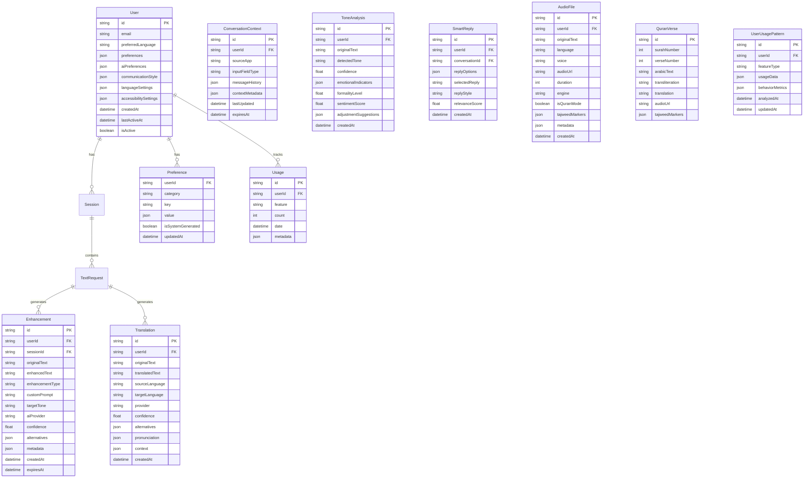

### **5.2 Cache Strategy**

#### **Redis Cache Layers**
```javascript
// Multi-level caching strategy
class CacheManager {
  constructor() {
    this.l1Cache = new Map(); // In-memory cache (L1)
    this.l2Cache = redis.createClient(); // Redis cache (L2)
    this.l3Cache = new CloudStorage(); // Object storage (L3)
  }
  
  async get(key) {
    // L1 Cache check
    if (this.l1Cache.has(key)) {
      return this.l1Cache.get(key);
    }
    
    // L2 Cache check
    const l2Result = await this.l2Cache.get(key);
    if (l2Result) {
      this.l1Cache.set(key, l2Result);
      return l2Result;
    }
    
    // L3 Cache check (for larger data like audio)
    const l3Result = await this.l3Cache.get(key);
    if (l3Result) {
      await this.l2Cache.setex(key, 3600, l3Result);
      this.l1Cache.set(key, l3Result);
      return l3Result;
    }
    
    return null;
  }
  
  async set(key, value, ttl = 3600) {
    // Set in all cache layers
    this.l1Cache.set(key, value);
    await this.l2Cache.setex(key, ttl, value);
    
    // Store large objects in L3
    if (this.isLargeObject(value)) {
      await this.l3Cache.set(key, value);
    }
  }
}

// Cache keys strategy
const CacheKeys = {
  textAnalysis: (text) => `analysis:${hash(text)}`,
  translation: (text, lang) => `trans:${hash(text)}:${lang}`,
  enhancement: (text, type) => `enhance:${hash(text)}:${type}`,
  quranVerse: (surah, verse) => `quran:${surah}:${verse}`,
  userPrefs: (userId) => `user:${userId}:prefs`,
  audioFile: (surah, verse, reciter) => `audio:${surah}:${verse}:${reciter}`
};
```

### **5.3 Data Retention Policy**

```javascript
// Data lifecycle management
class DataRetentionManager {
  constructor() {
    this.policies = {
      textRequests: {
        retention: '7 days',
        anonymize: true,
        backup: false
      },
      userSessions: {
        retention: '30 days',
        anonymize: false,
        backup: true
      },
      analytics: {
        retention: '2 years',
        anonymize: true,
        backup: true,
        aggregate: '1 year'
      },
      cacheData: {
        retention: '1 hour',
        anonymize: false,
        backup: false
      }
    };
  }
  
  async enforceRetention() {
    for (const [dataType, policy] of Object.entries(this.policies)) {
      await this.cleanupExpiredData(dataType, policy);
    }
  }
  
  async cleanupExpiredData(dataType, policy) {
    const cutoffDate = this.calculateCutoffDate(policy.retention);
    
    if (policy.anonymize) {
      await this.anonymizeData(dataType, cutoffDate);
    } else {
      await this.deleteData(dataType, cutoffDate);
    }
  }
}
```

---

## **6. Security Architecture**

### **6.1 Security Layers**

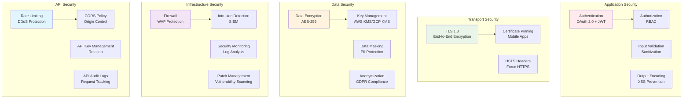

### **6.2 Authentication & Authorization**

#### **JWT Token Management**
```javascript
// JWT token handling with refresh mechanism
class AuthenticationService {
  generateTokens(user) {
    const accessToken = jwt.sign(
      {
        userId: user.id,
        email: user.email,
        roles: user.roles
      },
      process.env.ACCESS_TOKEN_SECRET,
      { expiresIn: '15m' }
    );
    
    const refreshToken = jwt.sign(
      { userId: user.id },
      process.env.REFRESH_TOKEN_SECRET,
      { expiresIn: '7d' }
    );
    
    return { accessToken, refreshToken };
  }
  
  async validateAccessToken(token) {
    try {
      const decoded = jwt.verify(token, process.env.ACCESS_TOKEN_SECRET);
      
      // Check token blacklist
      const isBlacklisted = await this.isTokenBlacklisted(token);
      if (isBlacklisted) {
        throw new Error('Token has been revoked');
      }
      
      return decoded;
    } catch (error) {
      throw new AuthenticationError('Invalid or expired token');
    }
  }
}

// Role-based access control
class AuthorizationService {
  constructor() {
    this.permissions = {
      'user': ['text:enhance', 'text:translate', 'quran:access'],
      'premium': ['text:enhance', 'text:translate', 'quran:access', 'custom:prompts'],
      'admin': ['*']
    };
  }
  
  checkPermission(userRoles, requiredPermission) {
    return userRoles.some(role => {
      const rolePermissions = this.permissions[role] || [];
      return rolePermissions.includes('*') || rolePermissions.includes(requiredPermission);
    });
  }
}
```

### **6.3 Data Encryption**

#### **Encryption at Rest**
```javascript
// Data encryption service
class EncryptionService {
  constructor() {
    this.algorithm = 'aes-256-gcm';
    this.keyService = new KeyManagementService();
  }
  
  async encryptSensitiveData(data, context) {
    const dataKey = await this.keyService.generateDataKey(context);
    const iv = crypto.randomBytes(16);
    
    const cipher = crypto.createCipher(this.algorithm, dataKey.key, iv);
    const encrypted = Buffer.concat([
      cipher.update(JSON.stringify(data), 'utf8'),
      cipher.final()
    ]);
    
    const authTag = cipher.getAuthTag();
    
    return {
      encryptedData: encrypted.toString('base64'),
      iv: iv.toString('base64'),
      authTag: authTag.toString('base64'),
      keyId: dataKey.keyId
    };
  }
  
  async decryptSensitiveData(encryptedPayload) {
    const dataKey = await this.keyService.getDataKey(encryptedPayload.keyId);
    const iv = Buffer.from(encryptedPayload.iv, 'base64');
    const authTag = Buffer.from(encryptedPayload.authTag, 'base64');
    const encrypted = Buffer.from(encryptedPayload.encryptedData, 'base64');
    
    const decipher = crypto.createDecipherGCM(this.algorithm, dataKey.key, iv);
    decipher.setAuthTag(authTag);
    
    const decrypted = Buffer.concat([
      decipher.update(encrypted),
      decipher.final()
    ]);
    
    return JSON.parse(decrypted.toString('utf8'));
  }
}
```

### **6.4 API Security**

#### **Rate Limiting Strategy**
```javascript
// Multi-tier rate limiting
class RateLimitingService {
  constructor() {
    this.limits = {
      anonymous: { requests: 10, window: '1h', burst: 2 },
      authenticated: { requests: 100, window: '1h', burst: 10 },
      premium: { requests: 1000, window: '1h', burst: 50 }
    };
  }
  
  async checkRateLimit(identifier, userTier) {
    const limit = this.limits[userTier] || this.limits.anonymous;
    const key = `rate_limit:${userTier}:${identifier}`;
    
    const current = await redis.get(key);
    const count = parseInt(current) || 0;
    
    if (count >= limit.requests) {
      throw new RateLimitError('Rate limit exceeded');
    }
    
    // Increment counter
    await redis.multi()
      .incr(key)
      .expire(key, this.parseTimeWindow(limit.window))
      .exec();
    
    return {
      allowed: true,
      remaining: limit.requests - count - 1,
      resetTime: Date.now() + this.parseTimeWindow(limit.window) * 1000
    };
  }
}
```

---

## **7. Integration Architecture**

### **7.1 External API Integration**

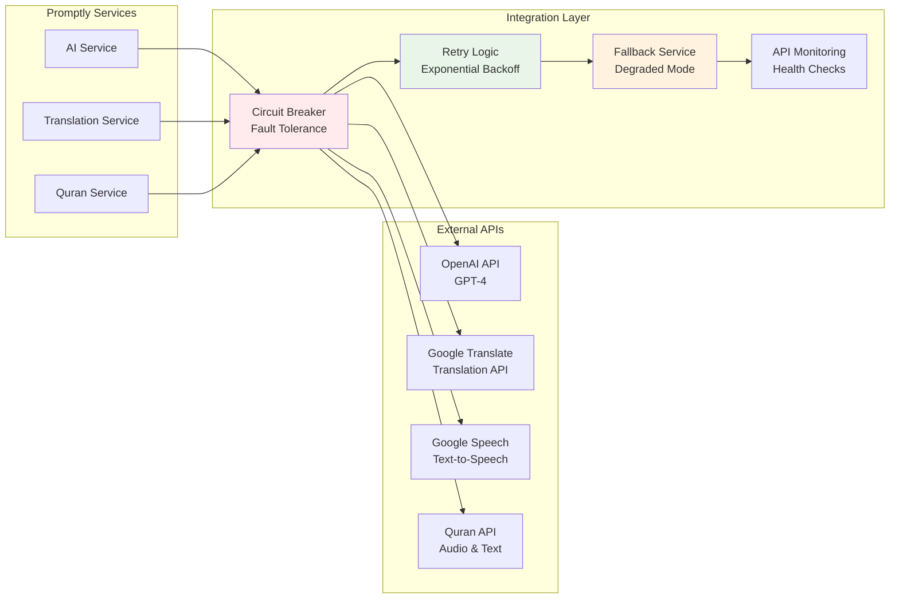

### **7.2 Circuit Breaker Pattern**

```javascript
// Circuit breaker for external API reliability
class CircuitBreaker {
  constructor(service, options = {}) {
    this.service = service;
    this.state = 'CLOSED'; // CLOSED, OPEN, HALF_OPEN
    this.failureCount = 0;
    this.failureThreshold = options.failureThreshold || 5;
    this.resetTimeout = options.resetTimeout || 60000; // 1 minute
    this.monitorTimeout = options.monitorTimeout || 10000; // 10 seconds
  }
  
  async call(method, ...args) {
    if (this.state === 'OPEN') {
      if (Date.now() - this.lastFailureTime > this.resetTimeout) {
        this.state = 'HALF_OPEN';
        this.failureCount = 0;
      } else {
        throw new Error('Circuit breaker is OPEN');
      }
    }
    
    try {
      const result = await this.service[method](...args);
      this.onSuccess();
      return result;
    } catch (error) {
      this.onFailure();
      throw error;
    }
  }
  
  onSuccess() {
    this.failureCount = 0;
    this.state = 'CLOSED';
  }
  
  onFailure() {
    this.failureCount++;
    this.lastFailureTime = Date.now();
    
    if (this.failureCount >= this.failureThreshold) {
      this.state = 'OPEN';
    }
  }
}

// Usage with OpenAI API
const openaiCircuitBreaker = new CircuitBreaker(openaiService, {
  failureThreshold: 3,
  resetTimeout: 30000
});

async function enhanceText(text, type) {
  try {
    return await openaiCircuitBreaker.call('rewriteText', text, type);
  } catch (error) {
    // Fallback to local processing or cached responses
    return await fallbackEnhancementService.enhance(text, type);
  }
}
```

### **7.3 API Versioning Strategy**

```javascript
// API versioning and backward compatibility
class APIVersionManager {
  constructor() {
    this.versions = {
      'v1': {
        deprecated: false,
        supportedUntil: '2025-12-31',
        features: ['basic_rewrite', 'translation', 'quran_audio']
      },
      'v2': {
        deprecated: false,
        supportedUntil: null,
        features: ['basic_rewrite', 'translation', 'quran_audio', 'custom_prompts', 'batch_processing']
      }
    };
  }
  
  getVersionFromRequest(req) {
    // Check header first
    let version = req.headers['api-version'];
    
    // Check query parameter
    if (!version) {
      version = req.query.version;
    }
    
    // Check URL path
    if (!version) {
      const match = req.path.match(/^\/api\/(v\d+)\//);
      version = match ? match[1] : 'v1';
    }
    
    return this.validateVersion(version);
  }
  
  validateVersion(version) {
    if (!this.versions[version]) {
      throw new Error(`Unsupported API version: ${version}`);
    }
    
    const versionInfo = this.versions[version];
    if (versionInfo.deprecated && Date.now() > new Date(versionInfo.supportedUntil)) {
      throw new Error(`API version ${version} is no longer supported`);
    }
    
    return version;
  }
}
```

---

## **8. Deployment Architecture**

### **8.1 Cloud Infrastructure**

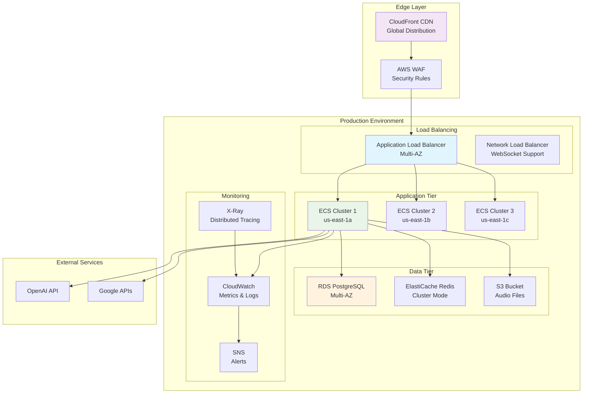

### **8.2 Container Orchestration**

#### **Docker Configuration**
```dockerfile
# Multi-stage build for Node.js services
FROM node:18-alpine AS builder

WORKDIR /app
COPY package*.json ./
RUN npm ci --only=production && npm cache clean --force

FROM node:18-alpine AS runtime

# Create non-root user
RUN addgroup -g 1001 -S nodejs && \
    adduser -S promptly -u 1001

# Install security updates
RUN apk update && apk upgrade && \
    apk add --no-cache dumb-init

# Copy application
WORKDIR /app
COPY --from=builder /app/node_modules ./node_modules
COPY --chown=promptly:nodejs . .

# Security hardening
RUN rm -rf /var/cache/apk/* && \
    chmod -R 755 /app

USER promptly

EXPOSE 3000

# Health check
HEALTHCHECK --interval=30s --timeout=10s --start-period=5s --retries=3 \
  CMD node healthcheck.js

ENTRYPOINT ["dumb-init", "--"]
CMD ["node", "server.js"]
```

#### **Kubernetes Deployment**
```yaml
# Kubernetes deployment configuration
apiVersion: apps/v1
kind: Deployment
metadata:
  name: promptly-api
  labels:
    app: promptly-api
spec:
  replicas: 3
  strategy:
    type: RollingUpdate
    rollingUpdate:
      maxSurge: 1
      maxUnavailable: 0
  selector:
    matchLabels:
      app: promptly-api
  template:
    metadata:
      labels:
        app: promptly-api
    spec:
      containers:
      - name: api
        image: promptly/api:latest
        ports:
        - containerPort: 3000
        env:
        - name: NODE_ENV
          value: "production"
        - name: DATABASE_URL
          valueFrom:
            secretKeyRef:
              name: promptly-secrets
              key: database-url
        - name: OPENAI_API_KEY
          valueFrom:
            secretKeyRef:
              name: promptly-secrets
              key: openai-key
        resources:
          requests:
            memory: "256Mi"
            cpu: "250m"
          limits:
            memory: "512Mi"
            cpu: "500m"
        livenessProbe:
          httpGet:
            path: /health
            port: 3000
          initialDelaySeconds: 30
          periodSeconds: 10
        readinessProbe:
          httpGet:
            path: /ready
            port: 3000
          initialDelaySeconds: 5
          periodSeconds: 5
        volumeMounts:
        - name: config
          mountPath: /app/config
          readOnly: true
      volumes:
      - name: config
        configMap:
          name: promptly-config
---
apiVersion: v1
kind: Service
metadata:
  name: promptly-api-service
spec:
  selector:
    app: promptly-api
  ports:
  - protocol: TCP
    port: 80
    targetPort: 3000
  type: ClusterIP
```

### **8.3 CI/CD Pipeline**

```yaml
# GitHub Actions workflow
name: Deploy to Production

on:
  push:
    branches: [main]
  pull_request:
    branches: [main]

jobs:
  test:
    runs-on: ubuntu-latest
    steps:
    - uses: actions/checkout@v3
    
    - name: Setup Node.js
      uses: actions/setup-node@v3
      with:
        node-version: '18'
        cache: 'npm'
    
    - name: Install dependencies
      run: npm ci
    
    - name: Run linter
      run: npm run lint
    
    - name: Run tests
      run: npm test
    
    - name: Run security audit
      run: npm audit --audit-level moderate
    
    - name: Build application
      run: npm run build

  security-scan:
    runs-on: ubuntu-latest
    steps:
    - uses: actions/checkout@v3
    
    - name: Run Trivy vulnerability scanner
      uses: aquasecurity/trivy-action@master
      with:
        scan-type: 'fs'
        scan-ref: '.'
        format: 'sarif'
        output: 'trivy-results.sarif'
    
    - name: Upload Trivy scan results
      uses: github/codeql-action/upload-sarif@v2
      with:
        sarif_file: 'trivy-results.sarif'

  build-and-deploy:
    needs: [test, security-scan]
    runs-on: ubuntu-latest
    if: github.ref == 'refs/heads/main'
    
    steps:
    - uses: actions/checkout@v3
    
    - name: Configure AWS credentials
      uses: aws-actions/configure-aws-credentials@v2
      with:
        aws-access-key-id: ${{ secrets.AWS_ACCESS_KEY_ID }}
        aws-secret-access-key: ${{ secrets.AWS_SECRET_ACCESS_KEY }}
        aws-region: us-east-1
    
    - name: Login to Amazon ECR
      id: login-ecr
      uses: aws-actions/amazon-ecr-login@v1
    
    - name: Build and push Docker image
      env:
        ECR_REGISTRY: ${{ steps.login-ecr.outputs.registry }}
        ECR_REPOSITORY: promptly-api
        IMAGE_TAG: ${{ github.sha }}
      run: |
        docker build -t $ECR_REGISTRY/$ECR_REPOSITORY:$IMAGE_TAG .
        docker push $ECR_REGISTRY/$ECR_REPOSITORY:$IMAGE_TAG
        docker tag $ECR_REGISTRY/$ECR_REPOSITORY:$IMAGE_TAG $ECR_REGISTRY/$ECR_REPOSITORY:latest
        docker push $ECR_REGISTRY/$ECR_REPOSITORY:latest
    
    - name: Deploy to ECS
      run: |
        aws ecs update-service \
          --cluster promptly-production \
          --service promptly-api \
          --force-new-deployment
    
    - name: Wait for deployment
      run: |
        aws ecs wait services-stable \
          --cluster promptly-production \
          --services promptly-api
```

---

## **9. Performance Architecture**

### **9.1 Performance Optimization Strategy**

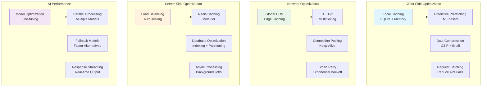

### **9.2 Caching Architecture**

```javascript
// Multi-tier caching implementation
class PerformanceCacheManager {
  constructor() {
    // L1: In-memory cache (fastest, smallest)
    this.memoryCache = new LRUCache({
      max: 1000,
      ttl: 5 * 60 * 1000 // 5 minutes
    });
    
    // L2: Redis cache (fast, larger)
    this.redisCache = redis.createClient({
      host: process.env.REDIS_HOST,
      port: process.env.REDIS_PORT,
      db: 0
    });
    
    // L3: Database cache (slower, persistent)
    this.dbCache = new DatabaseCache();
  }
  
  async get(key, options = {}) {
    const startTime = Date.now();
    
    try {
      // L1 Cache
      const memResult = this.memoryCache.get(key);
      if (memResult) {
        this.recordCacheHit('L1', Date.now() - startTime);
        return memResult;
      }
      
      // L2 Cache
      const redisResult = await this.redisCache.get(key);
      if (redisResult) {
        const parsed = JSON.parse(redisResult);
        this.memoryCache.set(key, parsed); // Populate L1
        this.recordCacheHit('L2', Date.now() - startTime);
        return parsed;
      }
      
      // L3 Cache
      if (options.checkDatabase) {
        const dbResult = await this.dbCache.get(key);
        if (dbResult) {
          await this.redisCache.setex(key, 3600, JSON.stringify(dbResult)); // Populate L2
          this.memoryCache.set(key, dbResult); // Populate L1
          this.recordCacheHit('L3', Date.now() - startTime);
          return dbResult;
        }
      }
      
      this.recordCacheMiss(Date.now() - startTime);
      return null;
    } catch (error) {
      logger.error('Cache get error', { key, error });
      return null;
    }
  }
  
  async set(key, value, ttl = 3600) {
    try {
      // Set in all cache tiers
      this.memoryCache.set(key, value);
      await this.redisCache.setex(key, ttl, JSON.stringify(value));
      
      // Optionally persist in database for longer-term caching
      if (ttl > 86400) { // More than 1 day
        await this.dbCache.set(key, value, ttl);
      }
    } catch (error) {
      logger.error('Cache set error', { key, error });
    }
  }
  
  recordCacheHit(tier, responseTime) {
    metrics.increment('cache.hit', { tier });
    metrics.histogram('cache.response_time', responseTime, { tier, result: 'hit' });
  }
  
  recordCacheMiss(responseTime) {
    metrics.increment('cache.miss');
    metrics.histogram('cache.response_time', responseTime, { result: 'miss' });
  }
}

// Intelligent cache warming
class CacheWarmer {
  constructor(cacheManager) {
    this.cache = cacheManager;
    this.mlPredictor = new UsagePredictionService();
  }
  
  async warmFrequentlyUsedData() {
    // Get prediction of likely requests
    const predictions = await this.mlPredictor.getPredictions();
    
    for (const prediction of predictions) {
      if (prediction.confidence > 0.7) {
        await this.preloadData(prediction);
      }
    }
  }
  
  async preloadData(prediction) {
    const { type, parameters } = prediction;
    
    switch (type) {
      case 'translation':
        await this.preloadTranslation(parameters.text, parameters.targetLang);
        break;
      case 'enhancement':
        await this.preloadEnhancement(parameters.text, parameters.type);
        break;
      case 'quran_audio':
        await this.preloadQuranAudio(parameters.surah, parameters.verse);
        break;
    }
  }
}
```

### **9.3 Database Performance**

```sql
-- Database optimization strategies

-- Indexing strategy for frequently queried data
CREATE INDEX CONCURRENTLY idx_text_requests_user_created 
ON text_requests(user_id, created_at DESC);

CREATE INDEX CONCURRENTLY idx_enhancements_text_hash 
ON enhancements USING HASH(text_hash);

CREATE INDEX CONCURRENTLY idx_translations_lang_pair 
ON translations(source_language, target_language);

-- Partitioning for large tables
CREATE TABLE text_requests_y2024m12 PARTITION OF text_requests
FOR VALUES FROM ('2024-12-01') TO ('2025-01-01');

CREATE TABLE text_requests_y2025m01 PARTITION OF text_requests
FOR VALUES FROM ('2025-01-01') TO ('2025-02-01');

-- Materialized views for analytics
CREATE MATERIALIZED VIEW user_usage_summary AS
SELECT 
    user_id,
    DATE_TRUNC('day', created_at) as date,
    COUNT(*) as total_requests,
    COUNT(DISTINCT enhancement_type) as unique_features,
    AVG(processing_time_ms) as avg_processing_time
FROM text_requests
WHERE created_at >= CURRENT_DATE - INTERVAL '30 days'
GROUP BY user_id, DATE_TRUNC('day', created_at);

-- Refresh materialized view automatically
CREATE OR REPLACE FUNCTION refresh_usage_summary()
RETURNS void AS $$
BEGIN
    REFRESH MATERIALIZED VIEW CONCURRENTLY user_usage_summary;
END;
$$ LANGUAGE plpgsql;

-- Schedule refresh every hour
SELECT cron.schedule('refresh-usage-summary', '0 * * * *', 'SELECT refresh_usage_summary();');
```

---

## **10. Data Flow Diagrams**

### **10.1 Text Enhancement Flow**

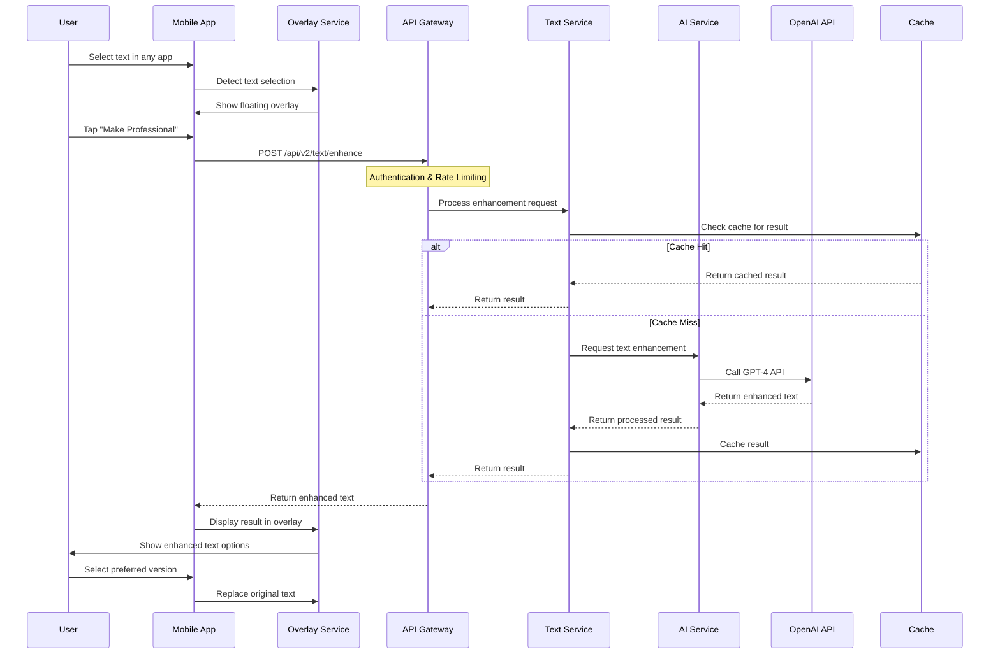

### **10.2 Translation Flow**

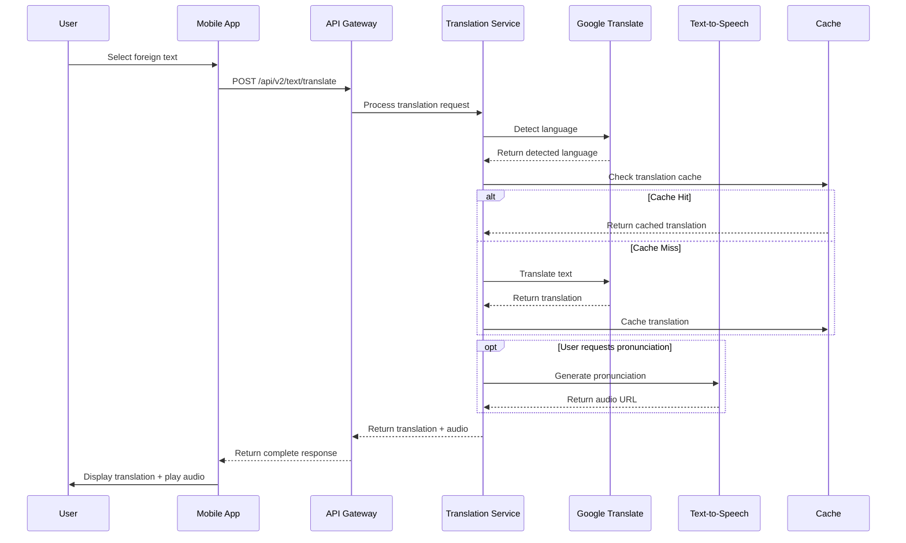

### **10.3 Quran Mode Flow**

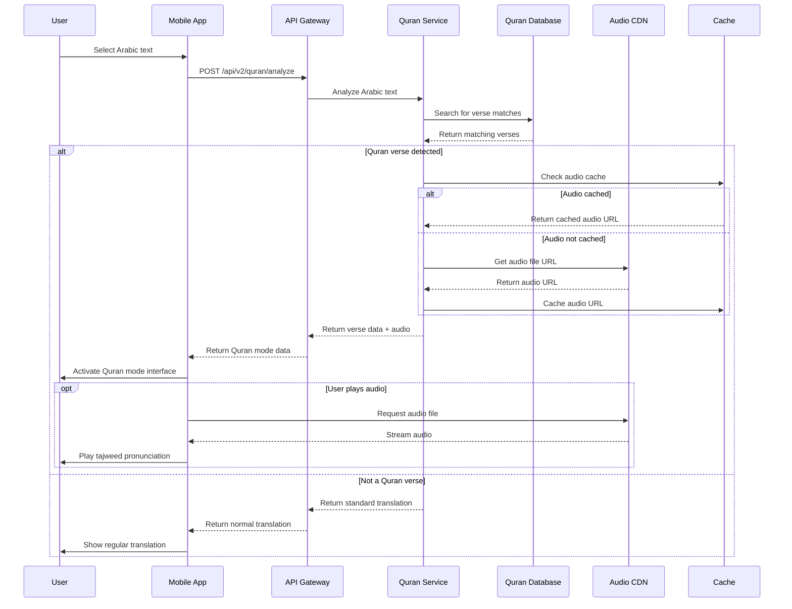

---

## **11. Technology Stack**

### **11.1 Complete Technology Matrix**

| Layer | Technology | Version | Purpose | Alternatives Considered |
|-------|------------|---------|---------|------------------------|
| **Mobile Framework** | Flutter | 3.16+ | Cross-platform mobile development | React Native, Native iOS/Android |
| **State Management** | BLoC | 8.1+ | Reactive state management | Provider, Riverpod, GetX |
| **Local Storage** | SQLite + Hive | Latest | Offline data storage | Realm, ObjectBox |
| **HTTP Client** | Dio | 5.3+ | API communication with interceptors | http package, Chopper |
| **Dependency Injection** | GetIt | 7.6+ | Service location and DI | Provider, Riverpod |
| **Cache Management** | flutter_cache_manager | 3.3+ | Local file and data caching | Custom cache implementation |
| **Platform Integration** | flutter_accessibility_service | Custom | Android accessibility integration | Platform channels |
| **Backend Runtime** | Node.js | 18 LTS | Server-side JavaScript runtime | Python FastAPI, Go, Java Spring |
| **Web Framework** | Express.js | 4.18+ | RESTful API development | Fastify, Koa.js, NestJS |
| **API Gateway** | Kong | 3.4+ | Advanced API management & routing | AWS API Gateway, Nginx, Envoy |
| **Primary Database** | PostgreSQL | 15+ | ACID-compliant data storage | MongoDB, MySQL, CockroachDB |
| **Cache Layer** | Redis | 7.0+ | Multi-tier in-memory caching | Memcached, Hazelcast, KeyDB |
| **Message Queue** | Redis Queue | 4.0+ | Background job processing | RabbitMQ, Apache Kafka, AWS SQS |
| **Circuit Breaker** | Opossum | 6.3+ | Fault tolerance for external APIs | Hystrix, resilience4j |
| **AI Services** | OpenAI GPT-4 | Latest | Primary text enhancement AI | Anthropic Claude, Cohere |
| **AI Services** | Google Gemini | 1.5-Pro | Alternative AI provider | OpenAI GPT-3.5, PaLM 2 |
| **Translation** | Google Translate API | v2 | Multi-language translation | AWS Translate, Azure Translator |
| **Translation Pro** | DeepL API | Latest | High-quality professional translation | Google Translate Advanced |
| **TTS Services** | Google Text-to-Speech | Latest | Multi-language voice synthesis | AWS Polly, Azure Cognitive Services |
| **Arabic TTS** | Custom Arabic Engine | 1.0 | Tajweed-compliant pronunciation | Specialized Arabic TTS providers |
| **Platform TTS** | Native Engines | System | Device-native voice synthesis | Third-party TTS only |
| **Object Storage** | AWS S3 | - | Audio files and static assets | Google Cloud Storage, Azure Blob |
| **CDN** | CloudFlare | Pro | Global content delivery with edge | AWS CloudFront, Azure CDN |
| **Audio CDN** | Specialized CDN | - | Optimized audio file delivery | Standard CDN with audio optimization |
| **Container** | Docker | 24+ | Application containerization | Podman, containerd |
| **Orchestration** | Kubernetes | 1.28+ | Container orchestration | Docker Swarm, AWS ECS, Google GKE |
| **Service Mesh** | Istio | 1.19+ | Microservices communication | Linkerd, Consul Connect |
| **CI/CD** | GitHub Actions | - | Automated testing and deployment | GitLab CI, Jenkins, CircleCI |
| **Infrastructure** | Terraform | 1.6+ | Infrastructure as Code | AWS CloudFormation, Pulumi |
| **Monitoring** | Prometheus + Grafana | Latest | Metrics collection and visualization | DataDog, New Relic |
| **Logging** | ELK Stack | 8.10+ | Centralized logging and analysis | Splunk, Fluentd + ClickHouse |
| **Tracing** | Jaeger + OpenTelemetry | Latest | Distributed tracing | Zipkin, AWS X-Ray |
| **Error Tracking** | Sentry | Latest | Error monitoring and alerting | Bugsnag, Rollbar, Crashlytics |
| **Mobile Crashes** | Firebase Crashlytics | Latest | Mobile-specific crash reporting | Sentry Mobile, Bugsnag |
| **Analytics** | Mixpanel | Latest | User behavior analytics | Google Analytics 4, Amplitude |
| **Business Intelligence** | Custom Metrics | - | AI quality and performance tracking | Third-party BI tools |
| **Security** | HashiCorp Vault | 1.15+ | Secrets management | AWS Secrets Manager, Azure Key Vault |
| **Load Balancing** | Nginx | 1.24+ | Application load balancing | HAProxy, AWS ALB |
| **Reverse Proxy** | Nginx | 1.24+ | SSL termination and routing | Traefik, Envoy Proxy |

### **11.2 Development Tools**

```yaml
# Development environment configuration
development:
  tools:
    IDE: "VS Code with Flutter/Dart extensions"
    API_Testing: "Postman + Newman for automation"
    Database_Admin: "pgAdmin for PostgreSQL"
    Cache_Admin: "Redis Commander"
    Container_Management: "Docker Desktop"
    Local_Kubernetes: "Minikube or Kind"
    
  dependencies:
    flutter_sdk: ">=3.16.0"
    dart_sdk: ">=3.2.0"
    node_version: "18.18.0"
    npm_version: "9.8.1"
    docker_version: ">=24.0.0"
    kubectl_version: ">=1.28.0"
    
  scripts:
    setup: "make setup-dev"
    test: "make test-all"
    lint: "make lint-fix"
    build: "make build-all"
    deploy_local: "make deploy-local"
```

### **11.3 Production Infrastructure**

```yaml
# Production infrastructure requirements
production:
  compute:
    app_servers: "AWS ECS Fargate (2 vCPU, 4GB RAM)"
    worker_nodes: "AWS ECS Fargate (1 vCPU, 2GB RAM)"
    database: "AWS RDS PostgreSQL (db.r6g.large)"
    cache: "AWS ElastiCache Redis (cache.r6g.large)"
    
  storage:
    primary_db: "PostgreSQL with 1TB SSD"
    cache_memory: "16GB Redis cluster"
    object_storage: "AWS S3 with Intelligent Tiering"
    cdn_cache: "CloudFlare Pro plan"
    
  network:
    load_balancer: "AWS Application Load Balancer"
    cdn: "CloudFlare with global edge locations"
    dns: "Route 53 with health checks"
    ssl: "Let's Encrypt with auto-renewal"
    
  security:
    secrets: "AWS Secrets Manager"
    key_management: "AWS KMS"
    network_security: "VPC with private subnets"
    waf: "CloudFlare WAF + AWS WAF"
    
  monitoring:
    metrics: "CloudWatch + DataDog"
    logs: "CloudWatch Logs + ELK Stack"
    tracing: "AWS X-Ray"
    uptime: "StatusPage.io"
    alerts: "PagerDuty integration"
```

---

## **12. Architectural Decisions**

### **12.1 Architecture Decision Records (ADRs)**

#### **ADR-001: Flutter for Cross-Platform Development**

**Status:** Accepted  
**Date:** 2024-12-01  

**Context:**
Need to develop mobile apps for both iOS and Android with limited development resources and tight timeline.

**Decision:**
Use Flutter for cross-platform mobile development.

**Rationale:**
- Single codebase for both platforms (60% development time savings)
- Excellent performance for UI-heavy applications
- Strong ecosystem and Google backing
- Built-in accessibility support
- Hot reload for rapid development

**Consequences:**
- Positive: Faster development, consistent UI across platforms
- Positive: Lower maintenance overhead
- Negative: Platform-specific features may require custom plugins
- Negative: Larger app size compared to native apps

**Alternatives Considered:**
- React Native: Considered but Flutter has better performance
- Native Development: Too resource-intensive for startup
- Progressive Web App: Insufficient for system-level integration

---

#### **ADR-002: Microservices Architecture**

**Status:** Accepted  
**Date:** 2024-12-01  

**Context:**
Backend architecture needs to handle different types of AI processing with varying performance characteristics and scaling requirements.

**Decision:**
Implement microservices architecture with domain-specific services.

**Rationale:**
- Independent scaling of different services (AI, translation, audio)
- Technology diversity (different services can use optimal tech stacks)
- Fault isolation (failure in one service doesn't affect others)
- Team autonomy (different teams can work on different services)
- Easier to maintain and update individual services

**Consequences:**
- Positive: Better scalability and maintainability
- Positive: Technology flexibility per service
- Negative: Increased complexity in deployment and monitoring
- Negative: Network latency between services
- Negative: Distributed system challenges (eventual consistency, etc.)

**Mitigation:**
- Use service mesh for inter-service communication
- Implement comprehensive monitoring and tracing
- Design for eventual consistency where appropriate

---

#### **ADR-003: PostgreSQL as Primary Database**

**Status:** Accepted  
**Date:** 2024-12-01  

**Context:**
Need a reliable, ACID-compliant database that can handle both transactional data and complex queries for analytics.

**Decision:**
Use PostgreSQL as the primary database with Redis for caching.

**Rationale:**
- ACID compliance for data integrity
- Excellent performance for both OLTP and OLAP workloads
- Rich feature set (JSON support, full-text search, extensions)
- Strong community and ecosystem
- Good performance with proper indexing
- Cost-effective compared to commercial databases

**Consequences:**
- Positive: Data consistency and reliability
- Positive: Single database technology to maintain
- Positive: Rich querying capabilities
- Negative: May need additional optimization for very large datasets
- Negative: Less flexible than NoSQL for schema changes

**Alternatives Considered:**
- MongoDB: Considered for flexibility but ACID compliance was priority
- MySQL: Considered but PostgreSQL has better feature set
- DynamoDB: Considered but too expensive for startup budget

---

#### **ADR-004: Redis for Multi-Tier Caching**

**Status:** Accepted  
**Date:** 2024-12-01  

**Context:**
Application requires very fast response times (< 2 seconds) for AI processing results and frequently accessed data.

**Decision:**
Implement multi-tier caching with Redis as the primary cache layer.

**Rationale:**
- Sub-millisecond response times for cached data
- Supports complex data structures
- Built-in persistence options
- Excellent performance under high load
- Rich ecosystem of tools and libraries
- Can be used for session storage and message queues

**Consequences:**
- Positive: Dramatically improved response times
- Positive: Reduced load on external APIs
- Positive: Better user experience
- Negative: Additional infrastructure to maintain
- Negative: Cache invalidation complexity
- Negative: Memory costs for large cache sizes

**Cache Strategy:**
- L1: In-memory application cache (LRU, 5-minute TTL)
- L2: Redis cache (1-hour TTL for API results)
- L3: Database cache for long-term storage

---

#### **ADR-005: OpenAI GPT-4 for Text Enhancement**

**Status:** Accepted  
**Date:** 2024-12-01  

**Context:**
Core feature requires high-quality text rewriting and enhancement capabilities.

**Decision:**
Use OpenAI GPT-4 API as the primary AI service for text enhancement.

**Rationale:**
- State-of-the-art text generation quality
- Proven reliability and performance
- Comprehensive API with good documentation
- Handles multiple languages effectively
- Regular model improvements from OpenAI
- Cost-effective for startup scale

**Consequences:**
- Positive: High-quality text enhancement results
- Positive: Reliable service with good uptime
- Positive: Comprehensive language support
- Negative: Dependency on external service
- Negative: API costs scale with usage
- Negative: Rate limiting may affect peak usage

**Risk Mitigation:**
- Implement circuit breaker pattern
- Cache results aggressively
- Have fallback models ready (GPT-3.5 Turbo)
- Monitor API costs and usage patterns

---

### **12.2 Technology Trade-offs**

#### **Performance vs. Cost**
```javascript
// Example: Caching strategy balancing performance and cost
class CostAwareCache {
  constructor() {
    this.tierCosts = {
      memory: 0.001, // Per MB per hour
      redis: 0.01,   // Per MB per hour  
      database: 0.1  // Per query
    };
  }
  
  async optimizeStorage(data, accessPattern) {
    const cost = this.calculateStorageCost(data, accessPattern);
    const performance = this.calculatePerformanceBenefit(data, accessPattern);
    
    // Use cost-performance ratio to decide storage tier
    if (performance / cost > 100) {
      return 'memory'; // High value, store in memory
    } else if (performance / cost > 10) {
      return 'redis'; // Medium value, store in Redis
    } else {
      return 'database'; // Low value, store in database only
    }
  }
}
```

#### **Scalability vs. Complexity**
```yaml
# Graduated complexity approach
scaling_strategy:
  phase_1: # 0-1K users
    architecture: "Monolith with external APIs"
    deployment: "Single container on ECS"
    database: "Single PostgreSQL instance"
    
  phase_2: # 1K-10K users  
    architecture: "Microservices (3-4 services)"
    deployment: "Multiple containers with load balancer"
    database: "PostgreSQL with read replicas"
    
  phase_3: # 10K+ users
    architecture: "Full microservices with service mesh"
    deployment: "Kubernetes with auto-scaling"
    database: "Sharded PostgreSQL with caching"
```

---

## **13. Scalability Considerations**

### **13.1 Horizontal Scaling Strategy**

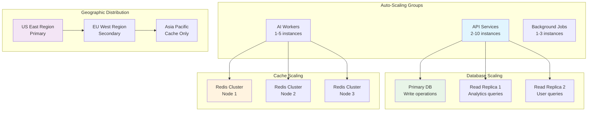

### **13.2 Auto-Scaling Configuration**

```yaml
# Kubernetes Horizontal Pod Autoscaler
apiVersion: autoscaling/v2
kind: HorizontalPodAutoscaler
metadata:
  name: promptly-api-hpa
spec:
  scaleTargetRef:
    apiVersion: apps/v1
    kind: Deployment
    name: promptly-api
  minReplicas: 2
  maxReplicas: 20
  metrics:
  - type: Resource
    resource:
      name: cpu
      target:
        type: Utilization
        averageUtilization: 70
  - type: Resource
    resource:
      name: memory
      target:
        type: Utilization
        averageUtilization: 80
  - type: Pods
    pods:
      metric:
        name: requests_per_second
      target:
        type: AverageValue
        averageValue: "100"
  behavior:
    scaleUp:
      stabilizationWindowSeconds: 60
      policies:
      - type: Percent
        value: 100
        periodSeconds: 60
    scaleDown:
      stabilizationWindowSeconds: 300
      policies:
      - type: Percent
        value: 10
        periodSeconds: 60
```

### **13.3 Database Sharding Strategy**

```javascript
// Database sharding implementation
class DatabaseShardManager {
  constructor() {
    this.shards = {
      shard_0: { region: 'us-east-1', capacity: 1000000 },
      shard_1: { region: 'us-east-1', capacity: 1000000 },
      shard_2: { region: 'eu-west-1', capacity: 1000000 }
    };
  }
  
  getShardForUser(userId) {
    // Consistent hashing for user distribution
    const hash = this.hashUserId(userId);
    const shardIndex = hash % Object.keys(this.shards).length;
    return `shard_${shardIndex}`;
  }
  
  async migrateToNewShard(fromShard, toShard, userIds) {
    // Zero-downtime migration strategy
    const migration = new ShardMigration(fromShard, toShard);
    
    // 1. Start dual-write mode
    await migration.startDualWrite(userIds);
    
    // 2. Copy existing data
    await migration.copyData(userIds);
    
    // 3. Verify data consistency
    await migration.verifyConsistency(userIds);
    
    // 4. Switch read traffic
    await migration.switchReads(userIds);
    
    // 5. Stop dual-write mode
    await migration.stopDualWrite(userIds);
    
    // 6. Clean up old data
    await migration.cleanup(fromShard, userIds);
  }
  
  hashUserId(userId) {
    // Consistent hashing algorithm
    return crypto.createHash('md5')
      .update(userId.toString())
      .digest('hex')
      .substring(0, 8)
      .reduce((acc, char) => acc + char.charCodeAt(0), 0);
  }
}
```

---

## **14. Monitoring and Observability**

### **14.1 Observability Stack**

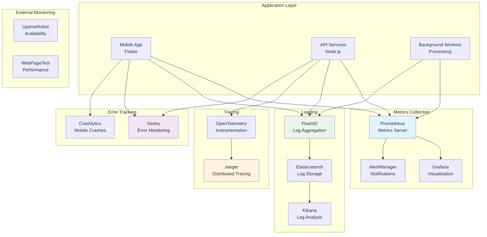

### **14.2 Key Metrics and Alerts**

```yaml
# Prometheus monitoring configuration
monitoring:
  business_metrics:
    - name: "daily_active_users"
      query: "count(rate(user_sessions_total[24h]))"
      alert_threshold: "< 1000"
      
    - name: "text_enhancement_success_rate"
      query: "rate(text_enhancements_success_total[5m]) / rate(text_enhancements_total[5m])"
      alert_threshold: "< 0.95"
      
    - name: "average_response_time"
      query: "histogram_quantile(0.95, rate(api_request_duration_seconds_bucket[5m]))"
      alert_threshold: "> 2.0"
      
  technical_metrics:
    - name: "error_rate"
      query: "rate(http_requests_total{status=~'5..'}[5m]) / rate(http_requests_total[5m])"
      alert_threshold: "> 0.01"
      
    - name: "cpu_utilization"
      query: "avg(rate(container_cpu_usage_seconds_total[5m]))"
      alert_threshold: "> 0.8"
      
    - name: "memory_utilization"
      query: "avg(container_memory_usage_bytes / container_spec_memory_limit_bytes)"
      alert_threshold: "> 0.85"
      
    - name: "database_connection_pool"
      query: "avg(database_connections_active / database_connections_max)"
      alert_threshold: "> 0.8"
      
  external_dependencies:
    - name: "openai_api_latency"
      query: "histogram_quantile(0.95, rate(external_api_duration_seconds_bucket{service='openai'}[5m]))"
      alert_threshold: "> 5.0"
      
    - name: "google_translate_error_rate"
      query: "rate(external_api_errors_total{service='google_translate'}[5m])"
      alert_threshold: "> 0.05"

# Alert routing configuration
alerting:
  routes:
    - match:
        severity: "critical"
      receiver: "pagerduty"
      group_wait: "30s"
      repeat_interval: "5m"
      
    - match:
        severity: "warning"
      receiver: "slack"
      group_wait: "5m"
      repeat_interval: "30m"
      
  receivers:
    - name: "pagerduty"
      pagerduty_configs:
        - service_key: "{{ .pagerduty_service_key }}"
          
    - name: "slack"
      slack_configs:
        - api_url: "{{ .slack_webhook_url }}"
          channel: "#alerts"
```

### **14.3 Custom Monitoring Dashboard**

```javascript
// Custom metrics collection for business intelligence
class BusinessMetricsCollector {
  constructor() {
    this.metrics = {
      userEngagement: new prometheus.Histogram({
        name: 'user_engagement_score',
        help: 'User engagement score based on feature usage',
        labelNames: ['user_tier', 'feature']
      }),
      
      featureAdoption: new prometheus.Counter({
        name: 'feature_adoption_total',
        help: 'Total feature adoption events',
        labelNames: ['feature', 'user_tier', 'source']
      }),
      
      revenueMetrics: new prometheus.Gauge({
        name: 'revenue_per_user',
        help: 'Revenue per user in USD',
        labelNames: ['user_tier', 'period']
      }),
      
      aiPerformance: new prometheus.Histogram({
        name: 'ai_quality_score',
        help: 'AI output quality score (1-10)',
        labelNames: ['model', 'task_type']
      })
    };
  }
  
  recordUserEngagement(userId, feature, engagementScore) {
    const userTier = this.getUserTier(userId);
    this.metrics.userEngagement
      .labels(userTier, feature)
      .observe(engagementScore);
  }
  
  recordFeatureAdoption(userId, feature, source) {
    const userTier = this.getUserTier(userId);
    this.metrics.featureAdoption
      .labels(feature, userTier, source)
      .inc();
  }
  
  async calculateQualityScore(originalText, enhancedText, userFeedback) {
    // Custom quality scoring algorithm
    const scores = {
      length_improvement: this.scoreLengthImprovement(originalText, enhancedText),
      readability: await this.scoreReadability(enhancedText),
      user_satisfaction: userFeedback ? userFeedback.rating : null,
      grammar_score: await this.scoreGrammar(enhancedText)
    };
    
    // Weighted average of scores
    const weights = { length_improvement: 0.2, readability: 0.3, user_satisfaction: 0.3, grammar_score: 0.2 };
    const weightedScore = Object.entries(scores)
      .filter(([_, score]) => score !== null)
      .reduce((acc, [metric, score]) => acc + (score * weights[metric]), 0);
    
    this.metrics.aiPerformance
      .labels('gpt-4', 'text_enhancement')
      .observe(weightedScore);
    
    return weightedScore;
  }
}
```

---

This comprehensive system architecture document provides a detailed blueprint for implementing the enhanced Promptly application with all advanced features from the updated PRD. The architecture supports:

**Core Enhancements:**
- Multi-AI provider integration (OpenAI GPT-4, Google Gemini)
- Advanced translation services (Google Translate, DeepL)
- Smart communication features (tone analysis, contextual replies)
- Universal audio processing (TTS, Tajweed-compliant Arabic pronunciation)
- Custom prompting engine with user-defined instructions
- System-level text selection across all mobile applications

**Platform Integration:**
- Enhanced Android accessibility services for comprehensive text detection
- Advanced iOS share extensions and keyboard integration
- Cross-platform privacy and security compliance
- Native performance optimizations for each platform

**Scalability & Performance:**
- Multi-tier caching strategy (memory, Redis, database)
- Circuit breaker patterns for external API reliability
- Intelligent load balancing and auto-scaling
- Advanced monitoring and observability

The modular design allows for incremental implementation and provides clear separation of concerns across different system components. Each architectural decision is backed by clear rationale and includes mitigation strategies for potential risks. The enhanced architecture ensures enterprise-grade scalability while maintaining the seamless user experience envisioned in the updated product requirements.
