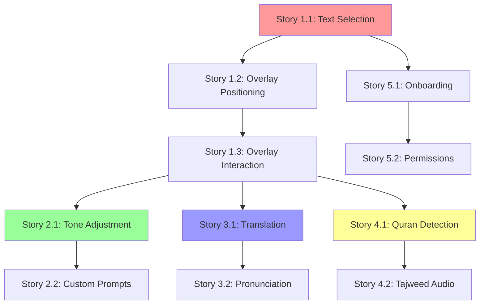

# User Stories Document
## Promptly - AI-Powered Mobile Text Enhancement App

**Document Version:** 2.0  
**Date:** December 2024  
**Last Updated:** December 2024 - Enhanced with advanced AI features  
**Product Manager:** [To be filled]  
**Development Team:** [To be filled]

---

## **Table of Contents**

1. [Overview](#1-overview)
2. [User Personas](#2-user-personas)
3. [Epic 1: Text Selection & Overlay System](#3-epic-1-text-selection--overlay-system)
4. [Epic 2: Professional Text Enhancement](#4-epic-2-professional-text-enhancement)
5. [Epic 3: Real-Time Translation](#5-epic-3-real-time-translation)
6. [Epic 4: Quran Mode & Arabic Support](#6-epic-4-quran-mode--arabic-support)
7. [Epic 7: Smart Communication & Tone Analysis](#7-epic-7-smart-communication--tone-analysis)
8. [Epic 8: Universal Audio & Read Aloud](#8-epic-8-universal-audio--read-aloud)
9. [Epic 9: Enhanced Platform Integration](#9-epic-9-enhanced-platform-integration)
10. [Epic 5: User Onboarding & Setup](#10-epic-5-user-onboarding--setup)
11. [Epic 6: Performance & Reliability](#11-epic-6-performance--reliability)
12. [Epic 10: Security & Privacy](#12-epic-10-security--privacy)
13. [Epic 11: Analytics & Personalization](#13-epic-11-analytics--personalization)
14. [Epic 12: Accessibility & Inclusivity](#14-epic-12-accessibility--inclusivity)
15. [Epic 10: Legacy Platform Integration](#15-epic-10-legacy-platform-integration)
16. [Story Mapping & Sprint Planning](#16-story-mapping--sprint-planning)
17. [Definition of Done](#17-definition-of-done)

---

## **1. Overview**

This document contains comprehensive user stories for the Promptly application, organized by epics and aligned with our target personas. Each story includes detailed acceptance criteria, business value, and technical considerations based on the system architecture.

### **1.1 Story Format**
All user stories follow the standard format:
- **As a** [persona]
- **I want** [goal/desire]
- **So that** [benefit/value]

### **1.2 Story Prioritization**
- **Must Have (P0)**: Core features for MVP
- **Should Have (P1)**: Important features for Phase 2
- **Could Have (P2)**: Nice-to-have features for Phase 3
- **Won't Have (P3)**: Future consideration

### **1.3 Business Value Scale**
- **High (H)**: Critical for user adoption/retention
- **Medium (M)**: Important for user satisfaction
- **Low (L)**: Enhances user experience

---

## **2. User Personas**

### **2.1 Primary Personas**

#### **Sarah - Remote Marketing Manager (40% of users)**
- **Age:** 32, works remotely
- **Tech Savvy:** High
- **Primary Use Case:** Professional communication
- **Key Pain Points:** 
  - Switching between apps disrupts workflow
  - Need to maintain professional tone across cultures
  - Time pressure for quick responses
- **Success Metrics:** Reduced communication time, improved message quality

#### **Ahmed - Arabic Language Student (20% of users)**
- **Age:** 24, studying Islamic studies
- **Tech Savvy:** Medium
- **Primary Use Case:** Quran study and Arabic learning
- **Key Pain Points:**
  - Difficulty with Arabic pronunciation
  - Limited access to authentic tajweed resources
  - Need for verse-by-verse study tools
- **Success Metrics:** Improved pronunciation accuracy, increased study time

#### **Maria - International Student (35% of users)**
- **Age:** 21, studying abroad
- **Tech Savvy:** Medium
- **Primary Use Case:** Academic and social communication
- **Key Pain Points:**
  - Language barriers in academic settings
  - Fear of making grammatical mistakes
  - Need for quick translation help
- **Success Metrics:** Improved academic performance, increased confidence

#### **Alex - Content Creator (5% of users)**
- **Age:** 28, social media influencer
- **Tech Savvy:** High
- **Primary Use Case:** Social media content creation
- **Key Pain Points:**
  - Need for engaging, well-written captions
  - Time pressure for content creation
  - Maintaining consistent brand voice
- **Success Metrics:** Increased engagement, faster content creation

---

## **3. Epic 1: Text Selection & Overlay System**

**Epic Goal:** Enable seamless text selection and AI action access across all mobile applications.

### **Story 1.1: Basic Text Selection Detection** 
**Priority:** P0 | **Business Value:** H | **Story Points:** 8

**As a** user  
**I want to** select text in any mobile app and immediately see AI enhancement options  
**So that** I can improve my text without interrupting my workflow

**Acceptance Criteria:**
- **Given** I am using any mobile application (WhatsApp, Email, Notes, etc.)
- **When** I select text using standard mobile selection gestures
- **Then** the system detects the text selection within 200ms
- **And** a floating overlay with AI options appears within 500ms
- **And** the overlay does not interfere with the selected text visibility
- **And** the overlay remains visible until I take an action or tap elsewhere

**Technical Requirements:**
- Integrate with Android Accessibility Service
- Implement iOS Share Extension for text detection
- Handle edge cases: password fields, secure apps, images with text
- Support selection in both portrait and landscape orientations

**Definition of Done:**
- [ ] Text selection works across 20+ popular apps
- [ ] Overlay appears within performance targets
- [ ] No crashes or freezes during text selection
- [ ] Accessibility compliance verified
- [ ] Performance testing completed

---

### **Story 1.2: Smart Overlay Positioning**
**Priority:** P0 | **Business Value:** H | **Story Points:** 5

**As a** user  
**I want** the AI options overlay to appear in the optimal position  
**So that** I can easily access options without blocking important content

**Acceptance Criteria:**
- **Given** text is selected in any position on screen
- **When** the overlay appears
- **Then** it positions itself to avoid blocking the selected text
- **And** it adjusts position based on available screen space
- **And** it remains within thumb-reachable areas for one-handed use
- **And** it moves smoothly when screen orientation changes

**Edge Cases:**
- Text selected at screen edges
- Very long text selections
- Split-screen mode
- Notched displays
- Foldable devices

**Technical Implementation:**
- Calculate optimal position using screen geometry
- Implement collision detection with UI elements
- Handle dynamic screen size changes
- Support different device form factors

---

### **Story 1.3: Overlay Interaction & Dismissal**
**Priority:** P0 | **Business Value:** M | **Story Points:** 3

**As a** user  
**I want** intuitive ways to interact with and dismiss the overlay  
**So that** I can control when and how I use the AI features

**Acceptance Criteria:**
- **Given** the overlay is visible
- **When** I tap outside the overlay
- **Then** it dismisses smoothly
- **And** when I tap an AI action button
- **Then** the corresponding feature activates immediately
- **And** when I drag the overlay
- **Then** it moves to the new position and stays there
- **And** when I long-press the overlay
- **Then** advanced options menu appears

**Interaction Patterns:**
- Single tap: Activate action
- Long press: Show advanced options
- Swipe up: Dismiss overlay
- Drag: Reposition overlay
- Double tap: Toggle between expanded/collapsed view

---

### **Story 1.4: Context-Aware Action Suggestions**
**Priority:** P1 | **Business Value:** H | **Story Points:** 8

**As a** user  
**I want** the overlay to show relevant AI actions based on my selected text  
**So that** I see the most useful options for my current context

**Acceptance Criteria:**
- **Given** I select text that appears to be informal
- **When** the overlay appears
- **Then** "Make Professional" is prominently displayed
- **And** when I select text in a foreign language
- **Then** "Translate" appears as the primary option
- **And** when I select Arabic text
- **Then** "Quran Mode" is offered if verse is detected
- **And** when I select text with grammar errors
- **Then** "Fix Grammar" is suggested

**Context Detection Logic:**
- Language detection for non-English text
- Formality analysis for professional suggestions
- Domain-specific content recognition (emails, social media)
- User behavior learning for personalized suggestions

---

### **Story 1.5: Multi-App Context Persistence**
**Priority:** P2 | **Business Value:** M | **Story Points:** 5

**As a** power user  
**I want** my overlay preferences to persist across different apps  
**So that** I have a consistent experience regardless of which app I'm using

**Acceptance Criteria:**
- **Given** I customize overlay position in one app
- **When** I use the overlay in another app
- **Then** it appears in my preferred position
- **And** my recent actions are remembered across apps
- **And** frequently used features are prioritized
- **And** app-specific preferences are maintained (if set)

---

## **4. Epic 2: Professional Text Enhancement**

**Epic Goal:** Provide high-quality text rewriting capabilities for professional communication.

### **Story 2.1: Basic Tone Adjustment**
**Priority:** P0 | **Business Value:** H | **Story Points:** 13

**As a** professional user like Sarah  
**I want to** quickly transform casual text into professional tone  
**So that** I maintain appropriate communication standards with clients

**Acceptance Criteria:**
- **Given** I select casual text like "hey, can u send me the files?"
- **When** I tap "Make Professional"
- **Then** I receive a professional version like "Hello, could you please send me the files?"
- **And** the rewritten text maintains the original meaning
- **And** I receive 2-3 alternative versions to choose from
- **And** the processing completes within 2 seconds
- **And** I can see a confidence score for the enhancement

**Advanced Features:**
- Tone intensity adjustment (slightly formal to very formal)
- Industry-specific professional styles (legal, medical, tech)
- Cultural adaptation for international communication
- Preservation of technical terms and proper nouns

**Example Transformations:**
- Input: "this is kinda broken and needs fixing asap"
- Output: "This requires immediate attention and needs to be addressed promptly"

---

### **Story 2.2: Custom Prompt Enhancement**
**Priority:** P0 | **Business Value:** H | **Story Points:** 8

**As a** content creator like Alex  
**I want to** provide specific instructions for text modification  
**So that** I can get exactly the style and tone I need for my brand

**Acceptance Criteria:**
- **Given** I select any text
- **When** I tap "Custom Prompt"
- **Then** a text input field appears with placeholder suggestions
- **And** I can type instructions like "make this more engaging for millennials"
- **And** the system applies my custom instructions accurately
- **And** I can save frequently used prompts for quick access
- **And** I receive suggestions based on my previous prompts

**Custom Prompt Examples:**
- "Make this sound more confident and assertive"
- "Rewrite in the style of a friendly email"
- "Simplify for a 5th-grade reading level"
- "Add humor while keeping it professional"
- "Translate the tone to be more empathetic"

**Saved Prompt Templates:**
- Quick access to user's top 5 most-used prompts
- Industry-specific prompt suggestions
- Team/organization shared prompt libraries

---

### **Story 2.3: Grammar and Style Correction**
**Priority:** P0 | **Business Value:** H | **Story Points:** 8

**As an** international student like Maria  
**I want** automatic grammar and style corrections  
**So that** I can write confidently in academic settings

**Acceptance Criteria:**
- **Given** I select text with grammatical errors
- **When** I tap "Fix Grammar"
- **Then** all grammar errors are corrected
- **And** style improvements are suggested
- **And** I can see what changes were made with explanations
- **And** I can choose to apply changes selectively
- **And** the corrected text maintains my intended meaning

**Error Types Addressed:**
- Subject-verb agreement
- Verb tense consistency
- Article usage (a, an, the)
- Preposition errors
- Run-on sentences
- Fragment sentences
- Passive voice suggestions

**Learning Features:**
- Explanation of corrections to help user learn
- Pattern recognition for user's common mistakes
- Personalized grammar tips and suggestions

---

### **Story 2.4: Length Adjustment**
**Priority:** P1 | **Business Value:** M | **Story Points:** 5

**As a** user  
**I want to** adjust the length of my text while preserving meaning  
**So that** I can meet specific word count or character limit requirements

**Acceptance Criteria:**
- **Given** I select text that's too long
- **When** I tap "Make Shorter"
- **Then** I receive a concise version with key points preserved
- **And** when I tap "Make Longer"
- **Then** I receive an expanded version with additional detail
- **And** I can specify target word count or character limit
- **And** the system shows me the current vs. target length

**Use Cases:**
- Twitter character limit compliance
- Executive summary creation
- Essay expansion for academic requirements
- Email brevity for mobile reading
- Resume bullet point optimization

---

### **Story 2.5: Multi-Version Comparison**
**Priority:** P1 | **Business Value:** M | **Story Points:** 5

**As a** user  
**I want to** compare multiple enhanced versions side-by-side  
**So that** I can choose the best option for my needs

**Acceptance Criteria:**
- **Given** I request text enhancement
- **When** multiple versions are generated
- **Then** I can view them in a comparison interface
- **And** I can see differences highlighted between versions
- **And** I can rate versions to improve future suggestions
- **And** I can combine elements from different versions
- **And** I can request additional alternatives

**Comparison Features:**
- Side-by-side text display
- Highlighted differences
- Tone/formality indicators
- Length comparisons
- Readability scores

---

### **Story 2.6: Contextual Enhancement Suggestions**
**Priority:** P2 | **Business Value:** M | **Story Points:** 8

**As a** user  
**I want** enhancement suggestions based on where I'm writing  
**So that** I get contextually appropriate improvements

**Acceptance Criteria:**
- **Given** I'm writing in an email app
- **When** I request enhancement
- **Then** suggestions are tailored for email communication
- **And** when I'm in a social media app
- **Then** suggestions are optimized for social engagement
- **And** when I'm in a professional app like Slack
- **Then** suggestions maintain professional tone

**Context-Specific Features:**
- Email: Subject line optimization, appropriate greetings/closings
- Social Media: Hashtag suggestions, engagement-focused rewrites
- Messaging: Casual but clear communication
- Documents: Formal writing with proper structure
- Reviews: Balanced and constructive feedback

---

## **5. Epic 3: Real-Time Translation**

**Epic Goal:** Provide accurate, fast translation with pronunciation support across 50+ languages.

### **Story 3.1: Automatic Language Detection & Translation**
**Priority:** P0 | **Business Value:** H | **Story Points:** 13

**As a** multilingual user like Maria  
**I want** foreign text to be automatically detected and translated  
**So that** I can understand content in any language without manual setup

**Acceptance Criteria:**
- **Given** I select text in a foreign language
- **When** I tap "Translate"
- **Then** the source language is detected automatically within 1 second
- **And** the text is translated to my preferred language within 2 seconds
- **And** the translation maintains original formatting (bold, italics, line breaks)
- **And** I can see the confidence level of the translation
- **And** I can switch between different target languages easily

**Supported Languages:**
- 50+ languages including major European, Asian, and Middle Eastern languages
- Automatic detection accuracy >95% for text >10 characters
- Support for mixed-language text detection
- Regional dialect recognition where applicable

**Quality Indicators:**
- Translation confidence score (1-100)
- Alternative translation suggestions
- Context-aware translation for ambiguous phrases
- Idiom and colloquialism handling

---

### **Story 3.2: Interactive Pronunciation Guide**
**Priority:** P0 | **Business Value:** H | **Story Points:** 8

**As a** language learner  
**I want to** hear accurate pronunciation of translated text  
**So that** I can learn correct pronunciation and improve my speaking skills

**Acceptance Criteria:**
- **Given** text has been translated
- **When** I tap the pronunciation button
- **Then** high-quality audio pronunciation plays immediately
- **And** the text is highlighted syllable-by-syllable during playback
- **And** I can adjust playback speed (0.5x to 2x)
- **And** I can repeat specific words or phrases
- **And** I can choose between male/female voice options

**Pronunciation Features:**
- Native speaker quality audio
- Syllable-by-syllable highlighting
- Phonetic transcription display (IPA notation)
- Speed control for learning purposes
- Regional accent options where available

**Accessibility:**
- Visual indicators for hearing-impaired users
- Haptic feedback synchronization
- Large text options for pronunciation guides

---

### **Story 3.3: Bidirectional Translation**
**Priority:** P1 | **Business Value:** M | **Story Points:** 5

**As a** user  
**I want to** easily translate between my native language and foreign language  
**So that** I can have two-way conversations and verify translation accuracy

**Acceptance Criteria:**
- **Given** I have translated text from Language A to Language B
- **When** I tap "Reverse Translation"
- **Then** the translated text is translated back to Language A
- **And** I can compare the original with the back-translation
- **And** I can quickly switch between both directions
- **And** the interface clearly shows source and target languages

**Use Cases:**
- Verification of translation accuracy
- Two-way conversation assistance
- Language learning comprehension checks
- Understanding nuanced meaning differences

---

### **Story 3.4: Translation History & Favorites**
**Priority:** P1 | **Business Value:** M | **Story Points:** 5

**As a** frequent translator  
**I want to** access my recent translations and save important ones  
**So that** I can quickly reference previously translated content

**Acceptance Criteria:**
- **Given** I have made several translations
- **When** I access translation history
- **Then** I see my last 50 translations with timestamps
- **And** I can search through my translation history
- **And** I can mark translations as favorites for quick access
- **And** I can organize favorites into categories
- **And** history is synchronized across devices (if logged in)

**Organization Features:**
- Search by source text, translation, or language pair
- Categories: Work, Travel, Study, Personal
- Export translation history to external apps
- Bulk delete old translations

---

### **Story 3.5: Offline Translation Support**
**Priority:** P2 | **Business Value:** M | **Story Points:** 13

**As a** traveler  
**I want** basic translation capabilities when offline  
**So that** I can communicate even without internet connection

**Acceptance Criteria:**
- **Given** I have downloaded offline language packs
- **When** I'm offline and select foreign text
- **Then** basic translation is available for downloaded languages
- **And** I'm notified about offline limitations (reduced accuracy)
- **And** translations sync when connection is restored
- **And** I can manage downloaded language packs in settings

**Offline Capabilities:**
- Top 10 languages available for offline download
- Basic phrase translation (90% accuracy)
- No pronunciation audio offline
- 50MB per language pack maximum
- Automatic updates when connected

---

### **Story 3.6: Contextual Translation Improvement**
**Priority:** P2 | **Business Value:** M | **Story Points:** 8

**As a** user dealing with specialized content  
**I want** translations that understand context and domain  
**So that** I get accurate translations for technical, medical, or specialized text

**Acceptance Criteria:**
- **Given** I select technical or specialized text
- **When** I request translation
- **Then** the system recognizes the domain context
- **And** uses appropriate specialized terminology
- **And** provides domain-specific alternative translations
- **And** explains technical terms when needed

**Specialized Domains:**
- Medical terminology
- Legal documents
- Technical documentation
- Academic papers
- Business communications
- Religious texts

---

## **6. Epic 4: Quran Mode & Arabic Support**

**Epic Goal:** Provide specialized features for Quranic text study with authentic pronunciation and navigation.

### **Story 4.1: Automatic Quran Verse Detection**
**Priority:** P0 | **Business Value:** H | **Story Points:** 13

**As a** Muslim user like Ahmed  
**I want** Arabic Quranic text to be automatically recognized  
**So that** I can access specialized religious study features

**Acceptance Criteria:**
- **Given** I select Arabic text that contains Quranic verses
- **When** the system analyzes the text
- **Then** it identifies the verse with >95% accuracy
- **And** it displays the Surah name and verse number
- **And** it shows transliteration and translation options
- **And** it activates specialized Quran mode interface
- **And** it handles text with or without diacritics

**Recognition Features:**
- Fuzzy matching for text with typos or different diacritics
- Support for verse fragments and multiple verses
- Recognition of popular translations and transliterations
- Confidence scoring for verse identification

**Quran Database:**
- Complete Quran text in Arabic
- Multiple translation options (English, Urdu, French, etc.)
- Transliteration in multiple formats
- Verse metadata (revelation location, theme, etc.)

---

### **Story 4.2: Tajweed-Aware Pronunciation**
**Priority:** P0 | **Business Value:** H | **Story Points:** 13

**As a** Quran student  
**I want to** hear authentic tajweed pronunciation  
**So that** I can learn correct Quranic recitation

**Acceptance Criteria:**
- **Given** a Quranic verse is detected
- **When** I tap the pronunciation button
- **Then** authentic tajweed recitation plays
- **And** tajweed rules are visually highlighted during playback
- **And** I can choose from multiple qualified reciters
- **And** the recitation speed can be adjusted for learning
- **And** specific tajweed rules are explained when highlighted

**Tajweed Features:**
- Visual highlighting of tajweed rules (ghunna, qalqalah, etc.)
- Color-coded pronunciation guides
- Slow recitation options for learning
- Rule explanations in multiple languages
- Practice mode with repetition

**Reciter Options:**
- 5+ world-renowned reciters available
- Different recitation styles (Hafs, Warsh, etc.)
- Biographical information about reciters
- Audio quality indicators

---

### **Story 4.3: Verse-by-Verse Navigation**
**Priority:** P0 | **Business Value:** M | **Story Points:** 8

**As a** Quran student  
**I want to** easily navigate between verses  
**So that** I can study continuously without interruption

**Acceptance Criteria:**
- **Given** I'm in Quran mode studying a verse
- **When** I complete listening to the recitation
- **Then** navigation controls appear for next/previous verse
- **And** I can jump to specific verse numbers directly
- **And** I can navigate to the beginning/end of the Surah
- **And** my current position is saved for later sessions
- **And** I can create bookmarks for important verses

**Navigation Features:**
- Previous/next verse controls
- Jump to verse number input
- Surah-level navigation
- Chapter/section navigation
- Recently studied verses history
- Personal bookmark system

---

### **Story 4.4: Multi-Language Translation Display**
**Priority:** P1 | **Business Value:** M | **Story Points:** 5

**As a** multilingual Muslim user  
**I want to** view translations in my preferred language alongside Arabic  
**So that** I can better understand the meaning

**Acceptance Criteria:**
- **Given** I'm viewing a Quranic verse
- **When** I select translation options
- **Then** I can choose from multiple language translations
- **And** I can display multiple translations simultaneously
- **And** I can toggle between different translation styles
- **And** I can see translator credentials and methodology
- **And** I can report translation issues or suggestions

**Translation Options:**
- 10+ languages with multiple translation options per language
- Literal vs. interpretive translation styles
- Contemporary vs. classical translation language
- Translator background and methodology information

---

### **Story 4.5: Study Notes & Bookmarks**
**Priority:** P1 | **Business Value:** M | **Story Points:** 8

**As a** dedicated Quran student  
**I want to** save personal notes and bookmarks  
**So that** I can track my learning progress and important insights

**Acceptance Criteria:**
- **Given** I'm studying a Quranic verse
- **When** I tap "Add Note"
- **Then** I can write personal study notes
- **And** I can categorize notes by theme or topic
- **And** I can bookmark verses for quick access
- **And** I can share study notes with study groups (optional)
- **And** all notes are synchronized across devices

**Study Features:**
- Personal note-taking with rich text formatting
- Voice notes recording capability
- Study progress tracking
- Reminder system for regular study
- Study session analytics

---

### **Story 4.6: Authentic Islamic Resources Integration**
**Priority:** P2 | **Business Value:** M | **Story Points:** 8

**As a** serious Islamic student  
**I want** access to authenticated commentary and resources  
**So that** I can deepen my understanding with reliable sources

**Acceptance Criteria:**
- **Given** I'm studying a verse
- **When** I request additional resources
- **Then** I see links to authenticated tafsir (commentary)
- **And** I can access hadith related to the verse
- **And** I can view the historical context of revelation
- **And** all sources are from verified Islamic scholars
- **And** content is available in multiple languages

**Resource Types:**
- Classical tafsir (Ibn Kathir, Tabari, etc.)
- Contemporary scholarly commentary
- Related hadith collections
- Historical context information
- Thematic verse connections

---

## **7. Epic 7: Smart Communication & Tone Analysis**

**Epic Goal:** Provide intelligent conversation analysis, smart reply suggestions, and emotional tone detection/adjustment.

### **Story 7.1: Conversation Context Analysis**
**Priority:** P0 | **Business Value:** H | **Story Points:** 13

**As a** professional user like Sarah  
**I want** the app to understand my conversation context  
**So that** I get relevant suggestions based on what I'm responding to

**Acceptance Criteria:**
- **Given** I'm writing a reply in a messaging app
- **When** I select text and activate Promptly
- **Then** the system analyzes recent message history for context
- **And** it identifies the conversation topic and tone
- **And** it suggests contextually appropriate enhancements
- **And** it respects privacy by processing conversations locally when possible
- **And** it provides different suggestions for different conversation types

**Context Analysis Features:**
- Recent message history analysis (last 5-10 messages)
- Conversation topic identification
- Participant relationship detection (formal/casual)
- Urgency level assessment
- Cultural context awareness

---

### **Story 7.2: Smart Reply Generation**
**Priority:** P0 | **Business Value:** H | **Story Points:** 8

**As a** busy professional  
**I want** AI-generated reply suggestions based on conversation context  
**So that** I can respond quickly with appropriate messages

**Acceptance Criteria:**
- **Given** I'm in a conversation thread
- **When** I activate smart reply mode
- **Then** I see 2-3 contextually relevant reply options
- **And** each suggestion matches the conversation tone
- **And** I can customize the formality level of suggestions
- **And** suggestions are generated within 2 seconds
- **And** I can quickly insert a suggestion or use it as a starting point

---

### **Story 7.3: Emotional Tone Detection**
**Priority:** P1 | **Business Value:** H | **Story Points:** 8

**As a** user who wants to communicate effectively  
**I want** to understand the emotional tone of my text  
**So that** I can ensure my message conveys the right sentiment

**Acceptance Criteria:**
- **Given** I select text I've written
- **When** I tap "Analyze Tone"
- **Then** I see the detected emotional tone (e.g., "Slightly Impatient", "Very Formal")
- **And** I see a confidence score for the tone detection
- **And** I get explanations of what linguistic cues indicate this tone
- **And** I see how the tone might be perceived by different audiences
- **And** I can request tone adjustment suggestions

---

### **Story 7.4: Tone Adjustment & Modification**
**Priority:** P1 | **Business Value:** H | **Story Points:** 8

**As a** user  
**I want** to adjust the emotional tone of my message  
**So that** it better matches my intended communication style

**Acceptance Criteria:**
- **Given** I have text with a detected tone
- **When** I select a different target tone
- **Then** the system rewrites the text to match the new tone
- **And** the meaning remains unchanged while adjusting emotional expression
- **And** I can preview the adjusted text before applying it
- **And** I see explanations of what changes were made
- **And** I can choose from multiple tone adjustment options

---

## **8. Epic 8: Universal Audio & Read Aloud**

**Epic Goal:** Provide comprehensive audio features including text-to-speech, pronunciation guidance, and background audio playback.

### **Story 8.1: General Text-to-Speech**
**Priority:** P0 | **Business Value:** H | **Story Points:** 8

**As a** user who prefers audio content  
**I want** to listen to any text being read aloud  
**So that** I can consume content while multitasking or to accommodate different learning preferences

**Acceptance Criteria:**
- **Given** I select any text (article, email, message)
- **When** I tap "Read Aloud"
- **Then** high-quality text-to-speech begins playing immediately
- **And** I can control playback speed (0.5x to 2x)
- **And** I can pause, resume, and skip through the text
- **And** the text is highlighted as it's being read
- **And** audio continues playing when I switch to other apps

**Audio Features:**
- High-quality multi-language TTS
- Natural-sounding voices with emotional inflection
- Background playback with notification controls
- Word-by-word highlighting during playback
- Audio bookmark and resume functionality

---

### **Story 8.2: Multi-Language Audio Support**
**Priority:** P1 | **Business Value:** H | **Story Points:** 8

**As a** multilingual user  
**I want** high-quality text-to-speech in multiple languages  
**So that** I can listen to content in any language I encounter

**Acceptance Criteria:**
- **Given** I select text in any supported language
- **When** I activate read aloud
- **Then** the system automatically detects the language
- **And** uses the appropriate native voice for that language
- **And** pronunciation is accurate for language-specific sounds
- **And** I can choose from multiple voice options per language
- **And** mixed-language text is handled appropriately

**Language Support:**
- 50+ languages with native TTS voices
- Automatic language detection for audio
- Regional accent variations where available
- Gender options for voice selection
- Language-specific pronunciation rules

---

### **Story 8.3: Background Audio Playback**
**Priority:** P1 | **Business Value:** M | **Story Points:** 5

**As a** multitasking user  
**I want** audio to continue playing when I switch apps  
**So that** I can listen while doing other tasks

**Acceptance Criteria:**
- **Given** audio is playing from Promptly
- **When** I switch to another app or lock my phone
- **Then** audio continues playing uninterrupted
- **And** I see playback controls in my notification panel
- **And** I can control playback from lock screen
- **And** audio integrates properly with other audio apps
- **And** I can resume from where I left off when returning to the app

---

### **Story 8.4: Audio Bookmarks & Navigation**
**Priority:** P2 | **Business Value:** M | **Story Points:** 5

**As a** user listening to long content  
**I want** to bookmark important sections and navigate through audio  
**So that** I can easily return to key information

**Acceptance Criteria:**
- **Given** I'm listening to long-form text
- **When** I hear something important
- **Then** I can create an audio bookmark with one tap
- **And** I can add notes to bookmarks for context
- **And** I can jump to any bookmark quickly
- **And** I can see a list of all bookmarks for the current text
- **And** bookmarks sync across devices if I'm signed in

---

## **9. Epic 9: Enhanced Platform Integration**

**Epic Goal:** Provide deep, native-feeling integration with mobile platforms and popular applications through advanced accessibility and extension technologies.

### **Story 9.1: Advanced Android Accessibility Integration**
**Priority:** P0 | **Business Value:** H | **Story Points:** 13

**As an** Android user  
**I want** seamless text processing across all apps  
**So that** I can access AI features without any workflow interruption

**Acceptance Criteria:**
- **Given** I'm using any Android app with text input
- **When** I select text anywhere on the system
- **Then** Promptly options appear in the accessibility overlay
- **And** I can access conversation history for messaging apps
- **And** the floating bubble interface works across all apps
- **And** I can use custom keyboard integration for inline suggestions
- **And** the system respects app-specific privacy settings

**Advanced Android Features:**
- **Accessibility Service**: System-wide text selection detection and conversation reading
- **Floating Bubble**: Persistent, moveable interface for quick access
- **Custom Keyboard**: Inline AI suggestions as you type
- **Intent Integration**: Deep linking with popular apps
- **Notification Access**: Smart reply suggestions for incoming messages

---

### **Story 9.2: Advanced iOS Extension System**
**Priority:** P0 | **Business Value:** H | **Story Points:** 13

**As an** iOS user  
**I want** powerful text processing capabilities within iOS's security model  
**So that** I can enhance text while maintaining iOS's privacy and security standards

**Acceptance Criteria:**
- **Given** I'm using any iOS app with text
- **When** I select text and access the share sheet
- **Then** Promptly provides comprehensive text processing options
- **And** I can use Siri Shortcuts for voice-activated enhancement
- **And** custom keyboard provides inline AI suggestions
- **And** Universal Clipboard enables cross-device functionality
- **And** all processing respects iOS privacy guidelines

**Advanced iOS Features:**
- **Enhanced Share Extension**: Rich text processing with preview
- **Custom Keyboard Extension**: Real-time AI suggestions and corrections
- **Siri Shortcuts Integration**: Voice commands for common enhancements
- **Universal Clipboard**: Cross-device text synchronization
- **Widget Integration**: Quick access to recent enhancements

---

### **Story 9.3: Conversation Context Intelligence**
**Priority:** P1 | **Business Value:** H | **Story Points:** 8

**As a** user engaged in conversations  
**I want** AI suggestions that understand the full conversation context  
**So that** my responses are relevant and appropriately toned

**Acceptance Criteria:**
- **Given** I'm participating in a conversation thread
- **When** I compose a response
- **Then** the system analyzes the conversation history
- **And** it understands participant relationships and communication patterns
- **And** it suggests responses that fit the conversation flow
- **And** it maintains context across different messaging platforms
- **And** it respects privacy by processing context securely

---

### **Story 9.4: Smart Keyboard Integration**
**Priority:** P1 | **Business Value:** M | **Story Points:** 8

**As a** power user who types frequently  
**I want** AI-powered suggestions directly in my keyboard  
**So that** I can enhance text in real-time as I type

**Acceptance Criteria:**
- **Given** I'm typing in any app using Promptly keyboard
- **When** I type text that could be improved
- **Then** I see inline suggestions for enhancement
- **And** I can accept suggestions with a single tap
- **And** the keyboard learns my writing patterns and preferences
- **And** I can toggle between different suggestion modes
- **And** suggestions don't significantly slow down typing

---

## **10. Epic 5: User Onboarding & Setup**

**Epic Goal:** Provide smooth onboarding experience that gets users to value quickly.

### **Story 5.1: First-Time User Onboarding**
**Priority:** P0 | **Business Value:** H | **Story Points:** 8

**As a** first-time user  
**I want** a quick and clear introduction to app capabilities  
**So that** I understand how to use the app effectively

**Acceptance Criteria:**
- **Given** I open the app for the first time
- **When** the onboarding starts
- **Then** I see a clear explanation of key features in ≤3 screens
- **And** I can try core functionality in a safe practice environment
- **And** I can skip onboarding if I prefer to explore myself
- **And** I can access onboarding again later from settings
- **And** the process takes less than 2 minutes to complete

**Onboarding Flow:**
1. Welcome screen with value proposition
2. Text selection demonstration with sample text
3. Quick feature tour (enhance, translate, Quran mode)
4. Permissions request with clear explanations
5. Language and preference setup

**Practice Environment:**
- Sample text provided for safe testing
- No real API calls during practice
- Instant feedback on user actions
- Guided tooltips for key interface elements

---

### **Story 5.2: Permission Setup & Education**
**Priority:** P0 | **Business Value:** H | **Story Points:** 5

**As a** privacy-conscious user  
**I want** clear explanations of why permissions are needed  
**So that** I can make informed decisions about granting access

**Acceptance Criteria:**
- **Given** the app requests permissions
- **When** each permission request appears
- **Then** I see a clear explanation of why it's needed
- **And** I understand what happens if I deny the permission
- **And** I can grant permissions individually or all at once
- **And** I can change permissions later in settings
- **And** the app functions gracefully with limited permissions

**Required Permissions:**
- **Accessibility Service (Android)**: For text selection detection
- **Share Extension (iOS)**: For cross-app text sharing
- **Network Access**: For AI processing and translations
- **Storage**: For offline features and caching
- **Microphone**: For pronunciation practice (optional)

**Permission Education:**
- Visual diagrams showing how permissions enable features
- Privacy policy highlights
- Data handling explanations
- Alternative feature access for denied permissions

---

### **Story 5.3: Language & Preference Setup**
**Priority:** P0 | **Business Value:** M | **Story Points:** 5

**As a** user  
**I want to** set my language preferences and common use cases  
**So that** the app provides personalized suggestions from the start

**Acceptance Criteria:**
- **Given** I'm setting up the app
- **When** I reach the preferences screen
- **Then** I can select my primary language
- **And** I can choose common translation language pairs
- **And** I can indicate my primary use cases (work, study, travel)
- **And** I can set default enhancement styles
- **And** all preferences are applied immediately

**Preference Categories:**
- **Languages**: Primary, secondary, and frequent translation targets
- **Use Cases**: Professional, academic, personal, religious
- **Enhancement Defaults**: Preferred tone, formality level, length
- **Interface**: Theme, font size, layout preferences
- **Notifications**: Feature updates, tips, reminders

---

### **Story 5.4: Feature Discovery & Tips**
**Priority:** P1 | **Business Value:** M | **Story Points:** 5

**As a** new user  
**I want** to discover advanced features gradually  
**So that** I don't feel overwhelmed but continue to find value

**Acceptance Criteria:**
- **Given** I've used basic features
- **When** I'm ready for more advanced capabilities
- **Then** I receive contextual tips about new features
- **And** I can access a comprehensive help system
- **And** I see usage tips based on my behavior patterns
- **And** I can disable tips if I prefer minimal interface

**Discovery Mechanisms:**
- Contextual tooltips for new features
- Weekly tip notifications (opt-in)
- In-app help system with searchable content
- Video tutorials for complex features
- Community tips from other users

---

### **Story 5.5: Account Creation & Sync**
**Priority:** P1 | **Business Value:** M | **Story Points:** 8

**As a** multi-device user  
**I want** to sync my preferences and history across devices  
**So that** I have a consistent experience everywhere

**Acceptance Criteria:**
- **Given** I want to use the app on multiple devices
- **When** I create an account
- **Then** my preferences sync across all devices
- **And** my translation history is accessible everywhere
- **And** my custom prompts and bookmarks sync
- **And** I can use the app offline and sync later
- **And** I can choose what data to sync for privacy

**Sync Features:**
- Preferences and settings
- Translation history
- Custom prompt templates
- Quran bookmarks and notes
- Usage analytics (anonymized)
- Offline queue synchronization

**Account Options:**
- Email/password registration
- Social login (Google, Apple)
- Anonymous usage with limited sync
- Guest mode with no sync

---

## **8. Epic 6: Performance & Reliability**

**Epic Goal:** Ensure fast, reliable performance that meets user expectations for response time and availability.

### **Story 6.1: Fast Response Times**
**Priority:** P0 | **Business Value:** H | **Story Points:** 13

**As a** user  
**I want** all AI operations to complete quickly  
**So that** the app doesn't interrupt my workflow

**Acceptance Criteria:**
- **Given** I request any AI operation
- **When** the system processes my request
- **Then** text enhancement completes within 2 seconds
- **And** translation completes within 1.5 seconds
- **And** Quran verse detection completes within 1 second
- **And** I see progress indicators for operations >500ms
- **And** the app remains responsive during processing

**Performance Targets:**
- **Text Enhancement**: <2 seconds for 95% of requests
- **Translation**: <1.5 seconds for 95% of requests
- **Quran Detection**: <1 second for 95% of requests
- **App Launch**: <1 second cold start
- **Overlay Display**: <200ms after text selection

**Technical Implementation:**
- Aggressive caching of frequent requests
- Request prioritization and queuing
- Background processing for non-critical operations
- Performance monitoring and alerting

---

### **Story 6.2: Offline Functionality**
**Priority:** P1 | **Business Value:** M | **Story Points:** 13

**As a** user in areas with poor connectivity  
**I want** basic functionality to work offline  
**So that** I can continue using the app without internet

**Acceptance Criteria:**
- **Given** I'm offline or have poor connectivity
- **When** I try to use core features
- **Then** cached results are available for recent requests
- **And** I can access downloaded Quran audio offline
- **And** basic grammar checking works without internet
- **And** I see clear indicators of offline status
- **And** queued requests process when connectivity returns

**Offline Capabilities:**
- Cache last 100 translations per language pair
- Cache last 50 text enhancements per type
- Downloadable Quran audio for offline study
- Basic grammar checking with local rules
- Queue requests for automatic retry when online

**Storage Management:**
- 500MB maximum offline storage
- User control over what to cache
- Automatic cleanup of old cached data
- Clear storage usage indicators

---

### **Story 6.3: Error Handling & Recovery**
**Priority:** P0 | **Business Value:** H | **Story Points:** 8

**As a** user  
**I want** clear error messages and recovery options when things go wrong  
**So that** I know what happened and how to fix it

**Acceptance Criteria:**
- **Given** an error occurs in the system
- **When** I see the error message
- **Then** it clearly explains what went wrong in user-friendly language
- **And** it provides specific steps to resolve the issue
- **And** it offers alternative actions when possible
- **And** it includes a way to report the problem
- **And** the app continues working for other features

**Error Scenarios:**
- Network connectivity issues
- API service downtime
- Invalid text input
- Permission denied
- Storage space full
- Authentication failures

**Error Handling Strategy:**
- User-friendly error messages (no technical jargon)
- Suggested actions for resolution
- Automatic retry for transient failures
- Graceful degradation to offline mode
- Error reporting system for debugging

---

### **Story 6.4: Battery & Resource Optimization**
**Priority:** P1 | **Business Value:** M | **Story Points:** 8

**As a** mobile user  
**I want** the app to minimize battery drain and resource usage  
**So that** it doesn't impact my device's overall performance

**Acceptance Criteria:**
- **Given** I use the app throughout the day
- **When** I check battery usage
- **Then** the app uses <5% battery per hour of active use
- **And** memory usage stays under 100MB during normal operation
- **And** background processing is minimized
- **And** I can adjust power saving settings if needed

**Optimization Strategies:**
- Efficient overlay rendering
- Smart background processing
- Request batching and deduplication
- Memory management and cleanup
- CPU usage monitoring and throttling

---

### **Story 6.5: Graceful Degradation**
**Priority:** P1 | **Business Value:** M | **Story Points:** 5

**As a** user  
**I want** the app to continue working even when some services are unavailable  
**So that** I can still get value from available features

**Acceptance Criteria:**
- **Given** external AI services are unavailable
- **When** I try to use affected features
- **Then** I'm informed about limited functionality
- **And** alternative features are suggested
- **And** cached results are offered when available
- **And** I can queue requests for later processing

**Degradation Scenarios:**
- OpenAI API downtime → Use cached results + local processing
- Translation service issues → Use offline translation packs
- Quran audio CDN problems → Use local audio files
- Network issues → Enable full offline mode

---

## **12. Epic 10: Security & Privacy**

**Epic Goal:** Protect user data and privacy while maintaining transparency about data handling.

### **Story 7.1: Data Privacy & Minimal Collection**
**Priority:** P0 | **Business Value:** H | **Story Points:** 8

**As a** privacy-conscious user  
**I want** my text data to be processed securely with minimal retention  
**So that** my personal information remains private

**Acceptance Criteria:**
- **Given** I use any AI feature
- **When** my text is processed
- **Then** it's encrypted during transmission
- **And** it's not stored longer than necessary for processing
- **And** I can see exactly what data is collected
- **And** I can request deletion of my data at any time
- **And** anonymous usage is possible without account creation

**Privacy Features:**
- End-to-end encryption for text processing
- 7-day maximum retention for processing optimization
- No storage of sensitive content (passwords, personal data)
- Clear data collection transparency
- One-click data deletion request

**Data Handling:**
- Text content: Encrypted, processed, cached briefly, then deleted
- User preferences: Stored locally with optional cloud sync
- Usage analytics: Anonymized and aggregated only
- Error logs: Scrubbed of personal information

---

### **Story 7.2: Secure Authentication**
**Priority:** P1 | **Business Value:** M | **Story Points:** 8

**As a** user with an account  
**I want** secure login options that protect my account  
**So that** my personal data and preferences are safe

**Acceptance Criteria:**
- **Given** I want to create or access my account
- **When** I authenticate
- **Then** I can use secure methods like biometric login
- **And** my password is protected with industry-standard security
- **And** I can enable two-factor authentication
- **And** suspicious login attempts are detected and blocked
- **And** I'm notified of account access from new devices

**Authentication Options:**
- Biometric authentication (fingerprint, face ID)
- Strong password requirements with breach checking
- Two-factor authentication via SMS or authenticator app
- Social login with privacy protections
- Account recovery with secure verification

---

### **Story 7.3: Transparent Data Usage**
**Priority:** P0 | **Business Value:** H | **Story Points:** 5

**As a** user  
**I want** clear information about how my data is used  
**So that** I can make informed decisions about the app

**Acceptance Criteria:**
- **Given** I want to understand data usage
- **When** I access privacy information
- **Then** I see a clear, jargon-free explanation of data handling
- **And** I can see what data is shared with third parties
- **And** I can control what data is collected about me
- **And** I receive notifications about privacy policy changes
- **And** I can opt out of data collection while keeping basic functionality

**Transparency Features:**
- Plain-language privacy policy
- Data usage dashboard showing what's collected
- Third-party data sharing disclosure
- Granular privacy controls
- Regular privacy audits and certifications

---

### **Story 7.4: Content Security**
**Priority:** P1 | **Business Value:** M | **Story Points:** 5

**As a** user processing sensitive content  
**I want** assurance that my confidential text is handled securely  
**So that** I can trust the app with important documents

**Acceptance Criteria:**
- **Given** I process sensitive or confidential text
- **When** the text is enhanced or translated
- **Then** it's protected with enterprise-grade security
- **And** sensitive content is automatically detected and flagged
- **And** I can mark content as confidential for extra protection
- **And** audit logs are available for enterprise users
- **And** compliance with data protection regulations is maintained

**Security Measures:**
- Automatic detection of sensitive content (SSN, credit cards, etc.)
- Enhanced encryption for flagged content
- Secure deletion with overwriting
- Compliance with GDPR, CCPA, HIPAA where applicable
- Regular security audits and penetration testing

---

## **13. Epic 11: Analytics & Personalization**

**Epic Goal:** Learn from user behavior to provide increasingly personalized and valuable experiences.

### **Story 8.1: Usage Analytics & Insights**
**Priority:** P1 | **Business Value:** M | **Story Points:** 8

**As a** user  
**I want** insights into how I use the app  
**So that** I can optimize my workflow and see my productivity improvements

**Acceptance Criteria:**
- **Given** I've used the app for some time
- **When** I access my usage insights
- **Then** I see statistics about my enhancement and translation activity
- **And** I can track my productivity improvements over time
- **And** I see my most-used features and language pairs
- **And** I get suggestions for workflow optimization
- **And** all analytics respect my privacy preferences

**Analytics Features:**
- Daily/weekly/monthly usage summaries
- Feature adoption tracking
- Productivity metrics (time saved, errors corrected)
- Language learning progress (for translation users)
- Personal efficiency recommendations

**Privacy-Respecting Analytics:**
- All data anonymized and aggregated
- User control over analytics collection
- No individual behavior tracking
- Transparent reporting of what's measured

---

### **Story 8.2: Personalized Suggestions**
**Priority:** P1 | **Business Value:** M | **Story Points:** 8

**As a** regular user  
**I want** the app to learn my preferences and style  
**So that** suggestions become more relevant and useful over time

**Acceptance Criteria:**
- **Given** I've used various features multiple times
- **When** I request enhancements or translations
- **Then** the app remembers my preferred styles and tones
- **And** it suggests relevant actions based on my context
- **And** it learns from my selections and corrections
- **And** it adapts to my writing patterns and vocabulary
- **And** I can reset or modify the learning if needed

**Personalization Features:**
- Learning preferred enhancement styles
- Remembering frequently used language pairs
- Adapting to user's vocabulary and writing patterns
- Context-aware suggestions based on app usage
- Customizable suggestion algorithms

---

### **Story 8.3: Smart Prompt Suggestions**
**Priority:** P2 | **Business Value:** M | **Story Points:** 5

**As a** power user  
**I want** intelligent suggestions for custom prompts  
**So that** I can discover new ways to enhance my text

**Acceptance Criteria:**
- **Given** I frequently use custom prompts
- **When** I start typing a new prompt
- **Then** the system suggests similar prompts I've used before
- **And** it recommends popular prompts from the community
- **And** it suggests prompts based on the selected text content
- **And** I can rate and improve prompt suggestions
- **And** successful prompts are prioritized in future suggestions

**Smart Suggestions:**
- Auto-completion based on prompt history
- Community-sourced prompt templates
- Context-aware prompt recommendations
- A/B testing of prompt effectiveness
- Machine learning-powered prompt optimization

---

### **Story 8.4: Learning Path Recommendations**
**Priority:** P2 | **Business Value:** L | **Story Points:** 5

**As a** language learner  
**I want** personalized recommendations for improving my language skills  
**So that** I can make progress beyond just translation

**Acceptance Criteria:**
- **Given** I regularly use translation features
- **When** I access learning recommendations
- **Then** I see suggestions based on my translation patterns
- **And** I get recommendations for common mistakes to avoid
- **And** I see progress tracking for my language improvement
- **And** I can set learning goals and track progress
- **And** the system adapts recommendations based on my progress

**Learning Features:**
- Identification of common translation needs
- Vocabulary building recommendations
- Grammar pattern recognition and teaching
- Cultural context explanations
- Progress tracking and milestone celebrations

---

## **14. Epic 12: Accessibility & Inclusivity**

**Epic Goal:** Ensure the app is accessible to users with disabilities and diverse needs.

### **Story 9.1: Screen Reader Compatibility**
**Priority:** P0 | **Business Value:** H | **Story Points:** 8

**As a** visually impaired user  
**I want** full screen reader support  
**So that** I can use all app features independently

**Acceptance Criteria:**
- **Given** I use a screen reader (VoiceOver, TalkBack)
- **When** I navigate the app
- **Then** all interface elements are properly labeled
- **And** I can access all features through voice commands
- **And** text enhancement results are clearly announced
- **And** overlay positioning works with screen reader focus
- **And** I can customize verbosity levels for announcements

**Accessibility Features:**
- Comprehensive element labeling and descriptions
- Logical navigation order and focus management
- Voice command integration for core features
- Customizable announcement preferences
- Haptic feedback for important interactions

---

### **Story 9.2: High Contrast & Visual Accessibility**
**Priority:** P1 | **Business Value:** M | **Story Points:** 5

**As a** user with visual impairments  
**I want** high contrast and customizable visual options  
**So that** I can see and interact with the interface clearly

**Acceptance Criteria:**
- **Given** I have visual accessibility needs
- **When** I customize the visual interface
- **Then** I can enable high contrast mode
- **And** I can adjust font sizes from small to extra large
- **And** I can choose between different color schemes
- **And** I can modify the overlay appearance for better visibility
- **And** all text remains readable in all customization modes

**Visual Accessibility Options:**
- High contrast mode with customizable colors
- Font size scaling (100% to 200%)
- Color blindness-friendly palettes
- Reduced motion options for sensitive users
- Customizable overlay styling and positioning

---

### **Story 9.3: Motor Accessibility**
**Priority:** P1 | **Business Value:** M | **Story Points:** 5

**As a** user with limited motor control  
**I want** alternative interaction methods  
**So that** I can use the app despite physical limitations

**Acceptance Criteria:**
- **Given** I have difficulty with precise touch gestures
- **When** I interact with the app
- **Then** I can adjust touch sensitivity and timing
- **And** I can use switch control or other assistive technologies
- **And** I can access features through voice commands
- **And** larger touch targets are available for easier interaction
- **And** gestures can be replaced with alternative actions

**Motor Accessibility Features:**
- Adjustable touch target sizes
- Customizable gesture timing and sensitivity
- Switch control support
- Voice command alternatives for all gestures
- One-handed operation modes

---

### **Story 9.4: Cognitive Accessibility**
**Priority:** P1 | **Business Value:** M | **Story Points:** 5

**As a** user with cognitive disabilities  
**I want** simplified interface options and clear guidance  
**So that** I can use the app without confusion

**Acceptance Criteria:**
- **Given** I need simplified interfaces
- **When** I enable simplified mode
- **Then** the interface shows only essential elements
- **And** instructions are clear and jargon-free
- **And** I can access help and guidance easily
- **And** the app remembers my preferences and context
- **And** error messages are simple and actionable

**Cognitive Accessibility Features:**
- Simplified interface mode with reduced clutter
- Clear, simple language throughout the app
- Contextual help and guidance
- Memory aids for frequently used features
- Error prevention and clear recovery paths

---

### **Story 9.5: Multilingual Accessibility**
**Priority:** P2 | **Business Value:** M | **Story Points:** 5

**As a** user whose primary language isn't English  
**I want** the app interface in my preferred language  
**So that** I can use the app comfortably in my native language

**Acceptance Criteria:**
- **Given** English is not my primary language
- **When** I set my language preference
- **Then** the entire interface switches to my preferred language
- **And** help documentation is available in my language
- **And** error messages and notifications are localized
- **And** voice commands work in my preferred language
- **And** cultural adaptations are made where appropriate

**Localization Features:**
- 10+ interface languages at launch
- Culturally appropriate text and imagery
- Right-to-left (RTL) language support
- Local number, date, and currency formats
- Region-specific feature variations

---

## **15. Epic 10: Legacy Platform Integration**

**Epic Goal:** Seamlessly integrate with mobile platforms and popular applications for maximum utility.

### **Story 10.1: Deep Android Integration**
**Priority:** P0 | **Business Value:** H | **Story Points:** 13

**As an** Android user  
**I want** the app to integrate deeply with Android's text handling  
**So that** I can access AI features in any app seamlessly

**Acceptance Criteria:**
- **Given** I'm using any Android app with text
- **When** I select text
- **Then** Promptly options appear in the text selection menu
- **And** I can use floating bubble overlay for quick access
- **And** the app integrates with Android's share functionality
- **And** it works with different keyboards and input methods
- **And** it respects Android's accessibility services

**Android-Specific Features:**
- Accessibility Service integration for system-wide text detection
- Floating bubble interface for persistent access
- Share sheet integration for cross-app functionality
- Keyboard integration for inline suggestions
- Android Auto/Android TV compatibility where applicable

**Technical Implementation:**
- Accessibility Service for text selection detection
- System overlay permissions for floating interface
- Intent handling for share functionality
- Keyboard IME integration
- Background service optimization

---

### **Story 10.2: iOS Platform Integration**
**Priority:** P0 | **Business Value:** H | **Story Points:** 13

**As an** iPhone user  
**I want** the app to work smoothly within iOS's ecosystem  
**So that** I can access features while respecting iOS design principles

**Acceptance Criteria:**
- **Given** I'm using any iOS app with text
- **When** I select text and access Share Sheet
- **Then** Promptly options are available in the share menu
- **And** the app integrates with iOS Universal Clipboard
- **And** it works with Siri Shortcuts for voice activation
- **And** it follows iOS design guidelines and behaviors
- **And** it supports iOS accessibility features fully

**iOS-Specific Features:**
- Share Extension for cross-app text sharing
- Siri Shortcuts integration for voice commands
- Universal Clipboard support for cross-device functionality
- iOS widget for quick access to recent enhancements
- Apple Pencil support for iPad text selection

**Technical Implementation:**
- Share Extension for text processing
- Siri Shortcuts configuration
- Universal Clipboard API integration
- WidgetKit implementation
- iOS accessibility API compliance

---

### **Story 10.3: Popular App Integrations**
**Priority:** P1 | **Business Value:** H | **Story Points:** 8

**As a** user of popular messaging and productivity apps  
**I want** optimized integration with apps I use daily  
**So that** the experience feels native to each platform

**Acceptance Criteria:**
- **Given** I'm using WhatsApp, Slack, Gmail, or other popular apps
- **When** I select text in these apps
- **Then** the integration feels native and optimized for that app
- **And** the suggestions are contextually appropriate
- **And** the enhanced text can be easily inserted back
- **And** app-specific features are available (formatting, etc.)
- **And** the integration doesn't interfere with the app's functionality

**Priority App Integrations:**
- **Messaging**: WhatsApp, Telegram, Signal, Messages
- **Email**: Gmail, Outlook, Apple Mail
- **Productivity**: Slack, Microsoft Teams, Notion
- **Social**: Twitter, LinkedIn, Instagram
- **Documents**: Google Docs, Microsoft Word, Pages

**App-Specific Optimizations:**
- Context-aware suggestions based on app type
- Preservation of app-specific formatting
- Integration with app-specific features (mentions, hashtags)
- Optimized overlay positioning for each app's interface

---

### **Story 10.4: Keyboard Integration**
**Priority:** P2 | **Business Value:** M | **Story Points:** 8

**As a** heavy typist  
**I want** AI suggestions available directly in my keyboard  
**So that** I can enhance text as I type without switching contexts

**Acceptance Criteria:**
- **Given** I'm typing in any app
- **When** I enable Promptly keyboard integration
- **Then** I see AI enhancement suggestions as I type
- **And** I can apply suggestions with a single tap
- **And** the keyboard learns my preferences over time
- **And** it works with different keyboard apps and languages
- **And** I can toggle the feature on/off easily

**Keyboard Features:**
- Inline grammar and style suggestions
- Real-time translation as you type
- Quick tone adjustment buttons
- Smart auto-completion with AI enhancement
- Customizable suggestion triggers

---

### **Story 10.5: Clipboard Enhancement**
**Priority:** P2 | **Business Value:** M | **Story Points:** 5

**As a** user who frequently copies and pastes text  
**I want** automatic enhancement of clipboard content  
**So that** my pasted text is always improved

**Acceptance Criteria:**
- **Given** I copy text to my clipboard
- **When** I enable clipboard monitoring
- **Then** the app can automatically enhance clipboard content
- **And** I see a notification with enhancement options
- **And** I can choose to apply enhancements before pasting
- **And** the original clipboard content is preserved
- **And** I can disable this feature for privacy

**Clipboard Features:**
- Optional automatic clipboard monitoring
- Non-intrusive enhancement suggestions
- Quick preview of enhanced content
- One-tap application of improvements
- Privacy controls for sensitive content

---

## **16. Story Mapping & Sprint Planning**

### **13.1 Release Planning**

#### **MVP Release (Phase 1 - Weeks 1-10)**
**Goal**: Core functionality for text enhancement, translation, and smart communication

**Must-Have Stories (P0):**
- Story 1.1: Basic Text Selection Detection
- Story 1.2: Smart Overlay Positioning  
- Story 1.3: Overlay Interaction & Dismissal
- Story 2.1: Basic Tone Adjustment
- Story 2.2: Custom Prompt Enhancement
- Story 3.1: Automatic Language Detection & Translation
- Story 3.2: Interactive Pronunciation Guide
- Story 4.1: Automatic Quran Verse Detection
- Story 4.2: Tajweed-Aware Pronunciation
- Story 7.1: Conversation Context Analysis
- Story 7.2: Smart Reply Generation
- Story 8.1: General Text-to-Speech
- Story 9.1: Advanced Android Accessibility Integration
- Story 9.2: Advanced iOS Extension System
- Story 10.1: First-Time User Onboarding
- Story 10.2: Permission Setup & Education
- Story 11.1: Fast Response Times
- Story 11.3: Error Handling & Recovery
- Story 12.1: Data Privacy & Minimal Collection
- Story 12.3: Transparent Data Usage
- Story 14.1: Screen Reader Compatibility

**Sprint Breakdown:**
- **Sprint 1-2**: Text selection system and overlay (Stories 1.1, 1.2, 1.3)
- **Sprint 3-4**: Basic AI enhancement and platform integration (Stories 2.1, 2.2, 9.1, 9.2)
- **Sprint 5-6**: Translation and smart communication (Stories 3.1, 3.2, 7.1, 7.2)
- **Sprint 7-8**: Quran mode and universal audio (Stories 4.1, 4.2, 8.1)
- **Sprint 9-10**: Performance optimization and user onboarding (Stories 10.1, 10.2, 11.1, 11.3)

#### **Enhanced Features (Phase 2 - Weeks 11-14)**
**Goal**: Advanced AI features and personalization

**Key Stories:**
- Story 1.4: Context-Aware Action Suggestions
- Story 7.3: Emotional Tone Detection
- Story 7.4: Tone Adjustment & Modification
- Story 8.2: Multi-Language Audio Support
- Story 8.3: Background Audio Playback
- Story 9.3: Conversation Context Intelligence
- Story 9.4: Smart Keyboard Integration
- Story 11.2: Offline Functionality

#### **Polish & Advanced Features (Phase 3 - Weeks 15-18)**
**Goal**: Enhanced user experience and advanced features

**Key Stories:**
- Story 2.3: Grammar and Style Correction
- Story 2.4: Length Adjustment
- Story 3.3: Bidirectional Translation
- Story 4.3: Verse-by-Verse Navigation
- Story 8.4: Audio Bookmarks & Navigation
- Story 13.1: Usage Analytics & Insights
- Story 13.2: Personalized Suggestions
- Story 11.4: Battery & Resource Optimization

#### **Enterprise & Accessibility (Phase 4 - Weeks 19-20)**
**Goal**: Enterprise features and comprehensive accessibility

**Key Stories:**
- Story 12.2: Secure Authentication
- Story 12.4: Content Security
- Story 14.2: High Contrast & Visual Accessibility
- Story 14.3: Motor Accessibility
- Story 14.4: Cognitive Accessibility
- Story 14.5: Multilingual Accessibility
- Advanced enterprise features and compliance

### **13.2 Story Dependencies**

### **13.3 Success Metrics by Epic**

| Epic | Key Metrics | Target (MVP) | Target (3 months) | Target (6 months) |
|------|-------------|--------------|-------------------|-------------------|
| Text Selection | Selection success rate | >95% | >98% | >99% |
| Text Enhancement | User satisfaction | >4.0/5 | >4.5/5 | >4.7/5 |
| Translation | Translation accuracy | >90% | >95% | >97% |
| Quran Mode | Verse detection accuracy | >95% | >98% | >99% |
| Smart Communication | Reply relevance score | >80% | >85% | >90% |
| Universal Audio | Audio quality rating | >4.0/5 | >4.5/5 | >4.7/5 |
| Platform Integration | Cross-app compatibility | >90% | >95% | >98% |
| Onboarding | Completion rate | >70% | >80% | >85% |
| Performance | Response time <2s | >90% | >95% | >98% |
| Security | Privacy compliance | 100% | 100% | 100% |
| Analytics | Feature adoption rate | >60% | >75% | >85% |
| Accessibility | Full feature coverage | 90% | 95% | 100% |

---

## **17. Definition of Done**

### **14.1 Story Completion Criteria**

For each user story to be considered "Done," it must meet ALL of the following criteria:

#### **Functional Requirements**
- [ ] All acceptance criteria are met and verified
- [ ] Feature works across target platforms (Android/iOS)
- [ ] Integration testing completed successfully
- [ ] Performance requirements met (response times, memory usage)
- [ ] Error handling implemented and tested

#### **Quality Requirements**
- [ ] Code review completed and approved
- [ ] Unit tests written with >80% coverage
- [ ] UI/UX review completed and approved
- [ ] Accessibility testing completed (screen reader, high contrast)
- [ ] Security review completed for user-facing features

#### **User Experience Requirements**
- [ ] Feature tested on target devices
- [ ] User testing feedback incorporated
- [ ] Interface follows design system guidelines
- [ ] Feature documented in user help system
- [ ] Analytics tracking implemented

#### **Technical Requirements**
- [ ] Code merged to main branch
- [ ] Documentation updated (technical and user)
- [ ] Monitoring and alerting configured
- [ ] Feature flags implemented for gradual rollout
- [ ] Rollback plan documented and tested

### **14.2 Epic Completion Criteria**

For each epic to be considered complete:

- [ ] All P0 and P1 stories in the epic are Done
- [ ] Epic-level integration testing completed
- [ ] Performance testing across the epic's features
- [ ] User journey testing for the epic's workflow
- [ ] Feature flag removal plan executed
- [ ] Epic metrics baseline established
- [ ] User documentation published
- [ ] Support team training completed

### **14.3 Release Criteria**

For a release to be ready for production:

- [ ] All release epics completed
- [ ] End-to-end testing across all features
- [ ] Load testing and performance validation
- [ ] Security audit completed
- [ ] Privacy compliance verified
- [ ] App store review guidelines compliance
- [ ] Customer support materials prepared
- [ ] Rollback procedures tested and documented
- [ ] Marketing and communication materials ready

---

**Document Approval:**

| Role | Name | Signature | Date |
|------|------|-----------|------|
| Product Manager | [Name] | [Signature] | [Date] |
| Engineering Lead | [Name] | [Signature] | [Date] |
| UX/UI Designer | [Name] | [Signature] | [Date] |
| QA Lead | [Name] | [Signature] | [Date] |

---

**Document Version Control:**

| Version | Date | Changes | Author |
|---------|------|---------|--------|
| 1.0 | Dec 2024 | Initial user stories creation | [Author] |
| 2.0 | Dec 2024 | Enhanced with Smart Communication, Universal Audio, Enhanced Platform Integration, and updated architecture alignment | [Author] |

---

**Next Steps:**
1. Review and prioritize stories with stakeholders
2. Estimate story points with development team
3. Create detailed technical specifications
4. Begin sprint planning for MVP development
5. Set up user testing protocols for iterative feedback
